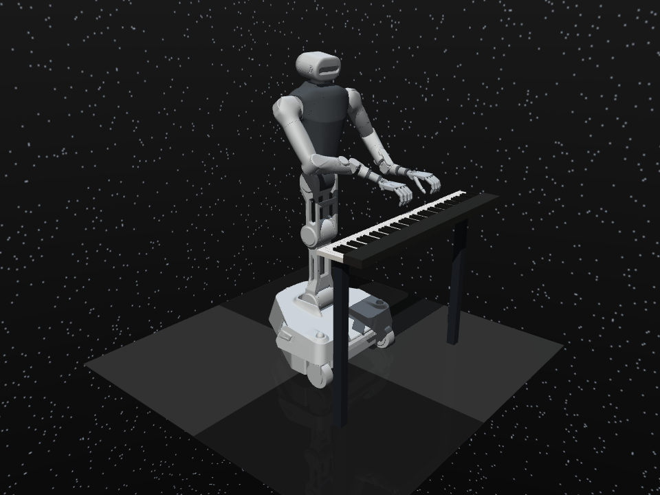

# G0.5 × 双手钢琴：琴位变化后的重新就位与续弹

让机器人演奏一段音乐，再把钢琴轻轻移开：机器人抬手，更新观察，通过 G0.5 与逆运动学控制器重新找到演奏位姿，随后继续弹奏。

本节开源这次 Demo 的演奏、模型调用、移琴续弹和结果检查代码。机器人采用 **Galaxea R1 Pro + 双 Shadow Hand**，运行于 MuJoCo / RoboPianist 仿真。先用随附练习跑通，再换成自己有权使用的曲谱。

## 演奏视频

| 音乐室版：《我爱你，中国》 | 钢琴移位后继续演奏 |
| --- | --- |
| [](assets/piano-xiaohongshu.mp4) | [](assets/piano-relocation-performance.mp4) |
| 小红书成片，34.6 秒，1080p | 移琴加速成片，36 秒，1080p |

点击封面观看带声音的视频。[素材署名与压缩记录](assets/VIDEO_CREDITS.md)



[观看公开练习：移琴后续弹](assets/public-relocation-demo.mp4) · [观看 6 厘米就位过程](assets/relocation-recovery.mp4) · [G0.5 接入教程](G05.md) · [运行记录](REPRODUCTION.md) · [资源与许可](SOURCES.md)

## G0.5 在这里带来什么

**把多模态动作模型接到一个有明确目标的灵巧操作技能上。** G0.5 接收头部、双腕相机画面、当前关节状态和任务指令，输出双臂动作提案。钢琴控制器负责把提案落实到新的演奏位置，并执行指法和节奏。

- **场景变化后重新组织动作**：移琴后再次输入当前观测，而不是继续发送移琴前的手臂轨迹。
- **语言、视觉与本体状态统一接入**：同一模型接口可用于演奏准备和移位恢复，便于继续扩展不同任务指令。
- **通用模型与专用技能分工**：模型处理双臂动作提案，IK 完成几何对齐，手指控制器保留和弦和按键时序。
- **复用预训练模型**：本次流程使用已有 G0.5 检查点推理，没有另行训练整套钢琴策略。

已记录的连续实验中，钢琴沿世界 Y 轴移动 **4 厘米**，G0.5 在恢复阶段进行 **4 次新观测推理**，与 IK 联合把双腕重新对齐到演奏位置，完成后续演奏。这里展示的是这套组合系统的适应流程；钢琴目标位置由仿真几何提供。

## 整体流程

```text
曲谱 / 指法计划 ──→ 双手演奏控制器 ──→ 实际琴键接触 ──→ 钢琴音频
                         ↑
演奏 → 抬手 → 钢琴移位 → 新观测 → G0.5 双臂提案 + IK 对齐 → 落手 → 续弹
```

| 部件 | 分工 | 代码入口 |
| --- | --- | --- |
| G0.5 | 根据新观测产生双臂动作提案 | g05_piano_worker.py |
| 就位与交接 | 限制动作范围、对齐双腕、切换演奏阶段 | g05_recovery.py / g05_relocation_session.py |
| 双手演奏 | 指法、按下松开、和弦、接触反馈 | polyphonic_piano.py |
| 音频与复核 | 从实际琴键状态生成事件、合成音色 | audit_polyphonic_contacts.py |
| Astra（可选） | 组织任务上下文、生成和检查结构化计划 | piano_context.py |

## 1. Windows：先看整机回放

只需 Python 3.10 和 MuJoCo，无需安装模型环境。在本章目录打开 PowerShell：

```powershell
py -3.10 -m venv .venv-replay
.\.venv-replay\Scripts\python.exe -m pip install mujoco==3.1.6 numpy==1.26.4
Expand-Archive -LiteralPath .\assets\galaxea-replay.zip -DestinationPath .\runs\galaxea-replay
.\.venv-replay\Scripts\python.exe replay_windows.py --run .\runs\galaxea-replay --viewer
```

这是随附的《小星星》入门执行器轨迹回放，窗口无声；通过物理仿真重新执行控制序列，运行后产生 `native_replay_report.json`。新观测模型推理请继续下一节。

## 2. Ubuntu：准备仿真环境

建议在 Linux 工作站运行仿真与 G0.5，在 Windows 查看结果。两个 Python 环境分别安装，避免模型依赖覆盖仿真版本。

```bash
git clone https://github.com/datawhalechina/every-embodied.git
cd "every-embodied/06-策略抓取或抓取VLA/大模型控制、VLA、VLM/20-GPT6-Astra机器人弹琴与上下文工程"
export PIANO_ROOT="$PWD"

sudo apt-get update
sudo apt-get install -y ffmpeg libfluidsynth3 libegl1 libgl1
python3.10 -m venv "$HOME/.venvs/piano-sim"
export SIM_PY="$HOME/.venvs/piano-sim/bin/python"
"$SIM_PY" -m pip install -r requirements-sim.txt

export MUJOCO_GL=egl
export PYOPENGL_PLATFORM=egl
export OMP_NUM_THREADS=2
export OPENBLAS_NUM_THREADS=2
```

RoboPianist 音色和运行资源按其安装过程获取。如果出现 `libEGL` / NVIDIA 驱动错误，先修复工作站的 EGL 渲染环境；本地有桌面的机器也可用 GLFW 渲染。

### 获取机器人模型

```bash
git clone https://github.com/OpenGalaxea/GalaxeaManipSim.git "$HOME/GalaxeaManipSim"
git -C "$HOME/GalaxeaManipSim" checkout abe7f5161eeaa150e6eaffdf443af5df7f23f356
"$SIM_PY" prepare_galaxea.py --repo "$HOME/GalaxeaManipSim" --out runs/r1pro-model
```

转换程序保留机器人资源许可证，生成 `runs/r1pro-model/r1_pro.xml`。本章在仿真中安装双 Shadow Hand，并固定底盘、采用理想重力补偿。

### 生成双手练习

随附的 [relocation-exercise.json](relocation-exercise.json) 包含两个乐句、左手三音和弦、右手旋律，以及用于移琴的乐句间休止。它是可分发的调试练习，不依赖歌曲 MIDI。

```bash
"$SIM_PY" polyphonic_piano.py \
  --model runs/r1pro-model --plan relocation-exercise.json \
  --out runs/public-physical --song-mode --fixed-torso --contact-surface \
  --little-abduction-limit 0.34 --hover-z 0.950 --pressed-z 0.912 \
  --song-staged-motion --song-active-priority --ik-max-step 0.08 \
  --max-hand-span 0.18 --video --video-fps 25
```

产物位于 `runs/public-physical/`：`demo.mp4`、`measured.wav`、`trajectory.npz`、`source.plan.json`、`report.json`。音频来自实际按下的琴键。

程序保留严格音符检查：若输出 `Polyphonic performance failed`，先查看 `report.json`。本次公开练习实测完整运行，但存在漏音及起音偏差，因此严格音乐检查未通过；已生成的完整轨迹仍可用于下一步移琴流程验证。环境加载或提前中止导致没有轨迹时，应先修复对应错误。[具体结果](REPRODUCTION.md)

## 3. 接入 G0.5，让琴位变化后继续演奏

按照 [G05.md](G05.md) 准备模型环境和四个路径变量，再运行：

```bash
"$SIM_PY" g05_relocation_session.py \
  --reference runs/public-physical --out runs/public-relocation \
  --boundary 4.5 --piano-shift 0 -0.02 0 --model-weight 0.1 \
  --g05-python "$G05_PY" --g05-repo "$G05_REPO" \
  --g05-models "$G05_MODELS" --g05-checkpoint "$G05_CHECKPOINT" \
  --g05-config-mode checkpoint
```

这条命令在休止处插入“抬手 → 平移钢琴 2 厘米 → 重新观察和调整 → 落手 → 续弹”。钢琴移动由场景控制器施加，动作提案由 G0.5 新推理得到。执行控制循环不逐帧改写关节状态。

公开练习实测完整执行 13.51 秒，恢复阶段新推理 4 次，最大腕部位置误差约 0.062 毫米；落手时长自动调整为 1.19 秒。[本次报告](assets/public-relocation-report.json)

使用新的输出目录重新运行，脚本不会覆盖旧实验。先检查 `demo.mp4`，再看报告中的 `model_calls_during_session`、`recovery_final_error`、`playback_completed` 与音符检查结果。

## 4. 换成自己的曲目

1. 准备有权使用的 MIDI 或结构化音符，保留正确的旋律与节拍。
2. 为双手分配指法；优先保留主旋律和关键和弦，按可达范围调整伴奏。
3. 先在固定琴位生成完整演奏，再在没有持续按键的休止处设置 `--boundary`。
4. 接入移琴续弹，检查恢复后琴键接触和音乐连续性。

`midi_score.py`、`bimanual_fingering.py`、`melody_review.py` 提供相关处理；可先用各脚本的 `--help` 查看入口。本仓库提供流程和练习，不打包宣传视频所用歌曲的曲谱或录音。

## 延伸阅读

- [G0.5 的安装、模型调用和控制融合](G05.md)
- [Astra 上下文与计划生成](ASTRA.md)
- [实验记录与结果字段](REPRODUCTION.md)
- [资源来源、许可证与目录说明](SOURCES.md)

PianoMime 的 `pianomime_runner.py` / `pianomime_galaxea.py` 作为后续策略适配入口保留，使用独立的 `requirements-pianomime.txt` 环境；本页的指法控制与移琴主流程不依赖其权重。
