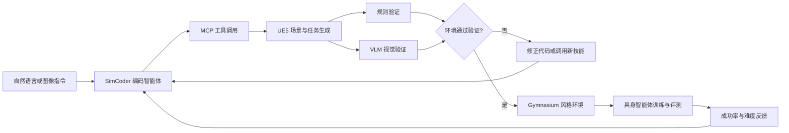

# SimWorld Studio：用自演化编码智能体自动生成具身学习环境

本专题介绍 UC San Diego 与 New York University 开源的 SimWorld Studio。它基于 Unreal Engine 5，将自然语言或图像指令转化为可运行的三维场景、任务和 Gymnasium 风格环境，并通过规则验证、视觉语言模型验证和失败经验沉淀，形成环境生成与具身智能体训练的闭环。

本专题的目标是理解这条技术链路和它与现有 VLA 教程的关系，不把官方项目包装成当前仓库已经完成的一键复现项目。视频演示、官方项目页和论文中的实验结果应分别理解。

- 视频演示：[视频号原始分享链接](https://weixin.qq.com/sph/AT5Qr1EEXg)
- 官方项目页：[SimWorld Studio](https://simworld.org/simworld-studio/)
- 官方代码：[SimWorld-AI/SimWorld-Studio](https://github.com/SimWorld-AI/SimWorld-Studio)
- 论文：[SimWorld Studio: Automatic Environment Generation with Evolving Coding Agent for Embodied Agent Learning](https://arxiv.org/abs/2605.09423)

## 1. 这一章解决什么问题

当前具身智能训练通常需要先准备仿真环境，再采集或生成数据，最后训练策略。环境制作本身经常成为瓶颈：场景需要摆放资产、设置材质和碰撞、编写任务逻辑、调试物理参数，还要把环境接入训练框架。

MuJoCo 教程适合学习控制、示教采集和策略训练。例如本仓库的 ACT 流程是：

```text
固定 MuJoCo 场景
    -> 键盘或遥操作采集示教
    -> LeRobot 数据集
    -> ACT / Pi0 / SmolVLA 训练
    -> 策略部署
```

SimWorld Studio 把问题向前推进了一层：它尝试自动生成训练环境和任务，再把环境交给具身智能体训练或评测。

```text
自然语言或图像需求
    -> 自动生成 UE5 场景
    -> 物理与语义验证
    -> 生成导航任务和环境接口
    -> 训练或评测具身智能体
    -> 根据智能体表现继续生成课程
```

因此，SimWorld Studio 不是 ACT 的替代品，而是可以位于数据采集和策略训练之前的环境生成层。

## 2. 系统架构



SimWorld Studio 的核心组件包括：

| 组件 | 作用 |
| --- | --- |
| Unreal Engine 5 | 提供场景渲染、物理和交互执行环境 |
| SimCoder | 根据需求编写和执行场景生成代码的编码智能体 |
| MCP 桥接 | 将编码智能体连接到 UE5 的资产、场景图和仿真工具 |
| 技能库 | 保存可复用的场景构建流程，例如布置房间或添加户外光照 |
| 规则验证器 | 检查碰撞、空间关系、对象数量和其他结构约束 |
| VLM 验证器 | 检查渲染结果是否符合自然语言或图像需求 |
| Gymnasium 层 | 将通过验证的场景导出为标准化学习接口 |

## 3. SimCoder 如何生成环境

### 3.1 MCP 工具调用

SimCoder 并不是直接输出一张三维图片，而是调用一组能够操作 UE5 的工具，完成资产放置、材质设置、场景图编辑和物理属性配置。最终结果应当是可以继续运行和交互的环境，而不是静态渲染图。

这也是它和普通文生图或静态 3D 生成方法的区别：场景中的物体需要有位置、碰撞、任务关系和可观测状态。

### 3.2 技能库组合

复杂需求通常由多个可复用技能组合而成。例如“生成一个可导航的室内场景”可能需要依次完成：

1. 创建房间和地面；
2. 添加家具和障碍物；
3. 设置光照和材质；
4. 检查可通行区域；
5. 自动生成起点和目标点；
6. 导出导航任务。

技能库的作用不是替代大模型，而是让大模型不必每次从零开始猜测同一类 UE5 操作。

### 3.3 双重验证

规则验证和 VLM 验证负责不同的问题：

- 规则验证偏向结构和物理有效性，例如物体是否互相穿插、碰撞是否过多、数量是否满足约束；
- VLM 验证偏向语义和视觉一致性，例如场景中是否真的出现了需求描述的道路、车辆、建筑和行人。

两类验证都通过后，环境才进入后续训练或评测流程。只有 VLM 通过并不能证明机器人一定能完成任务；只有规则通过也不能证明场景符合用户意图。

## 4. 自演化和协同演化

### 4.1 自演化：让生成器从失败中积累能力

当 SimCoder 多次遇到相似失败时，系统会尝试把修正过程整理成新的工具或技能，并写入技能库。下一次遇到类似任务时，可以直接复用这些能力。

这里的“自演化”主要是工具和技能层面的演化，不应理解为模型权重已经在线更新，也不等同于自动完成了强化学习训练。

### 4.2 协同演化：让环境难度跟随智能体变化

协同演化把智能体表现反馈给环境生成器：

```text
智能体在当前环境训练
    -> 统计成功率和失败类型
    -> 判断当前环境是否过易或过难
    -> SimCoder 调整场景和任务难度
    -> 继续训练
```

官方项目页描述了 8 个难度等级的自动课程过程。它的目标不是盲目增加随机性，而是把环境难度推向智能体当前能力边界附近。

## 5. 视频演示如何理解

视频中的画面大致分为四段：

1. **环境生成**：SimCoder 接收城市街区、道路、车辆和行人等文字或图像需求，并生成 UE5 场景。
2. **工作台交互**：左侧是编码智能体和工具调用过程，另一侧是 UE5 视口，旁边还可以查看场景图、技能库和验证结果。
3. **环境验证**：系统展示生成环境的碰撞或语义检查结果。这里的通过只说明该环境满足当前验证器定义的条件。
4. **具身训练接口**：通过 Gymnasium 风格接口提供观测和任务，使生成环境能够进入智能体训练或评测流程。

视频是一个高度压缩的演示，不能从画面直接推断所有安装步骤、模型配置或实验统计。完整的接口和环境要求应以官方仓库和论文为准。

## 6. 官方指标应该怎样读

官方项目页报告了以下指标：

| 指标 | 含义 | 不能直接推出的结论 |
| --- | --- | --- |
| `0.98+` collision-free rate | 生成场景的碰撞无冲突或物理有效性指标 | 不等于所有任务都可执行，也不等于真实机器人安全 |
| `+12pp` cross-environment transfer | 跨环境迁移到 SimWorld-MMNav 的提升 | 不等于所有 VLA 或所有任务都提升 12 个百分点 |
| `90%` co-evolution SR | 协同演化设置下的 SimWorld-MMNav 成功率 | 依赖具体数据、任务、智能体和评测协议 |
| `72%` fixed-environment baseline | 固定环境课程下的对照结果 | 不能与其他论文的基线直接横向比较 |
| `+18pp` / `+40pp` | 相对固定环境或未训练智能体的提升 | 需要结合完整实验设置和统计方差阅读 |

这些结果说明环境生成、验证和课程反馈在该实验中有效，但不能等同于“已经解决了通用具身智能环境生成”。

## 7. 复现前的环境检查

官方仓库给出的 Linux 最小包路线包含 UE5 环境、NVIDIA GPU、Vulkan、Node.js、Python 和较大的磁盘空间；仓库还提供 Windows 本地开发路线。具体版本会随官方仓库变化，安装前应以 [官方 README](https://github.com/SimWorld-AI/SimWorld-Studio) 为准。

| 项目 | 官方仓库给出的方向 |
| --- | --- |
| 引擎 | Unreal Engine 5.3 |
| Linux GPU | NVIDIA GPU，文档列出 8GB 以上显存的测试配置 |
| 驱动与图形 | NVIDIA 驱动 525+，需要 Vulkan 支持 |
| 软件 | Node.js 18+、Python 3.9+ |
| 存储 | 最小包下载和解压需要较大空间，官方 README 约列出 40GB 空间规划 |
| 编码智能体 | Claude Code、Codex、Gemini CLI、OpenCode 等后端 |

这里需要特别注意：SimWorld Studio 的运行链路包含 UE5、编码智能体和外部模型服务。即使 Web 工作台能够打开，也不代表 UE5、MCP、物理验证和 Gymnasium 导出链路全部可用。应当按照“引擎启动、MCP 连通、场景生成、验证通过、环境导出、智能体评测”的顺序逐级检查。

## 8. 与本仓库现有教程的衔接

SimWorld Studio 可以和本仓库现有教程形成上下游关系，但不能直接把它当作当前 LeRobot 数据集的替换品：

| 环节 | 当前 MuJoCo/ACT 教程 | SimWorld Studio |
| --- | --- | --- |
| 环境来源 | 手工准备的固定 MuJoCo 场景 | 编码智能体生成的 UE5 场景 |
| 数据来源 | 键盘或遥操作示教 | 自动生成任务、仿真轨迹或后续采集数据 |
| 主要接口 | LeRobot 数据集的 `observation` / `action` | Gymnasium 风格观测和动作接口 |
| 重点问题 | 动作标签、时序对齐和策略部署 | 场景生成、验证、任务生成和课程难度 |
| 主要风险 | 数据标注错误、环境配置和模型部署 | 资产、物理、VLM 判断和 sim-to-real 差距 |

如果要把 SimWorld 生成环境接入 ACT、Pi0 或 SmolVLA，至少还需要一个适配层：

1. 明确 Gymnasium 观测如何映射到 LeRobot 的图像和状态特征；
2. 明确环境动作空间如何映射到机器人关节、末端位姿或导航动作；
3. 统一帧率、动作时序和 episode 终止条件；
4. 将轨迹转换为 LeRobot 数据集格式；
5. 在训练前检查动作维度、归一化统计量和状态-动作时间对齐；
6. 分别评估生成环境内成功率、跨环境泛化和真实系统迁移。

因此，本专题更适合作为“环境自动生成与具身训练基础设施”导读，现阶段不声称已经完成 SimWorld 到本仓库 ACT/Pi0/SmolVLA 的直接适配。

## 9. 常见误解

### 9.1 不是“图片直接变成可训练机器人环境”

真实链路更接近：

```text
文字或图像需求
    -> 编码智能体规划
    -> MCP 工具调用
    -> UE5 场景代码与资产
    -> 物理和语义验证
    -> 任务与 Gymnasium 接口
```

中间仍然存在资产库、引擎 API、碰撞配置、任务逻辑和验证器。

### 9.2 VLM 通过不等于物理正确

VLM 可能认为画面“看起来像目标场景”，但它不一定能发现摩擦系数、质量、关节限制、碰撞体或可达性问题。物理验证和实际任务 rollout 仍然不可省略。

### 9.3 协同演化不等于自动得到通用智能体

自动调节环境难度可以减少课程设计工作，但仍然需要明确任务、奖励或成功判定、评测分布和泛化协议。如果反馈指标本身有偏，环境生成器也可能围绕错误指标优化。

## 10. 小结

SimWorld Studio 的重点不是“让大模型生成好看的三维画面”，而是尝试建立一条可执行、可验证、可持续扩展的具身环境生产链：

```text
需求理解
    -> 场景代码生成
    -> MCP 工具执行
    -> 规则与 VLM 双重验证
    -> 失败经验沉淀
    -> Gymnasium 导出
    -> 智能体训练反馈
    -> 自适应课程生成
```

对 Every Embodied 而言，它最适合作为现有 MuJoCo、VLA 和策略训练章节的上游扩展：先理解固定环境中的数据和策略链路，再进一步研究如何自动产生更多环境和任务。

## 参考资料

- [SimWorld Studio 官方项目页](https://simworld.org/simworld-studio/)
- [SimWorld-AI/SimWorld-Studio](https://github.com/SimWorld-AI/SimWorld-Studio)
- [SimWorld Studio 论文](https://arxiv.org/abs/2605.09423)
- [SimWorld 项目主页](https://simworld.org/)
