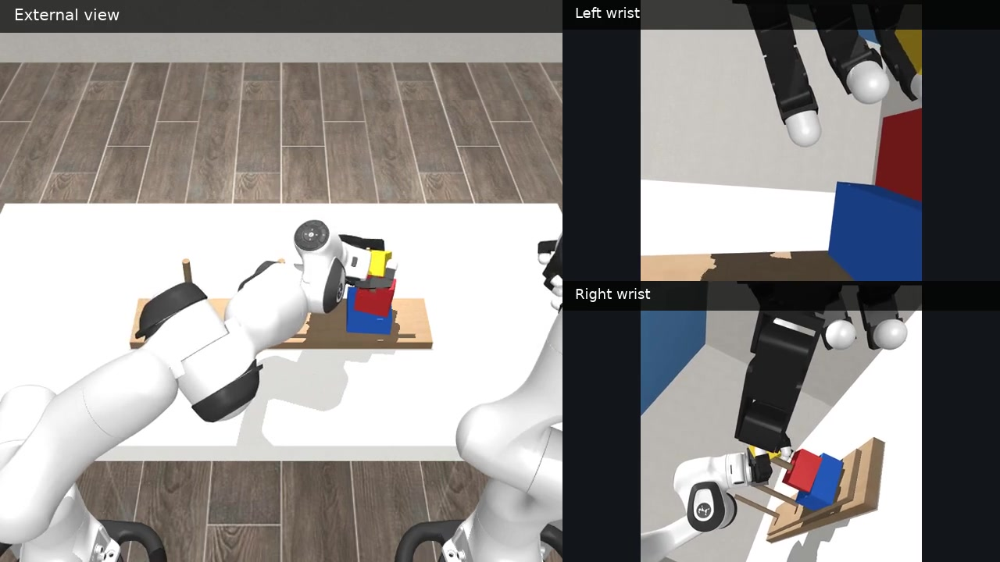
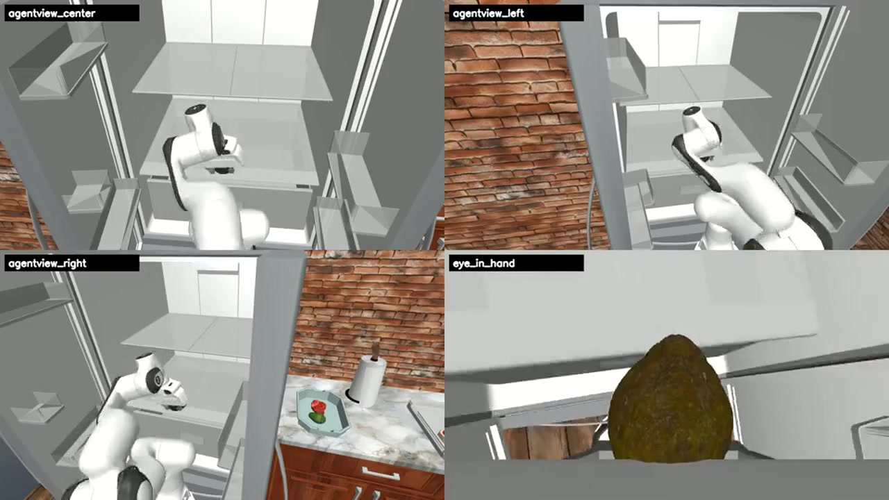

# AMD ROCm 策略复刻专题

本专题面向希望在 AMD GPU 上完成具身策略训练、闭环评估和仿真迁移的学习者。内容从 ROCm 设备检查、MuJoCo 数据采集和 LeRobot 策略训练开始，延伸到 RoboCasa365、DexJoCo、DISCOVERSE、RoboWits 和 Unitree G1。每个实验都给出输入、运行命令、产物目录和评估口径。

## 学习入口

根据目标选择一条路线即可，不必按文件编号从头读到尾。

| 路线 | 适合读者 | 推荐顺序 | 最终产物 |
| --- | --- | --- | --- |
| 抓取策略训练 | 第一次在 AMD 设备上训练机器人策略 | 00 → 01 → 07 → 08/09/10 → 11 → 02 | 数据集、模型、逐回合结果和视频 |
| 策略诊断 | 已有模型，希望定位闭环失败 | 02 → 03/04/05 → 06 | 阶段统计、动作曲线和修复记录 |
| 多基准迁移 | 希望复现家庭操作、灵巧手和安全控制 | 09 → 10 → 11/12/13/14/15 → 16 | 固定协议结果、多视角视频和归档目录 |

没有本地 AMD 设备时，先阅读 [AUP Learning Cloud 与 AMD 开发者云](./README_00_AMD_AUP免费云平台使用指南.md)。平台的网页操作细节放在 [AUP、Jupyter 和 Code Server 附录](./appendices/AUP_JUPYTER_CODE_SERVER.md)，主线章节只保留环境、存储和运行步骤。

## 长程案例

| DexJoCo 双臂河内塔 | RoboCasa365 长程装餐 |
| --- | --- |
|  |  |
| Pi0.5 双臂协同，三视角，47.6 秒 | GR00T N1.5 家庭长时序操作，四视角，195 秒 |

更多任务、模型和协议见 [AMD Physical AI 仿真基准与长程视频](./README_09_AMD_Physical_AI仿真基准与长程视频复现.md)。

## 第一次运行

1. 按 [设备与环境确认](./README_01_AMD_ROCm设备与环境确认.md) 检查 ROCm、PyTorch 和持久化目录。
2. 打开 [预训练权重与零训练体验](./README_08_预训练权重与零训练体验.md)，下载一个模型或观看仓库内的四视角回放。
3. 用 [数据采集与训练](./README_07_ROCm端到端采集训练部署.md) 完成示教采集、数据审计和短训练。
4. 用 [批量闭环脚本](./code/README.md) 运行固定随机种子，保存 `results.jsonl` 和视频。
5. 按 [统一评估与归档](./README_16_统一评估视频与结果归档.md) 汇总成功率和运行配置。

`5000 steps` 是课程短训配置。是否达到可用水平，由未参与训练的随机种子、物理成功判定和回放视频共同确认。

## 章节目录

### 基础与抓取策略

| 编号 | 章节 | 实操入口 |
| --- | --- | --- |
| 00 | [云平台、持久化存储与远程开发](./README_00_AMD_AUP免费云平台使用指南.md) | 平台命令 |
| 01 | [AMD ROCm 设备与环境确认](./README_01_AMD_ROCm设备与环境确认.md) | [Notebook 01](./notebooks/01_device_env_check.ipynb) |
| 02 | [物理成功评估与视频复核](./README_02_物理成功评估与视频复核.md) | [Notebook 02](./notebooks/02_physical_success_review.ipynb) |
| 03 | [ACT 迁移与 DAgger 诊断](./README_03_ACT_ROCm迁移与DAgger诊断.md) | [Notebook 03](./notebooks/03_act_dagger_diagnostics.ipynb) |
| 04 | [SmolVLA 迁移与采样加权](./README_04_SmolVLA_ROCm迁移与采样加权.md) | [Notebook 04](./notebooks/04_smolvla_weighted_sampling.ipynb) |
| 05 | [Pi0/Pi0.5 权限、短训练与评估](./README_05_pi0_ROCm权限Smoke与训练门控.md) | [Notebook 05](./notebooks/05_pi0_smoke_gate.ipynb) |
| 06 | [ROCm 排障手册](./README_06_ROCm调试复盘与排障案例.md) | [Notebook 06](./notebooks/06_rocm_debug_playbook.ipynb) |
| 07 | [数据采集、训练与 MuJoCo 部署](./README_07_ROCm端到端采集训练部署.md) | [Notebook 07–13](./notebooks/README.md) |
| 08 | [模型下载与零训练体验](./README_08_预训练权重与零训练体验.md) | Hugging Face 模型 |

### 多基准迁移

| 编号 | 章节 | 主要产物 |
| --- | --- | --- |
| 09 | [仿真基准与长程视频](./README_09_AMD_Physical_AI仿真基准与长程视频复现.md) | 项目地图和代表视频 |
| 10 | [统一目录、下载与鉴权](./README_10_仿真基准下载与统一目录.md) | 目录变量和环境检查 |
| 11 | [RoboCasa365](./README_11_RoboCasa365_ROCm下载训练评估.md) | 家庭任务训练、16 任务评估、四视角视频 |
| 12 | [DexJoCo](./README_12_DexJoCo_Pi05_ROCm_JAX迁移训练评估.md) | 11 个灵巧任务、ROCm JAX、Pi0.5 |
| 13 | [DISCOVERSE](./README_13_DISCOVERSE_ROCm数据生成训练与多视角视频.md) | 专家轨迹、LeRobot 转换、ACT/DP/3DGS |
| 14 | [RoboWits](./README_14_RoboWits_ROCm下载训练与创意任务评估.md) | 受限数据、创意任务训练与评估 |
| 15 | [Unitree G1 预测 CBF](./README_15_Unitree_G1预测CBF_ROCm复现.md) | 感知输入、安全奖励和全身体态回放 |
| 16 | [统一评估、视频与归档](./README_16_统一评估视频与结果归档.md) | `eval_info.json`、视频和汇总表 |

## Notebook 与脚本

- [Notebook 说明](./notebooks/README.md)：区分可直接阅读的结果 Notebook、运行模板和依赖上游工程的端到端工作流。
- [模型工作流](./notebooks/workflows/README.md)：普通训练与保护训练使用独立目录，评估读取本次训练产出的模型。
- [Python 脚本](./code/README.md)：批量闭环评估、数据回放、演示视频和 DISCOVERSE 数据转换。
- [上游工程布局](./external/README.md)：将源码、数据、模型和运行结果放到专题目录之外。

Notebook 适合逐格观察图像、状态和动作。长训练、批量评估和批量视频录制使用脚本入口，便于在远端设备上恢复和比较。

## 统一产物

每次正式实验至少保留以下文件：

| 文件 | 内容 |
| --- | --- |
| `run_config.json` | 上游版本、模型、任务、观测、动作、相机和随机种子 |
| `metrics.jsonl` | 训练步数、损失、学习率、耗时和设备指标 |
| `checkpoints/` | 可加载的模型与配置 |
| `eval/<task>/eval_info.json` | 逐回合结果和任务成功判定 |
| `eval/<task>/videos/` | 成功与失败回放 |
| `summary.json` | 从逐回合结果聚合的成功率和阶段统计 |

大型数据集、模型、缓存和批量视频放到持久化磁盘或公开模型仓库；Git 仓库保存源码、小配置、短示例媒体和文档。

## 附录

- [AUP、Jupyter 与 Code Server 操作](./appendices/AUP_JUPYTER_CODE_SERVER.md)
- [Pi0/Pi0.5 实验记录](./appendices/PI0_PI05_EXPERIMENT_NOTES.md)
- [ROCm 排障案例索引](./appendices/ROCM_DEBUG_CASES.md)

附录保留实验过程和深入诊断。首次学习先完成主线章节，再按问题进入对应附录。
