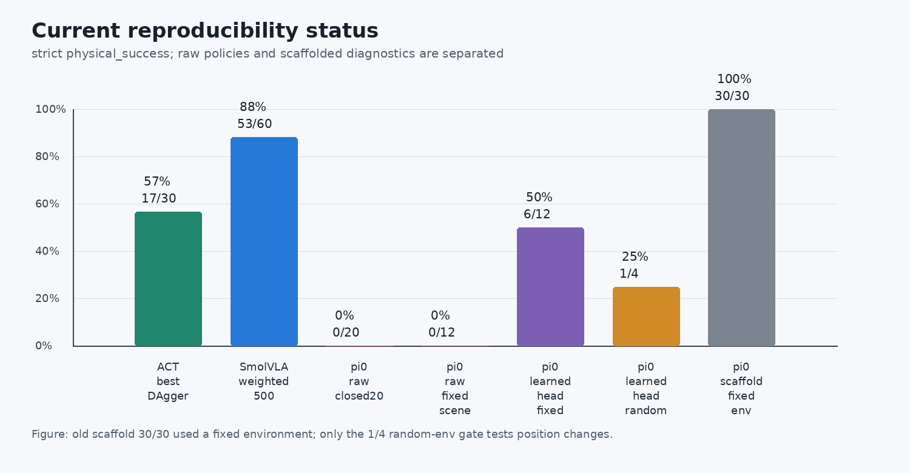

# AMD ROCm 策略复刻专题

本专题在 AMD Ryzen AI MAX+ / Radeon GPU 设备上复刻 LeRobot、ACT、SmolVLA 和 pi_0。它不是单纯的环境安装笔记，也不再假设模型已经训练完成：从设备资源检查开始，先完成 MuJoCo 键盘采集、LeRobot 数据审计、三类模型的 smoke 与正式训练，再进入闭环部署、ACT DAgger、SmolVLA 加权采样、pi_0 尾段诊断和实验报告整理。

如果暂时没有本地 AMD 设备，也可以先参考 [AUP Learning Cloud（优先）+ AMD 开发者云备用使用指南](./README_00_AMD_AUP免费云平台使用指南.md)，优先用 AUP Learning Cloud 的远程 JupyterHub 或 Code Server 完成本专题的开发、训练和评估；开发者云作为备用入口，用于快速验证 ROCm 模板。两种平台的硬件、缓存和使用方式不同，指南中已分开说明；具体额度和开通方式以平台当前页面或管理员通知为准。

如果要把本专题组织成 Datawhale 组队学习活动，可以先参考：[00_组队学习招募参考稿.md](./00_组队学习招募参考稿.md)。其中的开营时间、领学员、报名入口和二维码需要在正式发布前替换。

## 先看到成功，再开始训练

第一次接触具身策略时，不建议从 loss 曲线或失败诊断开始。先运行一条已经通过严格物理判定的回放，确认任务正确完成时应该出现哪些动作阶段，再采集和训练自己的策略。这样可以把“环境没装好”“模型没训够”和“成功判定写错了”三类问题分开。

推荐第一次按下面的顺序学习：

1. 运行 Task 01，确认 ROCm、PyTorch、GPU 和持久化目录；
2. 打开 Task 11，先执行“零训练成功预览”单元格，在 Notebook 内观看四视角严格成功视频；
3. 运行 Task 07，完成键盘遥操作、四视角录制和数据物理成功审计；
4. 从 Task 08 的 ACT 开始做 smoke 和正式训练，再回到 Task 11 做 closed-loop；
5. ACT 闭环跑通后，再尝试 Task 09 的 SmolVLA 和 Task 10 的 pi_0；
6. 最后进入 Task 02–06、12–13，用成功/失败视频、动作轨迹和严格指标做诊断。

Task 11 已内置一条约 2 MB 的严格成功回放，不需要模型权重，也不会消耗训练额度。可下载 checkpoint、适用任务、评测协议和发布状态统一记录在 [预训练权重与零训练体验](./README_08_预训练权重与零训练体验.md)。

> `5000 steps` 只是一种短训基线，不是通用收敛保证。训练是否够用必须由 held-out closed-loop 成功率和视频判断，不能只看步数或 loss。

完成本专题后，可以做到：

- 判断 AMD ROCm 设备是否具备训练和推理条件；
- 区分显存、统一内存、温度、风扇模式和训练稳定性的关系；
- 用 `physical_success` 复核策略是否真的夹起杯子，而不是只满足几何成功；
- 解释 ACT 在闭环部署中为什么会失败，以及 DAgger / oracle correction 解决了什么；
- 用红杯、蓝杯固定指令评估 SmolVLA 是否存在任务分布偏置；
- 在 pi_0 训练前完成 Hugging Face gated model 权限检查和 1-step smoke，并理解 raw policy 成功率该如何继续提升；
- 把训练日志、成功率表格和代表视频整理成别人能读懂、能复现实验判断的报告。

## 适合谁学习

本专题适合希望在国产或异构 GPU 环境中做真实复刻的读者。最好已经了解：

- Python / conda / uv 的基础环境管理；
- LeRobot 数据集的基本结构；
- MuJoCo 中 observation、action、rollout 的含义；
- ACT、SmolVLA、pi_0 的大致区别。

如果还没有跑过原始 MuJoCo 教程，可以选择两条路线：先学习上游基础教程，或者直接从本专题 Task 07 的端到端 Notebook 开始。上游教程仍是理解原始场景和代码结构的重要参考：

- [LeRobot MuJoCo 训练 ACT、SmolVLA、pi_0 教程](https://github.com/datawhalechina/every-embodied/blob/main/06-策略抓取或抓取VLA/大模型控制、VLA、VLM/04mujoco复现ACT、Pi0、SmolVLA/README.md)
- [策略诊断与物理成功评估](https://github.com/datawhalechina/every-embodied/blob/main/06-策略抓取或抓取VLA/大模型控制、VLA、VLM/04mujoco复现ACT、Pi0、SmolVLA/09策略诊断与物理成功评估.md)

## 章节目录

| 任务 | Markdown 概述 | Notebook 实操 |
| --- | --- | --- |
| 00 | [AUP Learning Cloud（优先）+ AMD 开发者云备用使用指南](./README_00_AMD_AUP免费云平台使用指南.md) | - |
| 01 | [AMD ROCm 设备与环境确认](./README_01_AMD_ROCm设备与环境确认.md) | [01_device_env_check.ipynb](./notebooks/01_device_env_check.ipynb) |
| 02 | [物理成功评估与视频复核](./README_02_物理成功评估与视频复核.md) | [02_physical_success_review.ipynb](./notebooks/02_physical_success_review.ipynb) |
| 03 | [ACT 在 ROCm 上的迁移与 DAgger 诊断](./README_03_ACT_ROCm迁移与DAgger诊断.md) | [03_act_dagger_diagnostics.ipynb](./notebooks/03_act_dagger_diagnostics.ipynb) |
| 04 | [SmolVLA 在 ROCm 上的迁移与采样加权](./README_04_SmolVLA_ROCm迁移与采样加权.md) | [04_smolvla_weighted_sampling.ipynb](./notebooks/04_smolvla_weighted_sampling.ipynb) |
| 05 | [pi_0 权限 smoke 与训练门控](./README_05_pi0_ROCm权限Smoke与训练门控.md) | [05_pi0_smoke_gate.ipynb](./notebooks/05_pi0_smoke_gate.ipynb) |
| 06 | [ROCm 调试复盘与排障案例](./README_06_ROCm调试复盘与排障案例.md) | [06_rocm_debug_playbook.ipynb](./notebooks/06_rocm_debug_playbook.ipynb) |
| 07 | [ROCm 端到端采集、训练与 MuJoCo 部署](./README_07_ROCm端到端采集训练部署.md#数据采集边界) | [07_data_collection_and_audit.ipynb](./notebooks/07_data_collection_and_audit.ipynb) |
| 08 | [ACT smoke 与正式训练](./README_07_ROCm端到端采集训练部署.md#smoke-与正式训练) | [08_act_training_rocm.ipynb](./notebooks/08_act_training_rocm.ipynb) |
| 09 | [SmolVLA smoke 与正式训练](./README_07_ROCm端到端采集训练部署.md#smoke-与正式训练) | [09_smolvla_training_rocm.ipynb](./notebooks/09_smolvla_training_rocm.ipynb) |
| 10 | [pi_0 权限门控与正式训练](./README_07_ROCm端到端采集训练部署.md#smoke-与正式训练) | [10_pi0_training_rocm.ipynb](./notebooks/10_pi0_training_rocm.ipynb) |
| 11 | [MuJoCo closed-loop 部署](./README_07_ROCm端到端采集训练部署.md#mujoco-closed-loop) | [11_mujoco_closed_loop_deploy.ipynb](./notebooks/11_mujoco_closed_loop_deploy.ipynb) |
| 12 | [pi0 strict-input 与随机环境复核](./README_07_ROCm端到端采集训练部署.md#pi0-strict-input-复核) | [12_pi0_strict_input_end_to_end.ipynb](./notebooks/12_pi0_strict_input_end_to_end.ipynb) |
| 13 | [Pi0.5 随机位置、coherent recovery、EEF-delta 与 chunk 对齐](./README_05_pi0_ROCm权限Smoke与训练门控.md#pi05-eef-delta) | [13_pi05_random_position_eef_delta.ipynb](./notebooks/13_pi05_random_position_eef_delta.ipynb) |

Markdown 章节主要负责讲清楚背景、判断口径和实验结论；Notebook 负责逐格运行检查、读取指标、生成图表和整理命令模板。可以先读 Markdown，再打开对应 Notebook 跟着跑。

### 基础执行与诊断进阶的关系

| 学习目标 | 入口 |
| --- | --- |
| 从零采数据、训练模型并部署到 MuJoCo | Task 07–12 |
| 理解原始场景和历史 Notebook | 上游 `04mujoco复现ACT、Pi0、SmolVLA` |
| 已有结果，重点学习物理评估和失败修复 | Task 02–06 |

因此，本专题既可以先看成功回放建立直觉，也可以使用已有数据学习诊断，或从 Task 07 开始完成完整训练闭环。Notebook 里的长采集和长训练默认关闭，确认路径、显示会话和磁盘空间后再显式打开。

## 阶段性复刻状态

本专题的示例实验中，ACT、SmolVLA 和 pi_0 都已经形成了训练、评估和视频复核链路，但三者的成熟度不同。SmolVLA 是相对稳定的结果案例，ACT 是典型的闭环诊断案例。pi_0 raw policy 在当前严格闭环协议中仍未成功；加入只读取图像、语言、robot proprio 和历史执行动作的 visual/history learned head 后，固定环境由 `0/12` 提升到 `6/12`，但修正环境随机 seed 后只有 `1/4`。Pi0.5 已完成官方基座 strict load、随机位置数据重采、EEF-delta 转换、LeRobot action-chunk 对齐修复、prefix DAgger 数据验证、ROCm cache 崩溃定位和 400-step/800-step expert-vision continuation；当前 canonical102 数据通过物理行序门禁；400-step continuation 为 `legacy 1/10、physical 0/10`，随后完成的 800-step continuation 仍为 `legacy 0/10、physical 0/10`。它们都是“能力边界与修复过程”的排障案例，不是 raw pi0/Pi0.5 已复刻成功。

图 1：本专题示例实验的阶段性状态。这里使用更严格的 `physical_success`，并把 raw policy、learned head 和 scaffold 分开。SmolVLA 当前最稳，ACT 已经能作为 DAgger 诊断案例；pi_0 的固定场景 learned-head 提升是真实的，但随机环境 `1/4` 说明位置泛化还没有跑通。旧 30 条 scaffold 评估后来发现环境一直固定为 seed 0，只能解释为策略采样稳定性，不能再当作空间泛化证据。

## 推荐学习节奏

| 顺序 | 建议时长 | 主要产出 |
| --- | --- | --- |
| Task 01：环境确认 | 0.5 天 | AMD 设备资源表、ROCm 检查日志、缓存目录规划 |
| Task 11：零训练预览 | 5 分钟 | 在 Notebook 内看到四视角严格成功回放，理解完整动作阶段 |
| Task 07：采集与审计 | 0.5 到 1 天 | 20–50 条经过物理成功审计的红/蓝杯示教数据 |
| Task 08：ACT 训练 | 0.5 到 1 天 | ACT smoke、正式 checkpoint 和第一条闭环基线 |
| Task 11：ACT 闭环 | 0.5 天 | held-out seeds 成功率、JSONL 和成功/失败视频 |
| Task 02–03：ACT 诊断 | 1 到 1.5 天 | `physical_success`、open/closed-loop 诊断表和 DAgger 数据设计 |
| Task 09 → 11 → 04：SmolVLA | 1 到 1.5 天 | SmolVLA checkpoint、红/蓝杯成功率对照和加权采样实验 |
| Task 10 → 11 → 12–13：pi_0 / Pi0.5 | 2 到 3 天 | 权限门控、raw/head 对照、seed 审计、EEF-delta 与 chunk 对齐 |
| Task 05–06：综合复盘 | 0.5 到 1 天 | 训练门控、失败案例、排障记录和实验报告 |

## Notebook 还是 Python 脚本

本专题建议同时保留两类材料：

| 形式 | 适合内容 | 原因 |
| --- | --- | --- |
| Notebook | 环境检查、单条 rollout 可视化、教学解释 | 方便逐格观察状态、图像和动作 |
| Python 脚本 | 批量评估、严格成功率、批量视频录制、训练入口 | 结果更可复现，也适合远端 AMD 设备长时间运行 |

建议不要把所有诊断都塞进 Notebook。批量评估和训练入口应该脚本化，这样组队学习时不同同学的结果更容易比较。

## 学习产物怎么整理

完成复刻后，不要只留下一串命令或一段“跑通了”的描述。更好的做法是把证据整理成一份小型实验报告，让别人能看出你验证了什么、还没有验证什么。

一份合格的实验报告至少包含：

| 资料 | 作用 | 建议写法 |
| --- | --- | --- |
| 环境表 | 说明实验在哪类硬件和 ROCm 版本上完成 | 写 GPU/APU 型号、系统、ROCm、PyTorch、温度和显存占用 |
| 数据表 | 说明训练数据是否可信 | 写 episode 数量、任务类型、红/蓝杯比例、是否通过物理回放审计 |
| 成功率表 | 说明模型是否真的完成任务 | 同时写 `legacy_success` 和 `physical_success`，优先解释后者 |
| 代表视频 | 展示成功和失败行为 | 至少放 1 个真实成功和 1 个典型失败，配关键帧或图注 |
| 排障记录 | 说明为什么这样修 | 按“现象、证据、根因、修复、验证”整理，不贴长日志 |
| 命令模板 | 帮助别人复现 | 使用 `$PROJECT_ROOT`、`$DATA_ROOT`、`$OUTPUT_ROOT` 这类变量 |

结果报告不需要包含模型权重、缓存目录、完整训练日志或个人机器路径。只需要保留足够复现实验判断的内容：命令模板、短日志片段、summary 表格、关键视频和清楚的结论。

## 最小成果模板

完成本专题后，可以整理一份结果摘要：

| 项目 | 内容 |
| --- | --- |
| 设备 | AMD GPU / APU 型号、ROCm 版本、系统版本 |
| 数据 | episode 数量、任务类型、红/蓝杯比例 |
| ACT | best checkpoint、严格成功率、主要失败类型 |
| SmolVLA | 红杯成功率、蓝杯成功率、采样策略 |
| pi_0 | gated 权限、1-step smoke、raw policy 成功率、脚本收尾器诊断结果 |
| 视频 | 1 个真实成功、1 个典型失败 |
| 复盘 | 这次复刻中最关键的一个坑 |
