# AMD ROCm 云平台使用指南（AUP Learning Cloud 优先）

> 推荐顺序：优先使用 AUP Learning Cloud 完成本专题的代码开发、模型准备、训练和 Notebook 实验；AMD Radeon Cloud 作为备用入口，用于快速验证 ROCm、PyTorch 和现成模板。具体额度、镜像、硬件和授权方式以平台当前页面与管理员通知为准。

开发者云部分参考并整理自 [hello-rocm 的 AMD Radeon Cloud 使用文档](https://github.com/datawhalechina/hello-rocm/blob/master/docs/zh/cloud/amd-radeon-cloud.md)，图片已下载到本专题仓库并改为统一的本地相对路径。AUP Learning Cloud 的登录、Notebook、Code Server 和持久化目录说明也整理在本页中。

## 一、两个平台怎么选

| 项目 | AUP Learning Cloud（ALC，推荐） | AMD Radeon Cloud（开发者云，备用） |
|---|---|---|
| 入口 | [tpe.aupcloud.io](https://tpe.aupcloud.io)，使用 GitHub 授权登录 | [AMD AI 开发者计划中文站](https://developer.amd.com.cn/login?source=91kadjjnI) |
| 本专题记录的硬件 | AMD Ryzen AI MAX+ 395，约 64 GB 统一内存 | AMD Radeon PRO 7900D，约 48 GB 显存 |
| 工作区 | JupyterHub 或 Code Server GPU Environment | Radeon Cloud Gallery 中的 Notebook / Workspace |
| 模型和数据准备 | 可按 Notebook 使用 Hugging Face、GitHub 及本地持久化目录 | 按当前模板与平台提供的方式准备模型和数据，优先使用魔搭 ModelScope |
| 适合的任务 | 本专题正式训练、Notebook 调试、闭环评估和长任务续跑 | 直接启动现成 AMD ROCm 模板，快速验证教程 |
| 使用前确认 | GitHub 授权、GPU 镜像、持久化目录和可用额度 | 额度、工作区模板和 ModelScope 登录状态 |

两边的**代码、数据格式和评估口径可以保持一致**。真正需要按平台切换的主要是硬件探测、模型下载方式、缓存目录和可用的 GPU/统一内存容量。不要因为平台不同而复制两套训练脚本。

当前课程沟通中，AUP Learning Cloud 处于内测/学习支持阶段，常见初始额度约为 10 小时，优秀学习者可由课程组织者汇总后申请增加；也有活动期赠送使用的安排。这个数字和追加方式不是永久承诺，实际可用时长以登录页面和管理员当期通知为准。建议先在 AUP 上完成本专题主流程，再根据需要使用开发者云做快速验证。

无论使用哪一个平台，都先用内置成功视频完成零训练预览，再启动正式训练。这样即使当前额度较少，也能先理解任务、输出格式和严格成功判定。

本专题统一使用以下原则：

- 代码和 Notebook 放在仓库或持久化目录中；
- 数据集、模型权重和 Hugging Face / ModelScope 缓存放在容量明确的持久化目录；
- 模型下载失败先判断网络和缓存，不要直接改训练代码；
- 训练完成必须用同一套 MuJoCo strict rollout 和 physical success 复核。

## 二、AUP Learning Cloud（推荐入口）

AUP Learning Cloud 是本专题的优先实践入口，适合直接打开 Notebook、使用 Code Server、准备公开模型和数据，并在持久化目录中完成训练与闭环评估。建议第一次学习按下面的顺序操作：

1. 打开 [AUP Learning Cloud](https://tpe.aupcloud.io)，使用 GitHub 授权登录；
2. 选择 GPU Environment，确认课程目录、项目目录和持久化存储可用；
3. 克隆本专题仓库，按 Notebook 中的环境检查单元格确认 ROCm、PyTorch 和 GPU；
4. 优先运行零训练成功预览，再开始 smoke、正式训练和视频评估；
5. 将源码、数据、模型权重、checkpoint 和结果保存到持久化目录，并保留校验信息。

AUP 的完整登录、JupyterHub、Code Server、持久化目录和退出方式见下方的详细章节。学习者不需要先申请本地账号，直接使用 GitHub 授权即可进入。

## 三、AMD 开发者云（Radeon Cloud，备用入口）

AMD Radeon Cloud 是 AMD AI 开发者计划中文站提供的浏览器云算力入口。它适合先启动现成模板，确认 ROCm、PyTorch、Notebook 和本专题代码能否运行。


图：Radeon Cloud Gallery 中的 `AMD ROCm Embodied AI Policy Replication` 工作区示例。平台页面、模板名称和可用硬件会更新，以当前 Gallery 为准。

### 1. 登录与创建工作区

打开 [AMD 开发者云登录入口](https://developer.amd.com.cn/login?source=91kadjjnI)。中文站通常提供微信、魔搭账号和手机号 / 邮箱验证码等登录方式。


登录后，按“进入 Radeon Cloud → 选择 Notebook / Workspace → 选择 AMD GPU → Launch”的顺序启动工作区。可以先在 Gallery 中搜索 `ROCm` 或 `Embodied AI`，优先选择与本专题名称对应的工作区。

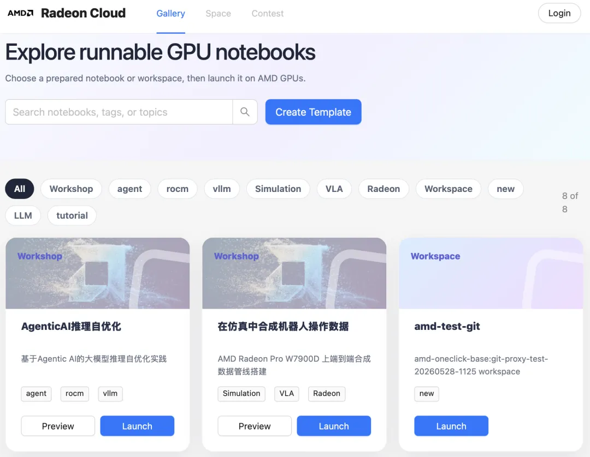

### 2. 开发者云的模型下载方式

开发者云中优先使用魔搭 ModelScope 准备模型和数据。示例命令如下，具体模型名和保存目录按任务替换：

```bash
pip install modelscope
modelscope download --model <model-id> --local_dir <model-dir>
```

下载后先检查文件是否完整，再把训练脚本的模型路径指向本地目录。大文件不要反复下载到临时工作区；如果平台提供持久化 Workspace，把缓存目录放到持久化位置。

### 3. 开发者云的登录与工作区参考图

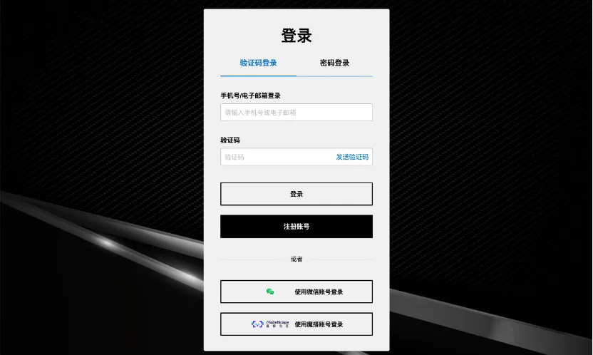


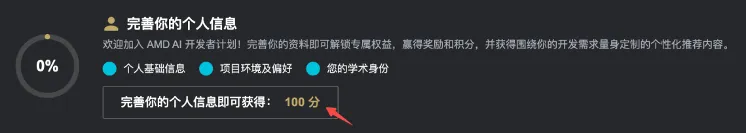


活动期间可能有免费算力、积分兑换和魔搭联动任务。额度、兑换规则和有效期会变化，教程只保留操作思路，不把活动额度当成永久配置。

### 开发者云额度与魔搭联动

如果平台当前账号有积分或活动额度，可以在开发者云页面完成兑换。下面的图片保留了上游平台教程中的操作顺序，图片路径已经统一到本专题的 `assets/amd_radeon_cloud/`：


兑换流程通常是：在 AMD 开发者计划页面生成兑换链接，进入 Radeon Cloud 的 Profile，打开 Redeem Credits，把兑换链接粘贴到 Coupon Link 后提交。兑换比例、起兑门槛和有效期以平台当前规则为准。


### 本专题在开发者云上的运行入口

进入工作区后，直接打开本专题的 [AMD ROCm 策略复刻专题](./README.md)，推荐从以下顺序开始：

1. [设备与环境确认](./README_01_AMD_ROCm设备与环境确认.md)；
2. 打开 [MuJoCo closed-loop Notebook](./notebooks/11_mujoco_closed_loop_deploy.ipynb)，先运行零训练成功预览；
3. [端到端采集、训练与 MuJoCo 部署](./README_07_ROCm端到端采集训练部署.md)；
4. 对应的 ACT、SmolVLA 或 Pi0.5 Notebook；
5. [物理成功评估与视频复核](./README_02_物理成功评估与视频复核.md)。

这里不再跳转到与本专题无关的入门课程；开发者云在本专题中的用途是运行 ROCm 具身策略复刻代码。

## 四、AUP Learning Cloud 详细说明

### AUP 的模型和数据准备

本专题在 AUP 上优先使用 Hugging Face、GitHub 和本地持久化目录准备模型、数据与源码。建议按下面的顺序操作：

1. 通过 GitHub 授权进入 AUP，并在 GPU Environment 中打开终端或 Notebook；
2. 使用 Hugging Face 官方仓库或 GitHub 仓库准备模型、数据和代码，并将缓存目录指向持久化存储；
3. 需要跨设备准备文件时，可使用共享目录、SFTP 或浏览器上传到 AUP 的持久化目录；
4. 在 Notebook / 训练脚本中把模型路径和数据路径指向持久化目录；
5. 启动训练前检查文件大小、校验和、权重文件数量和磁盘空间。

不要把 Hugging Face token 写进公开 Notebook、Markdown、截图或日志。AUP 的持久化目录只保存源码、数据、模型和实验结果，临时工作区结束后会被重置的目录不要放唯一副本。

欢迎使用本课程/实验室提供的 **AUP Learning Cloud 远程 JupyterHub / Code Server 开发环境**！
本指南将帮助你从 **第一次登录** 到 **日常开发使用**，快速上手远程编程与学习。

## 🌐 什么是 JupyterHub / Code Server？

|||
|---|---|
|**JupyterHub** 是一个基于浏览器的远程开发平台，你可以：  <br>\- ✅ 通过浏览器直接写代码（无需本地配置环境）  <br>\- ✅ 使用 Python / Jupyter Notebook 进行实验和学习  <br>\- ✅ 代码和文件保存在服务器，不怕电脑重装  <br>\- ✅ 在不同电脑上随时继续学习  <br>📌 **你只需要：**<br>\- 一台能上网的电脑  <br>\- 一个现代浏览器（推荐 Chrome / Edge / Firefox）|**Code Server（VSCode Server）** 是一个在浏览器中运行的 **完整 VSCode 编辑器**，你可以把它理解为：  <br>\> 🖥️「在浏览器里打开一个和本地一模一样的 VSCode」  <br>通过 Code Server，你可以：  <br>\- ✅ 使用完整的 VSCode 编辑体验（语法高亮、自动补全、调试）  <br>\- ✅ 在终端中运行程序、脚本和训练任务  <br>\- ✅ 安装 VSCode 插件（Python、Jupyter、GitLens 等）  <br>\- ✅ 使用端口转发预览 Web 应用  <br>\- ✅ 适合需要 IDE 级开发体验的用户|

---

## 🔐 AUP Learning Cloud 登录说明

### 1️⃣ 使用 GitHub 授权登录

AUP Learning Cloud 现在直接使用 GitHub 账户授权，无需额外登记或申请。

1. 在浏览器地址栏打开：https://tpe\.aupcloud\.io

2. 点击 **Use GitHub Login** 按钮

3. 按页面提示完成 GitHub 授权

4. 授权完成后，浏览器会自动返回 JupyterHub

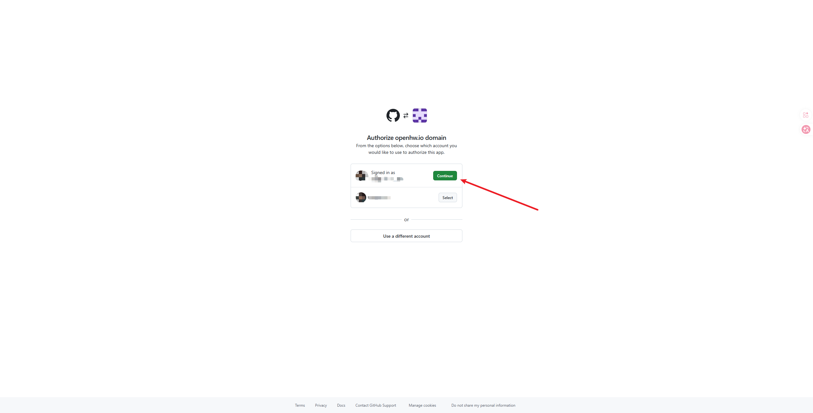

> 首次使用也直接通过 GitHub 授权进入平台，不需要提前填写表格或等待管理员开通。

### 2️⃣ 成功登录后的界面

#### JupyterHub

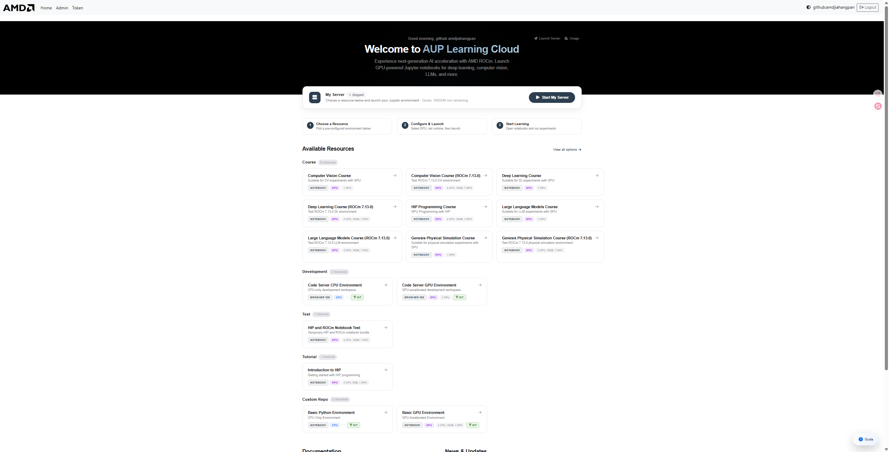

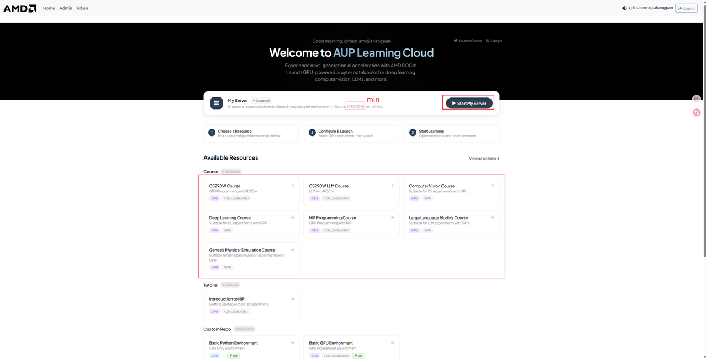

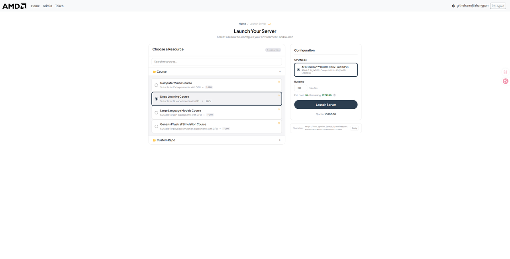

可用资源目录

- **Course**：课程资料

    - Computer Vision Course

    - Computer Vision Course \(ROCm 7\.13\.0\)

    - Deep Learning Course

    - Deep Learning Course \(ROCm 7\.13\.0\)

    - HIP Programming Course

    - Genesis Physical Simulation Course

    - Genesis Physical Simulation Course \(ROCm 7\.13\.0\)

- **Development**：开发环境

    - Code Server CPU Environment

    - Code Server GPU Environment

- **Test**：测试环境

    - HIP and ROCm Notebook Test

- **Tutorial**：教程内容

    - Introduction to HIP

- **Custom Repo**：自定义仓库，提供基础镜像

    - Basic Python Environment

    - Basic GPU Environment

> 注意：选择合适的镜像时间，计时结束时会关闭链接，未放置在用户存储目录 `/home/jovyan` 的内容会被重置
> 
> 

## 🧑‍💻 AUP 基本使用说明

### ✨ 1\. 新建一个 Notebook

1. 选择 **Python 3**

2. 浏览器会打开一个新的 Notebook 页面

🎉 恭喜，你已经可以开始写代码了！

### ▶️ 2\. 运行代码

- 在代码单元格中输入代码

- 按 **Shift \+ Enter** 运行当前单元

- 运行结果会显示在下方

示例：

```python
print("Hello, JupyterHub!")
```

### 💾 3\. 保存你的工作

- JupyterHub **会自动保存**

- 也可以手动保存：

    - `Ctrl + S`（Windows）

    - `Cmd + S`（Mac）

- 需要注意每次镜像的默认工作目录为 `/ryzers/notebooks` 用户拥有 20G 的使用磁盘目录在 `/home/jovyan` 如果需要保存工作内容，请在镜像结束前将工作内容迁移至 `/home/jovyan`

⚠️ 默认工作目录：`/ryzers/notebooks`

⚠️ 用户存档目录：`/home/jovyan`

```bash
# 切换bash
bash
cp <需要保存的文件> /home/jovyan
```

## 💻 AUP Code Server（VSCode Server）使用说明

### 🚀 1\. 启动 Code Server 环境

1. 登录后，在启动页面选择 **Code Server CPU Environment** 或 **Code Server GPU Environment**

2. 选择所需的硬件配置（如 AMD Radeon™ 8060S GPU）

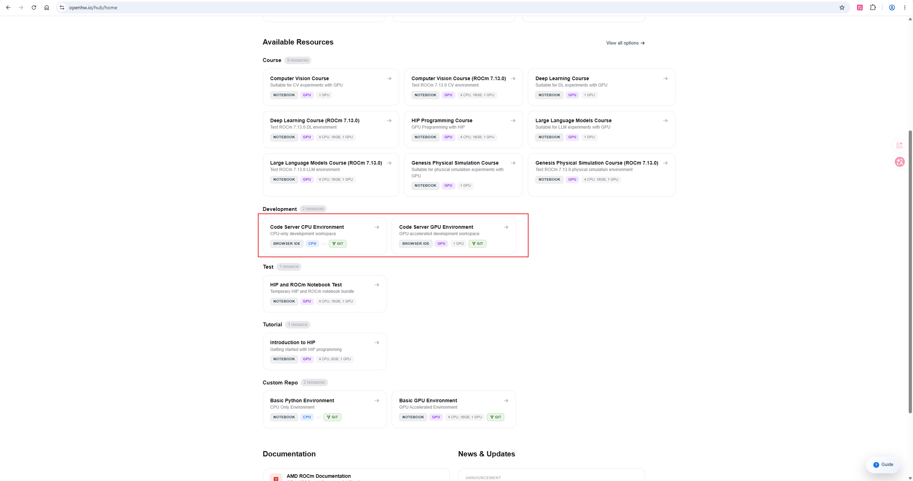

1. 设置运行时长，点击 **Launch Server**

2. 等待几秒后，浏览器将自动打开 VSCode 界面

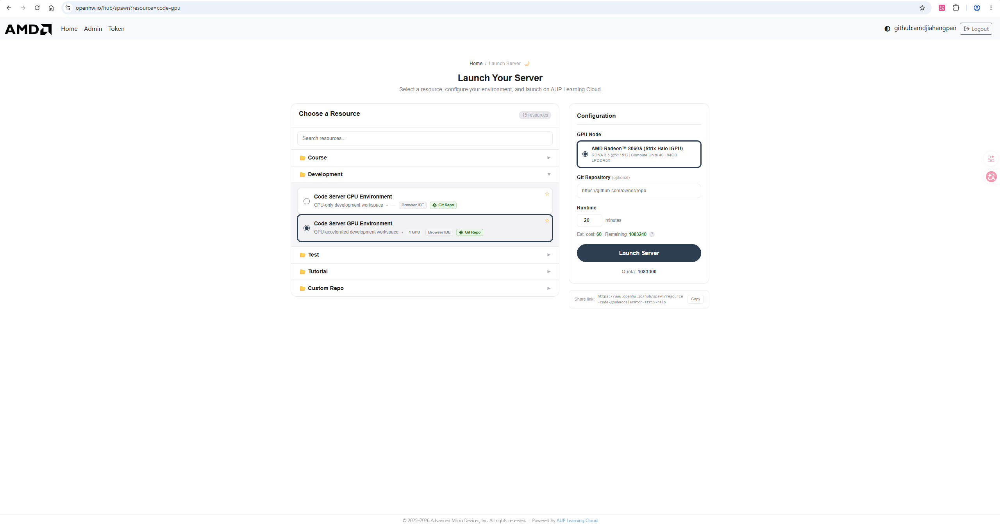

### 🖥️ 2\. 界面介绍

Code Server 的界面和本地 VSCode **完全一致**：

- **左侧**：文件资源管理器、搜索、源代码管理、调试、扩展

- **中间**：代码编辑区域

- **下方**：集成终端（Terminal）、端口面板（Ports）、输出面板

### 📡 3\. 端口转发（Port Forwarding）

当你在 Code Server 中运行一个 Web 服务（如 Node\.js、Flask、Streamlit 等），系统会 **自动检测并转发端口**。

#### 使用方法：

1. 在终端中启动服务，例如：

```bash
node test.js
# 输出: Running on port: 3000
```

1. 右下角会弹出通知提示端口已转发，点击 **"Open in Browser"** 即可在新标签页中访问

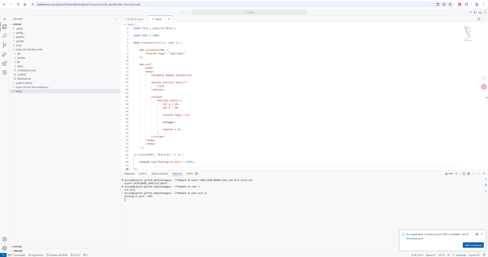

1. 也可以在底部 **PORTS** 面板中查看所有已转发的端口

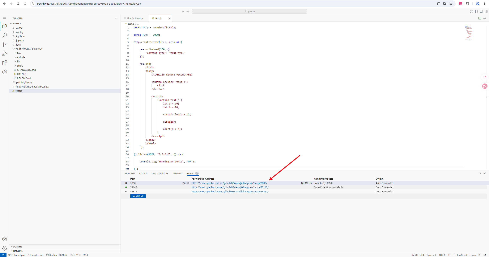

#### 转发地址格式：

```
https://tpe.aupcloud.io/user/<your-username>/proxy/<port>/
```

例如：`https://``tpe.aupcloud.io``/user/github%3Ausername/proxy/3000/`

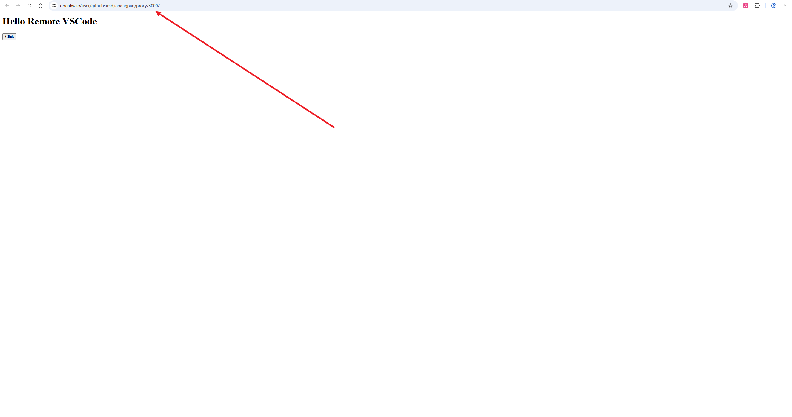

#### 注意事项：

- 端口转发是 **自动** 的，无需手动配置

- 支持任何在服务器上监听端口的服务（HTTP/WebSocket）

- 转发地址可以分享给他人访问（在同一网络授权下）

- 如果端口未自动检测，可在 PORTS 面板手动添加

> 📸 **需要截图位置**：这里建议补充一张端口转发弹窗通知的截图
> 
> 

### 🧩 4\. 插件（Extensions）使用

Code Server 支持安装 VSCode 插件来增强开发体验。

#### 已预装的插件：

|插件|用途|
|---|---|
|Python|Python 语言支持、IntelliSense、调试|
|Jupyter|在 VSCode 中运行 Jupyter Notebook|
|GitLens|Git 增强（查看 blame、历史、对比）|
|Python Debugger|Python 断点调试|
|Ruff|Python 代码格式化和 lint|
|YAML|YAML 文件语法支持|

#### 安装新插件：

1. 点击左侧 **扩展图标**（四方块形状）

2. 在搜索框输入插件名称

3. 点击 **Install** 安装

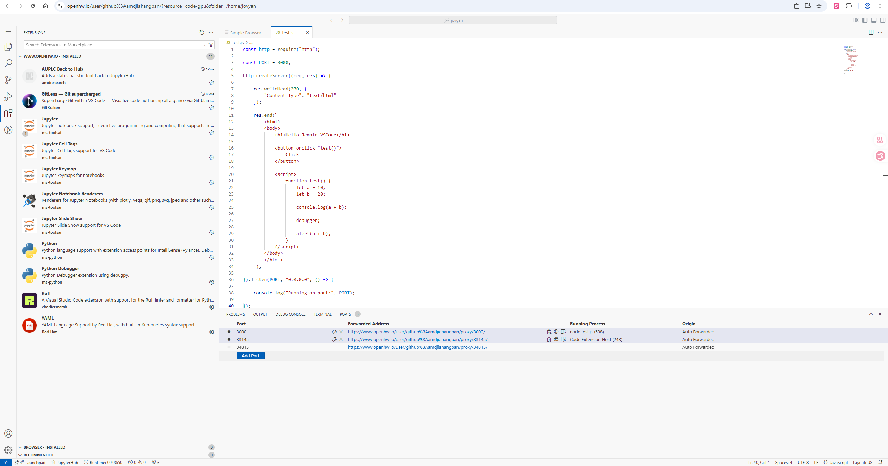

#### 推荐安装的插件：

- **C/C\+\+** — C/C\+\+ 开发支持（配合 HIP 开发）

- **ROCm HIP** — AMD GPU 编程支持

- **Remote \- Containers** — 容器开发支持

- **Thunder Client** — 轻量 API 测试工具

- **Markdown Preview** — Markdown 实时预览

#### 注意事项：

- 插件安装在服务器端，**镜像重启后需要重新安装**

- 建议将常用插件列表记录下来，方便下次快速安装

- 部分插件可能因网络原因安装失败，可尝试刷新页面后重试

### 🔧 5\. 终端（Terminal）使用

在 Code Server 中可以直接使用集成终端：

- 快捷键 `Ctrl + `` 打开/关闭终端

- 支持多终端窗口（点击 \+ 号新建）

- 默认 shell 为 bash

常用操作示例：

```bash
# 查看 GPU 状态
rocm-smi

# 安装 Python 包
pip install torch torchvision

# 运行训练脚本
python train.py

# 启动 Web 服务（会自动端口转发）
python -m http.server 8080
```

## 🚪 AUP 正确退出方式（很重要）

使用完成后，请 **正确退出**：

1. 关闭 Notebook 页面

⚠️ 不要长时间占用服务器资源！

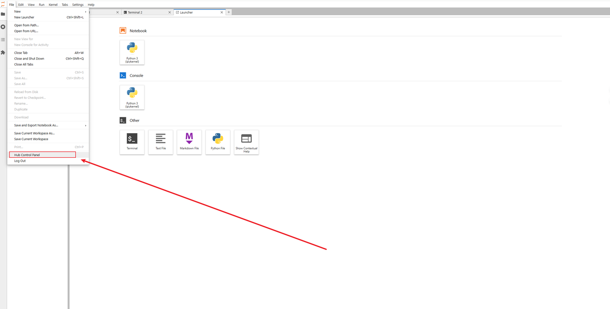


---

## ❓ AUP 常见问题答疑（FAQ）

### Q1：页面打不开 / 加载很慢怎么办？ 🐢

- 检查网络是否正常

- 尝试更换浏览器（推荐 Chrome / Edge）

- 刷新页面或重新登录

---

### Q2：如果已经启用一个镜像，想换另一个镜像，无法启动？

1. 请在选择界面，点击 Stop my server 关闭当前镜像

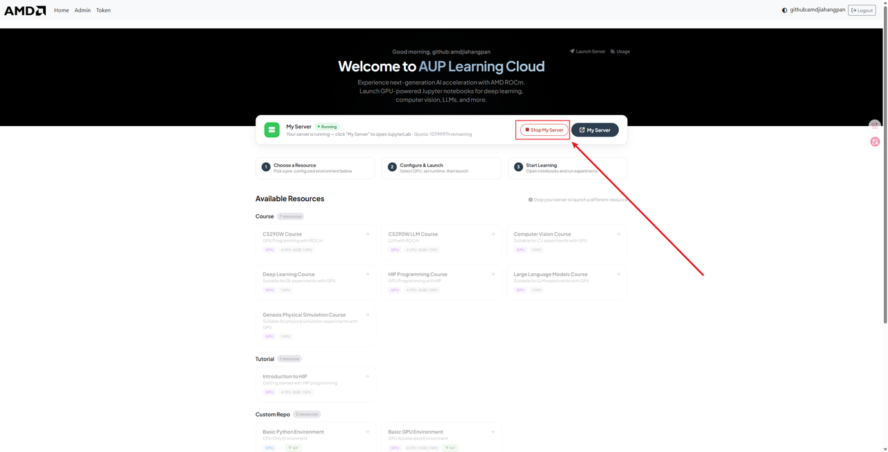


---

### Q3：代码报错了，是平台的问题吗？ 😵

**大多数情况下不是！**

请先检查：

- 是否有拼写错误

- 是否漏写了括号或冒号

- 是否按顺序运行了所有单元


---

### Q4：Code Server 中端口转发不生效？

- 确认服务确实在监听该端口（终端中能看到 `Running on port: XXXX`）

- 检查 PORTS 面板中是否有对应端口记录

- 尝试手动在 PORTS 面板中添加端口

- 如果仍不生效，刷新浏览器页面

---

### Q5：Code Server 中插件安装失败？

- 检查网络连接是否正常

- 尝试刷新页面后重新安装

- 部分插件可能不兼容 Code Server（web 版），可尝试搜索替代插件

---

## 📌 AUP 使用小建议

- ⭐ 经常保存代码

- ⭐ 文件命名清晰（不要用 `test123.ipynb`）

- ⭐ 不要在一个 Notebook 里写"所有内容"

- ⭐ 遇到问题及时提问，不要憋着

- ⭐ 重要文件记得存到 `/home/jovyan` 目录

- ⭐ Code Server 用户建议记录常用插件列表，方便重装
