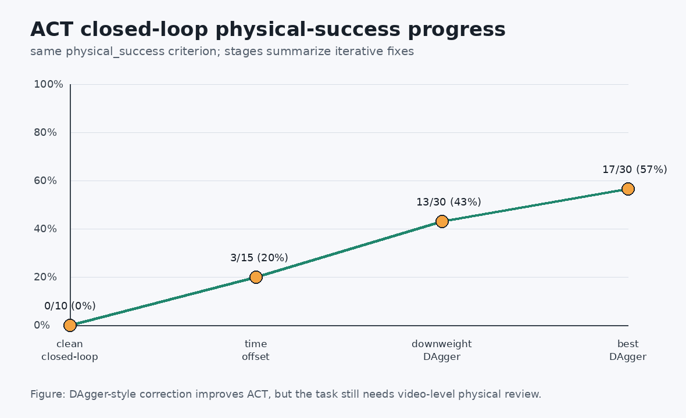
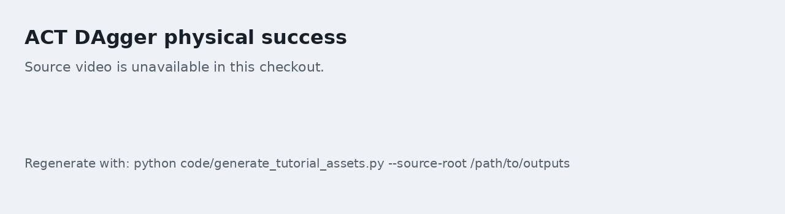
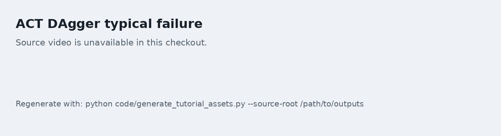

# 03 ACT 在 ROCm 上的迁移与 DAgger 诊断

本任务关注 ACT。ACT 在训练集上 loss 下降，并不等于闭环部署稳定成功。尤其在 ROCm 设备上复刻时，要先证明失败不是环境、数据、显存或成功判定造成的，再讨论模型结构和数据策略。

配套实操 Notebook：[03_act_dagger_diagnostics.ipynb](./notebooks/03_act_dagger_diagnostics.ipynb)。

## 先看结论

学习时先记住下面三条，不需要先区分很多评估组：

| 模型 | 当前可复核结果 | 学习定位 |
| --- | --- | --- |
| SmolVLA | `57/60`（红杯 `27/30`，蓝杯 `30/30`） | 主案例：先看成功回放，再学习训练与评估 |
| Pi0 | `12/14`；其中未见位置 `9/10`、hard 组 `6/8` | 进阶案例：学习大模型权限、动作对齐和失败诊断 |
| ACT | 当前保护候选 `15/30`；历史教程参考 `17/30` | 诊断案例：学习闭环分布偏移、DAgger 和严格成功判定 |

这里的 `15/30` 是 AMD395 上已经完成的保护候选结果；Notebook 中已经写入同一套原生训练配方，但还需要在具备 Jupyter kernel 的环境里从零实际执行一次，才能把这个分数称为“Notebook 原生复现”。因此，教程会同时展示可运行配方和可审计结果，不把两者混为一谈。

## ACT 诊断路线

建议按照下面顺序排查：


每一步回答的问题不同：

| 步骤 | 回答的问题 |
| --- | --- |
| 数据动作回放 | 采集数据本身是否能完成任务 |
| ACT 训练 | 模型是否能学习离线动作分布 |
| open-loop | 模型在数据状态上是否能复现轨迹 |
| closed-loop | 策略自己跑时是否稳定 |
| 失败视频 | 失败发生在接近、夹取、搬运还是释放 |
| DAgger | 如何补闭环跑偏后的状态 |

## 常见 ACT 失败类型

| 失败类型 | 现象 | 可能原因 |
| --- | --- | --- |
| 不接触杯子 | 夹爪停在杯子旁边 | 图像条件不足、初始位姿 OOD、闭环偏移 |
| 能抬起但不释放 | 杯子悬在盘上或被带走 | gripper 标签、尾段 release 太短 |
| 放到盘边但倒杯 | 位置接近但姿态失败 | 末端阶段示教不足、放置高度不稳 |
| open-loop 成功 closed-loop 失败 | 数据状态下会，自己跑不会 | 闭环分布偏移 |

## DAgger 数据怎么采

一个适合教学的 DAgger 流程：

1. 训练 reset-start 基线；
2. 固定一批 seed 做闭环 rollout；
3. 找出失败 seed；
4. 让当前策略先跑前若干步，例如 40 个控制 tick；
5. 从失败附近状态切换到 oracle 或 scripted policy；
6. 保存纠偏 suffix；
7. 合并数据时记录来源、timestamp offset 和采样权重；
8. 重新训练并用同一批 seed 评估。

注意：correction 数据不一定越多越好。直接把 full-reset failure-bucket 数据高权重混入主训练，可能破坏原本已经学会的 reset-start 行为。

## 本轮 ACT 到底改了什么

旧教程摘要曾记录 `17/30`，当前 repair15 保护候选已经在同一严格协议下达到 `15/30`，但还没有完全恢复历史 17/30。W7900 普通 ACT 是 `0/30`，AMD395 stable61 fallback 是 `7/30`，旧 protected DAgger artifact 是 `2/30`。ACT 原始 closed-loop 基线几乎不能通过严格物理成功判定，后续诊断仍然来自一串可复查的改动。

第一步是把评估口径改严。旧 `success` 只看环境几何条件，可能把推杯、挤杯、倒杯误判成成功。本专题统一报告 `physical_success`：杯子要被抬起、移动到盘上，并且终态基本直立。没有这一步，后面的训练改动很容易被旧指标误导。

第二步是把失败拆成 open-loop 和 closed-loop。我们用数据集 observation 生成 ACT 动作，再把这些动作 open-loop 回放到 MuJoCo。这个诊断能区分两件事：模型在数据状态上是否已经学到动作，以及策略自己闭环跑时是否因为状态漂移而失败。结果显示，单 demo 或 clean 数据下，ACT 有时手臂轨迹接近可用，但 gripper release 很短、闭环分布偏移也很明显，所以不能只靠改 gripper 或继续训练解决。

第三步是重做 reset 对齐的数据。旧数据里不少 episode 并不是从评估 reset 姿态开始，训练时看起来 loss 正常，closed-loop 从 reset 出发却不接触杯子。后续主线改成 reset-aligned scripted oracle：每条轨迹从评估使用的 reset 状态开始，先保证数据本身能按同一物理口径回放成功。

第四步是调整 ACT 训练配置。最终主线使用 no-VAE、`chunk_size=20`、`n_action_steps=10`、timestamp state、`obj_init` state、gripper BCE `0.5` 和 per-episode early weight。这里每一项都对应一个失败现象：

| 改动 | 解决的问题 |
| --- | --- |
| no-VAE | 小数据下减少采样随机性，让复刻更稳定 |
| timestamp state | 给模型显式时间相位，避免所有阶段被平均到一起 |
| `obj_init` state | 让模型知道本轮杯子和盘子的初始几何关系 |
| gripper BCE `0.5` | 强化开合爪时序，但不过度牺牲手臂轨迹 |
| per-episode early weight | 保护每条 episode 的 reset-start 前段，不让 correction 数据冲掉开头行为 |
| `n_action_steps=10` | 保留 chunk 连贯性，同时降低一次执行太长带来的闭环漂移 |

第五步是 prefix40 DAgger。让当前 ACT 先跑 40 个 control tick，再切到 scripted oracle 接管并保存 suffix。这样采到的是“策略自己跑偏后的状态”，比只用完美 reset-start 示教更接近 closed-loop 失败分布。

第六步是给 correction episode 加 timestamp offset。prefix40 suffix 不是从 reset 开始的完整任务，如果它的 timestamp 也从 0 开始，模型会把“中途纠偏动作”误认为“任务开头动作”。因此 correction episodes 使用 `timestamp offset = 2.0`，让时间相位和 reset-start episode 分开。

第七步是给 correction 数据降权。我们试过不同权重：

| correction 采样权重 | 严格结果 | 结论 |
| --- | --- | --- |
| `0.1` | 1/15 | 纠偏数据太弱，release / 落点能力补不上 |
| `0.5` | 0/15 | 纠偏数据太强，破坏 reset-start 主分布 |
| `0.25` | 13/30 | 当时最好的折中 |

最后再用 best025 checkpoint 对失败 seed 做一轮 prefix40 DAgger v1，采到 3 条有效纠偏轨迹，并继续用 timestamp offset `2.0` 和 sample weight `0.25` 合并训练，得到旧 protected DAgger checkpoint。它的当前 exact 复核是 `2/30`。随后从 stable61 fallback 保护权重出发，使用同一纠偏数据做低学习率、无内存泄漏的 2500-step continuation，得到当前 repair15 保护候选：

```text
ckpt/act_scripted_reset_oracle_plus_prefix40_dagger_best025_toffset2_downweight025_chunk20_n10_novae_gpu_5000_20260629_031208/step_5000
```

```text
AMD395 protected/act_stable61_to_dagger_nomemleak_step1500_strict15of30
physical_success = 15/30
fixed_seed_groups = 3 组，每组 10 条
```

固定三面板评估中，AMD395 上 stable61/step2500 为 `7/30`，protected DAgger 为 `2/30`，repair15 为 `15/30`。专家恢复采集得到 `17/40` 条合格轨迹；该数值描述数据采集质量，策略结果统一采用后续闭环评估的 `physical_success`。

[`notebooks/16_act_end_to_end.ipynb`](./notebooks/16_act_end_to_end.ipynb)内置同一套保护训练配方：数据包装、轨迹加权采样、no-VAE、gripper BCE、tqdm、checkpoint 和严格评估。运行时设置 `ACT_RECIPE=repair15`，训练与评估使用同一输出目录。

## ROCm 上要记录什么

ACT 训练通常显存占用不算高，但仍然要记录：

- batch size；
- chunk size；
- `n_action_steps`；
- 是否 no-VAE；
- 是否有 gripper 辅助损失；
- 训练温度；
- VRAM 使用；
- 是否出现 kernel crash / OOM。

如果训练失败，先用设备日志证明是不是硬件或 ROCm 问题；如果训练稳定但策略失败，优先回到数据和闭环诊断。

## 闭环诊断结果

clean closed-loop 基线为 `0/10`。加入 timestamp offset、downweight correction 和 DAgger 数据后，stable61 为 `7/30`，protected DAgger 为 `2/30`，repair15 continuation 为 `15/30`。三个固定面板分别取得 `3/10`、`4/10` 和 `8/10`。



图 1：ACT 闭环物理成功率随诊断步骤的变化。这里的提升来自数据和闭环状态纠偏，不是简单加长训练时间。

| 阶段 | physical success | 解释 |
| --- | --- | --- |
| clean closed-loop | 0/10 | 模型在闭环状态下无法稳定接触并搬运杯子 |
| timestamp offset | 3/15 | 动作对齐改善了一部分轨迹，但仍不稳定 |
| downweight DAgger | 13/30 | correction 数据开始补上失败附近状态 |
| stable61 fallback | 7/30 | 旧基线 |
| protected DAgger artifact | 2/30 | 旧 protected 目录的 exact 结果 |
| repair15 protected candidate | 15/30 | 当前最佳；三组固定种子各 10 条，分组结果为 `3/10 + 4/10 + 8/10` |



图 2：ACT DAgger 物理成功 rollout，用于观察抓取、搬运和释放阶段。



图 3：ACT best DAgger 的典型失败 rollout。即使环境几何条件偶尔接近成功，也要继续检查抬升高度和终态姿态。

## Checkpoint

完成本任务后，整理这些项目：

| 项目 | 内容 |
| --- | --- |
| ACT checkpoint | 路径用变量表示 |
| open-loop 成功率 | 训练集或固定 seed |
| closed-loop 成功率 | 使用 `physical_success` |
| DAgger 数据说明 | prefix 长度、oracle 类型、采样权重 |
| 典型失败视频 | 至少 1 个 |
| 下一步判断 | 继续 DAgger / 修 gripper / 补示教 / 调 chunk |
