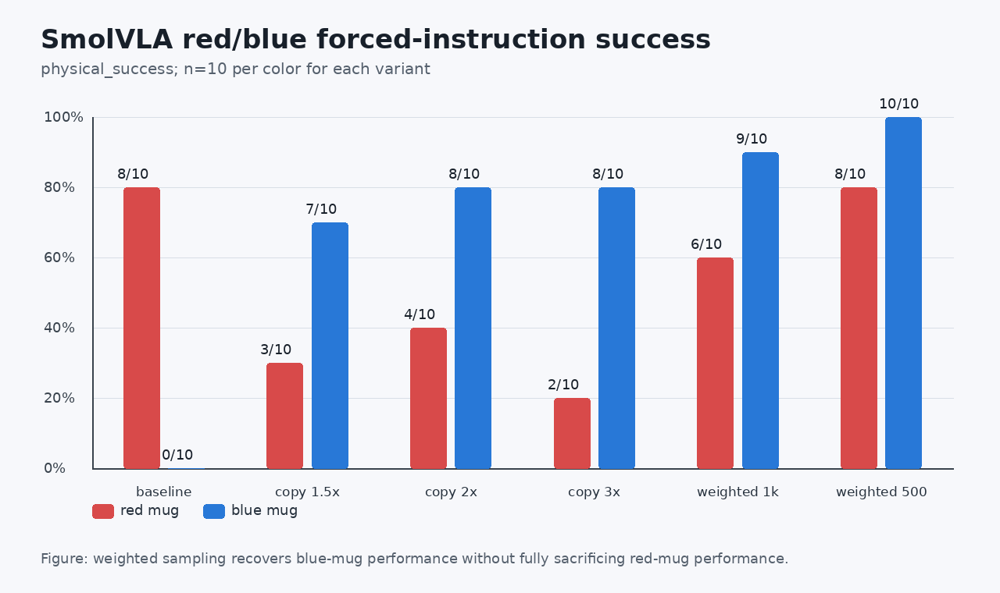
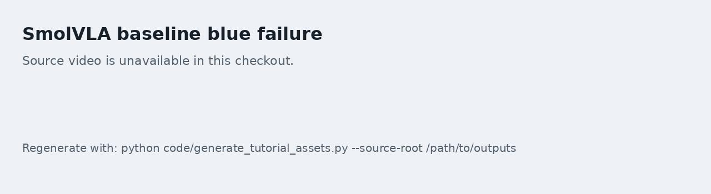
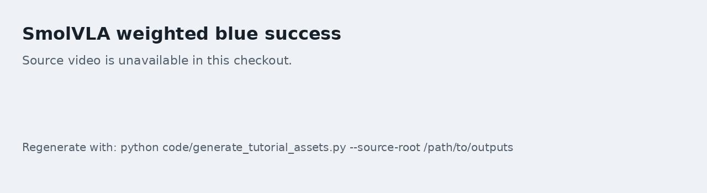

# 04 SmolVLA 在 ROCm 上的迁移与采样加权

本任务关注 SmolVLA。相比 ACT，SmolVLA 更依赖语言条件和视觉特征，因此特别适合用红杯、蓝杯任务检查模型是否真的理解了指令，而不是只记住数据分布。

配套实操 Notebook：[04_smolvla_weighted_sampling.ipynb](./notebooks/04_smolvla_weighted_sampling.ipynb)。

## 固定红杯和蓝杯评估

不要只随机抽任务。建议同一批 seed 分别强制两条指令：

```text
Place the red mug on the plate.
Place the blue mug on the plate.
```

然后比较：

| 模型 | 红杯 physical success | 蓝杯 physical success | 备注 |
| --- | --- | --- | --- |
| baseline step5000 | 8/10 | 0/10 | 原始分布明显偏向红杯 |
| blue copy 1.5x | 3/10 | 7/10 | 蓝杯提升，但红杯受损 |
| blue copy 2x | 4/10 | 8/10 | 仍存在红杯退化 |
| blue copy 3x | 2/10 | 8/10 | 复制过多会加重分布偏移 |
| weighted blue 2.0 step1000 | 6/10 | 9/10 | 更均衡，但不是最佳 checkpoint |
| weighted blue 2.0 step500 | 8/10 | 10/10 | 本轮最适合作为保护基线 |

如果红杯很好、蓝杯很差，说明模型不是完全不会抓，而是任务条件或颜色分布存在偏置。



图 1：SmolVLA 在红杯、蓝杯固定指令上的 `physical_success` 对比。关键不是只追求单一颜色最高成功率，而是看“蓝杯提升是否牺牲红杯”。

## 为什么不直接复制数据

一种直觉做法是把蓝杯 episode 复制多份。但复制数据会改变数据集统计和 episode 分布，可能让模型向蓝杯过拟合，同时伤害红杯。

更温和的做法是按 frame 或 episode 加权采样。例如使用 `WeightedRandomSampler`，让 blue frame 被更高概率采到，但不修改原始 parquet 文件。

建议对比两类方法：

| 方法 | 优点 | 风险 |
| --- | --- | --- |
| 复制 episode | 实现简单 | 改变数据集统计，容易伤害另一类任务 |
| Weighted sampler | 不改原始数据，便于回滚 | 需要记录采样权重和随机种子 |

## 本轮 SmolVLA 到底改了什么

SmolVLA 的原始问题不是“完全不会抓杯”，而是明显偏向红杯。固定同一批 seed 分别强制红杯和蓝杯指令后，baseline 是红杯 `8/10`、蓝杯 `0/10`。这个现象说明模型具备抓取能力，但语言条件和颜色分布没有学均衡。

我们先试了最直觉的复制数据路线：把蓝杯 episode 复制到 1.5x、2x、3x。结果蓝杯确实上来了，但红杯掉得很厉害：

| 方案 | 红杯 | 蓝杯 | 判断 |
| --- | --- | --- | --- |
| baseline | 8/10 | 0/10 | 明显偏红杯 |
| blue copy 1.5x | 3/10 | 7/10 | 蓝杯提升，红杯严重受损 |
| blue copy 2x | 4/10 | 8/10 | 仍然伤害红杯 |
| blue copy 3x | 2/10 | 8/10 | 更偏蓝杯，整体不稳 |

所以主线改成 `WeightedRandomSampler`。它不复制 parquet episode，不改变原始 LeRobot 数据集，也不改变 norm stats，只在训练采样时提高蓝杯 frame 的抽样概率。实际使用的两个关键环境变量是：

```bash
export LEROBOT_TASK_WEIGHT_SUBSTRING=blue
export LEROBOT_TASK_WEIGHT=2.0
```

这样做的好处是回滚简单：数据集本体还是原来的 `demo_data_language`，只要去掉 sampler 权重，训练就回到普通采样；同时它不会像复制 episode 那样把数据集统计硬改掉。

本轮最佳 checkpoint 不是同一 run 的最终 step，而是中间的 `000500`：

```text
ckpt/smolvla_weighted_blue2_from5000_1000_20260629_143123/checkpoints/000500/pretrained_model
```

`001000` 的 loss 继续下降，但红蓝杯均衡性不如 `000500`。因此本专题把 `000500` 设为 protected checkpoint。后续任何 SmolVLA 新方案，都必须在同一批 fixed seeds、同一 `physical_success` 口径下超过它，才值得替换。

最终结果分两层报告：

| 评估范围 | 结果 |
| --- | --- |
| seeds `0-9` | 红杯 `8/10`，蓝杯 `10/10` |
| seeds `0-29` | 红杯 `27/30`，蓝杯 `30/30`，总体 `57/60` |
| 失败 seed 复跑 | `19/21` 成功，说明不少失败是边界非确定性 |

这条线的核心经验很直接：先把任务按 instruction 拆开评估，再处理数据分布偏置。不要只看总体成功率，也不要看到蓝杯差就立刻复制数据；复制 episode 往往会把另一个任务伤掉，sampler 加权更适合作为第一优先级。

## ROCm 训练记录

SmolVLA 在 ROCm 上训练时，记录：

- 初始 checkpoint；
- 数据根目录；
- 训练 steps；
- batch size；
- task weight substring；
- task weight；
- GPU 利用率；
- 温度区间；
- VRAM 使用；
- 保存 checkpoint 的 step。

结果不要只看 final checkpoint。中间 checkpoint 可能更好，例如 500 step 可能比 1000 step 更均衡。

## 视频和失败 seed 复跑

如果某些 seed 在 batch eval 中失败，可以复跑 3 次检查是否是稳定失败：

| seed | 指令 | batch 结果 | repeat 1 | repeat 2 | repeat 3 | 判断 |
| --- | --- | --- | --- | --- | --- | --- |
|  | red |  |  |  |  | 固定失败 / 偶发失败 |
|  | blue |  |  |  |  | 固定失败 / 偶发失败 |

偶发失败说明策略已经接近边界，下一步应补边界状态示教或做少量 targeted DAgger，而不是盲目长训。

## 本轮复刻结果示例

本教程示例中表现最稳的 SmolVLA checkpoint 是端到端 Notebook 重建的 `weighted500`。小批量对比中它达到红杯 `8/10`、蓝杯 `10/10`；正式保护评估扩大到 30 个 seed 后，红杯 `27/30`、蓝杯 `30/30`，总计 `57/60`。这说明 SmolVLA 主线已经在 ROCm 设备上复刻出比较稳定的固定指令抓杯能力。

这里把它称为“保护基线”，意思是后面的新实验都要和它比较。新 checkpoint 只有在同一批 seed、同一 `physical_success` 口径下超过这条基线，才值得替换它。这样可以避免看到某一次训练 loss 更低，就误以为模型真的更好。



图 2：baseline 的蓝杯失败序列。这个失败不是因为环境不能抓杯，而是模型没有稳定执行蓝杯指令。



图 3：加权采样后的蓝杯成功序列。它适合放在教程里说明为什么需要按指令颜色拆开评估。

## Checkpoint

完成本任务后，保留这些结果：

- 红杯和蓝杯固定指令成功率；
- 至少两个采样策略的对照；
- 一个保护基线 checkpoint；
- 一个成功视频和一个失败视频；
- 对失败 seed 是否稳定的复跑结论。
