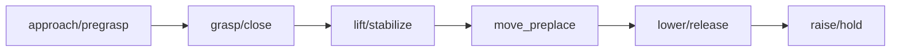

# 05 pi_0 权限 smoke 与训练门控

本任务关注 pi_0。pi_0 的复刻难点不只是训练本身，还包括 gated model 权限、模型权重下载、缓存管理和大模型初始化。先完成 smoke test，再决定是否启动长训练。

配套实操 Notebook：[05_pi0_smoke_gate.ipynb](./notebooks/05_pi0_smoke_gate.ipynb)。

## 重要更正：旧 30 条评估不是位置泛化

复盘 `mujoco_env/y_env2.py` 时发现，旧代码写成了 `if seed != None: np.random.seed(seed=0)`。评估虽然传入了 `1010-1039`，也确实改变了 Pi0 的动作采样随机性，但杯子和盘子的初始位置始终来自环境 seed 0。旧 scaffold 的 `30/30` 仍能证明“同一场景下，不同策略采样能稳定完成”，却不能证明位置泛化。

代码已经改为 `if seed is not None: np.random.seed(seed=seed)`。修复后用真正变化的环境 seeds `41-44` 做 strict-input visual/history head gate，结果只有 `1/4`；固定环境 seed 0、同一批 12 个 policy sampling seeds 的对照是 raw pi0 `0/12`、pi0 + learned head `6/12`。所以当前结论是：自采完整任务数据和 learned head 显著改善固定场景，但下一轮必须重新采多位置数据，不能继续引用旧 `30/30` 作为空间泛化成功率。

## 先检查 Hugging Face 权限

pi_0 依赖 PaliGemma。先确认：

1. Hugging Face 账号已接受 `google/paligemma-3b-pt-224` 的 gated 条款；
2. token 具备 public gated repository 读取权限；
3. 远端机器可以访问 Hugging Face；
4. token 没有出现在命令行、Notebook 输出或日志里。

推荐脚本形态：

```bash
HF_TOKEN_STDIN=1 REQUIRE_PROXY=1 ./install_hf_token_for_pi0.sh
```

这个脚本应该从隐藏输入或 stdin 读取 token，先验证 `whoami`、PaliGemma 和 `lerobot/pi0`，全部通过后再保存 token。

## 1-step smoke test

权限通过后，先跑 1-step smoke：

```bash
RUN_SMOKE=1 RUN_FULL_TRAIN=0 ./run_pi0_train_eval_after_hf_ready.sh
```

这个 smoke test 证明：

- gated model 权限可用；
- 数据集能加载；
- pi_0 policy 能构造；
- 至少一次 forward/backward/optimizer step 能跑通；
- checkpoint 保存链路正常。

它不证明策略已经收敛，也不代表最终成功率。

## 正式训练门控

只有当 smoke test 通过后，才启动正式训练：

```bash
RUN_SMOKE=1 RUN_FULL_TRAIN=1 PI0_STEPS=20000 PI0_BATCH_SIZE=4 ./run_pi0_train_eval_after_hf_ready.sh
```

正式训练前建议确认：

| 检查项 | 状态 |
| --- | --- |
| PaliGemma 权限 | 通过 |
| `lerobot/pi0` 权限 | 通过 |
| 1-step smoke | 通过 |
| GPU 温度 | 可接受 |
| VRAM / 内存 | 有余量 |
| checkpoint 目录 | 空间足够 |
| 代理或网络 | 稳定 |

## 公共基线重建后的训练门控

如果本地 checkpoint 或临时数据 root 丢失，不要急着从残缺目录里继续实验。先回到公开教学数据集，重建一个干净的 pi_0 基线：

```bash
git clone https://huggingface.co/datasets/Datawhale/datawhale_eai_pnp_language demo_data_language
```

这个公开数据集对应本教程的 `pi0_omy.yaml` / `smolvla_omy.yaml`，包含 20 条抓杯放盘 episode、2621 帧，`observation.state` 是 6 维，`action` 是 7 维。重建后按下面顺序过门控：

| 检查点 | 应观察到什么 | 说明 |
| --- | --- | --- |
| `steps=0` policy 初始化 | 能创建 pi_0 policy 并加载权重 | 证明 gated 权限、缓存、policy config 可用 |
| 1-step expert-only | 能完成一次 forward/backward/optimizer step | 证明数据、模型和 GPU backward 链路可用 |
| 20-step checkpoint | 能写出 `pretrained_model` 并重新加载到 GPU | 证明 checkpoint 保存和 safetensors 加载路径可用 |
| 500-step checkpoint | loss 明显下降，例如从 5 左右降到 0.2 以下 | 证明训练健康，但还不能说明任务成功 |
| red/blue 小面板评估 | 固定红/蓝指令各跑几个 seed | 用 `physical_success` 判断策略是否真的会做任务 |

示例实验中，公共数据 500-step expert-only checkpoint 的 loss 从约 `5.28` 降到 `0.179`，说明训练链路已经恢复；但 red seeds `0-2` 和 blue seeds `0-2` 的 closed-loop strict 评估都是 `0/3 physical_success`，旧几何 success 也为 `0/3`。视频行为上，模型已经会接触、推杯、偶尔抬起，但会出现倒杯、抬升不足或把杯子带飞。

继续从 500-step checkpoint resume 到 1500 step 后，最终 loss 约 `0.046`，中间和最终 checkpoint 都能正常保存，说明 resume、scheduler、optimizer state 和 checkpoint 写出路径都已经恢复。但同一 red/blue seeds `0-2` closed-loop strict 小面板仍是 red `0/3`、blue `0/3`，旧几何 success 也为 0。1500-step 的失败形态更偏 no-lift：杯子基本没有被稳定抬起，或者只有非常小的扰动。

这组结果的意义很明确：500-step 和 1500-step checkpoint 都是训练健康基线，不是成功模型。loss 下降不能自动推出 closed-loop 成功；后续应该做 teacher-forced / open-loop 误差诊断、动作表示检查和阶段化数据设计，而不是继续盲目加 BC 步数或围绕某个失败 rollout 调一堆后处理。

## 训练后的物理成功诊断

在本专题的示例实验中，pi_0 已经完成了权限、下载、policy 构造、训练和 open-loop replay 诊断。这里最重要的结论不是“pi_0 已经成功”，而是要把 raw policy 和诊断用混合方案分开报告。

我们先在一个重编号后的 2 蓝 2 红小数据集上做严格 `physical_success` 评估。该小集的作用是减少颜色偏置，专门观察 pi_0 是否学会抓取、搬运和末端释放。随后又把同一个 raw policy 放到完整 `demo_data_language` 的 20 条 episode 上做 teacher-forced open-loop replay，用来得到更有代表性的动作预测结果。

| 方案 | 严格 physical success | 应如何理解 |
| --- | --- | --- |
| pi_0 raw policy，小集 reference run | 0/4 | raw policy 已经能把杯子送到盘子附近，但终态 release / raise / stabilize 不稳定 |
| pi_0 raw policy，小集 batch rerun | 1/4 | 有边界样本会短暂或偶发跨过阈值，说明小样本成功率不稳定，不能据此报告复刻成功 |
| pi_0 raw policy，完整 20 episode open-loop | 1/20 final，3/20 ever | 更适合作为当前 raw policy 的代表性结论：模型学到部分动作，但终态物理成功仍很低 |
| pi_0 raw policy，20 seed closed-loop strict | 0/20 strict，旧几何 2/20 | 最接近部署口径；raw policy 还不能算迁移成功 |
| pi_0 + scripted finisher，小集 | 4/4 | 用数据集均值尾段做脚本收尾，并在达到 `physical_success` 后立即停止；这是尾段瓶颈诊断，不是 raw 成功 |
| pi_0 + template-tail finisher，完整 20 episode open-loop | 4/20 final，4/20 ever | 扩大到完整数据集后，固定收尾器只能救一部分样本；前段接触、搬运和姿态偏差仍会让尾段救不回来 |


图 1：pi_0 raw policy 在代表 episode 中已经非常接近目标，但末端高度和释放稳定性没有跨过严格成功阈值。脚本收尾器把同一前缀状态接到更稳定的 release / raise / stabilize 尾段，说明主要瓶颈集中在任务尾段。

下面的视频展示了同一个 episode 的左右对比。左侧是 raw pi_0，右侧是加脚本收尾器后的混合诊断结果：

<video controls muted preload="metadata" width="100%">
  <source src="./assets/pi0_ep2_raw_vs_finisher_side_by_side.mp4" type="video/mp4">
</video>

图 2：pi_0 episode2 raw-vs-hybrid 对比视频。这个视频用于解释失败机制，不代表 raw pi_0 已经达到 100% 成功率。

从这个诊断里，可以得到两个判断：

1. pi_0 的训练链路已经可以在 AMD ROCm 设备上跑通，并且模型并不是完全没有学到动作；
2. raw policy 仍不能直接报告为复刻成功，后续优化要围绕末端释放、抬高和稳定放置阶段继续设计数据或训练目标。

完整 20 条 open-loop replay 的结果还暴露了一个很关键的细节：旧几何成功和严格物理成功并不一样。本次 raw policy 在 20 条里只有 1 条终态 `physical_success`，有 3 条曾经短暂进入过 `physical_success`，还有 2 条旧几何口径成功。也就是说，pi_0 不是完全不会接近目标，而是在接触、释放、姿态稳定和终态保持上还不够稳。复现时要同时看 `final_physical_success`、`physical_success_ever`、旧 `success` 和视频，而不是只看某一个布尔值。

进一步跑 20 seed closed-loop strict 评估后，raw pi_0 的严格物理成功率是 `0/20`，旧几何口径为 `2/20`。这比 open-loop 更接近真实部署，也说明当前失败不只是数据集帧上的尾段动作误差；在闭环图像、状态和动作逐步漂移后，前段接触、抓取稳定性和终态保持都会放大误差。

这里要特别注意小数据抓放任务的边界。pi_0 论文强调的是大规模、多任务、跨机器人数据和精心设计的 post-training recipe；论文还把 corrections 和 recovery behaviors 这类覆盖偏差状态的数据看得很重要：[π0: A Vision-Language-Action Flow Model for General Robot Control](https://arxiv.org/html/2410.24164v1)。而我们的抓杯数据很小，episode 里如果没有稳定录入“打开夹爪、抬手、等待杯子稳定、必要时纠偏”的尾段，模型不会凭空学会这段。

再加上 pi_0 使用 action chunking 思路，一次预测一段连续动作。Physical Intelligence 在 [Real-Time Action Chunking](https://www.pi.website/research/real_time_chunking) 中明确讨论了 chunk 边界、延迟和训练时未出现的暂停会带来的执行问题；[Real-Time Execution of Action Chunking Flow Policies](https://arxiv.org/html/2506.07339v1) 也把 action chunking 的边界和实时执行列为关键问题。放到这次小数据抓杯里，前段移动还能被模型平均出来，最后几厘米的 release / raise / stabilize 就很容易被累积误差击穿。

所以，脚本收尾器不是“作弊式宣布成功”，而是一个干净的诊断工具：如果加上一个固定尾段就能从失败变成成功，说明 raw policy 的主要缺口确实包含尾段动作建模。但完整 20 条 template-tail 只有 `4/20`，也说明前段接触、抓稳、搬运和姿态控制同样重要。后续要么补阶段化数据和纠偏数据，要么把 scripted finisher 作为工程兜底单独报告，不能把它混成 raw pi_0 成功率。

## pi_0 成功率怎么往上提

先把当前硬基线写清楚：

| 口径 | 当前结果 | 作用 |
| --- | --- | --- |
| raw teacher-forced open-loop，完整 20 条 | `1/20 final`，`3/20 ever` | 判断模型在数据状态上预测动作是否接近专家 |
| raw closed-loop strict，20 seed | `0/20` | 最接近部署口径，当前 raw policy 还没成功 |
| 小集 scripted finisher | `4/4` | 证明尾段 release / raise / stabilize 是瓶颈之一 |
| 完整 20 条 template-tail finisher | `4/20` | 证明固定尾段只能救部分样本，不是泛化方案 |
| oracle prefix + 10eps finisher handoff scan | prefix `120/180/240/300` 均为 `0/2` | 即使前缀由 oracle 提供，当前 finisher 仍会把杯子带离盘，接管点不是主因 |
| oracle prefix180 + phase schedule + `tcp_to_plate` finisher | strict `5/10`，legacy `6/10` | 第一条明显抬升 Pi0 后段成功率的路线；它仍是诊断 scaffold，不是 raw policy 成功 |
| 上一行 + phase-scripted gripper | strict `7/10`，legacy `7/10` | 证明夹爪时序是后段瓶颈之一；剩余失败集中在红杯搬运/落点 |
| 策略采样 seeds（环境实际固定为 seed 0）1010-1039，schedule 0..9 重复 | strict `21/30`，legacy `23/30` | 扩大策略采样样本后仍有效，但失败全部集中在短 `move_preplace` schedule 模板 |
| 策略采样 seeds（环境实际固定为 seed 0） 1010-1039，强制长 schedule episode 0 | strict `30/30`，legacy `30/30` | 证明主要瓶颈是搬运阶段模板太短；这是改好版 scaffold，不是 raw pi_0 端到端 |
| 上一行，把 phase-scripted gripper 换成 phase-only learned head | strict `30/30`，legacy `30/30` | 第一块脚手架被可学习模块替代；仍保留 oracle prefix 和长 schedule |
| schedule 0..9 正常重复 + adaptive `move_preplace` gate + learned gripper head | strict `30/30`，legacy `30/30` | 不再强制长 episode0；用 live TCP-to-plate 进度决定是否继续搬运 |
| schedule 0..9 正常重复 + learned transition head + learned gripper head | strict `30/30`，legacy `30/30` | 第二块脚手架进一步可学习化；29/30 由 transition head 主动切换，1/30 走 max-step 安全兜底 |
| policy prefix + target-relative contact scaffold + pregrasp-geometry/contact transition heads + floor guard | strict `30/30`，legacy `30/30` | 第三层去脚手架：前段 `pregrasp/descend/close` 核心切换由 head 触发，但仍保留 contact scaffold、floor safety guard 和后段 finisher |
| 上一行 + `dynamic_timed` finisher，stage-aware target/plate state + hard-reset 评估 | strict `30/30`，legacy `30/30` | 第四层去脚手架：不再用 `dataset_schedule` 尾段；prefix 用 `tcp_to_target`，finisher 用 `tcp_to_plate`；clean hard-reset 后 mean `xy=0.0219 m`，max `xy=0.0450 m` |

后续任何新方案都要和这些数对比。只看 loss、只看 2 蓝 2 红小集、只看某一个成功视频，都不够。最少要报告完整 20 条 open-loop 和 20 seed closed-loop strict；如果只跑小集，必须把它写成诊断，不写成成功率。

已经排除掉的方向也要记下来，避免重复烧时间：

| 路线 | 观察到的结果 | 结论 |
| --- | --- | --- |
| 同一数据继续加 BC steps | loss 会下降，但 strict 成功率没有跟着上来 | 不是“步数不够”这么简单 |
| tail-frame weighted sampling | 小集几何变好，但 raw 仍不稳，继续加权会退化前段 | 尾段重要，但不能只盯最后几十帧 |
| 只改 gripper 阈值、binarize、open-until | 能救个别 teacher-forced 样本，closed-loop 不稳定 | gripper 是症状之一，不是唯一根因 |
| suffix-only DAgger 直接混入 | state/action 对齐稍错会严重退化；修正后仍没学稳搬运 | DAgger 数据必须按阶段和统计量处理 |
| full-reset scripted oracle 直接 BC | 数据本身 `20/20` 成功，但 pi_0 仍难闭环过拟合 | 不能只靠自动生成完美轨迹 |
| phase / EEF / eef_abs 单独改表示 | teacher-forced 有局部成功，closed-loop 仍失败 | 方向有价值，但需要阶段化和 on-policy 数据配合 |
| 只扫 handoff 接管步数 | oracle prefix `120/180/240/300` 接当前 10eps finisher 都是 `0/2`，多数样本能抬起但最终 `xy` 偏到 `0.22-0.60 m` | 当前后段策略的搬运目标已经学偏，不能靠换接管步数解决 |
| 固定 template-tail 当最终方案 | full20 只有 `4/20` | 可以做工程兜底或诊断，不能当 raw policy 成功 |

在这些反例之后，`tcp_to_plate` 是目前最有价值的一次正向更新。它把 state 从 19 维扩到 22 维：

```text
joint6 + timestamp + phase_index_norm + phase_onehot11 + tcp_to_plate3
```

其中 `tcp_to_plate = tcp_link_xyz - plate_xyz`。训练数据里的第一帧 TCP 位置来自采集摘要里的 `prefix_end_debug.tcp_pos`，后续帧用上一帧记录的 `eef_abs` 目标近似；闭环评估时不再用近似值，而是直接从 MuJoCo 读取真实 `tcp_link` 和 `body_obj_plate_11`。这一步解决的是“后段策略到底知不知道盘子在自己哪边”的问题。

这轮实验把原来的 10eps prefix120 suffix 数据转换成 22D state，并从旧 19D finisher checkpoint 初始化继续训练 250 step。加载旧 checkpoint 时会遇到一个很典型的坑：旧模型里 `normalize_inputs.buffer_observation_state.mean/std` 是 19 维，新数据是 22 维，直接加载会 shape mismatch。这里的处理方式是复制一份 checkpoint，删掉这两个 state normalizer buffer，让新数据集统计重新初始化；主干权重仍然沿用旧模型。

训练健康状态正常：step 25 到 step 250 的 loss 大致在 `0.012-0.019` 间波动，显存和温度都稳定，没有 OOM 或 kernel crash。随后用 `oracle prefix180` 先把杯子带到可接管状态，再让 22D finisher 从 `move_preplace` 阶段 schedule 接手，10 个 seeds 的结果是 strict `5/10`、legacy `6/10`。成功 seeds 是 `1000, 1001, 1004, 1005, 1006`；失败里有两类，一类是杯子被抬起过但没有搬到盘心，终态 `xy` 还有 `0.18-0.59 m`，另一类是 `xy` 已到盘附近但杯子倒了，说明 release / stabilize 仍未完全学稳。

再做一个只改夹爪、不改 EEF/arm 的对照：finisher 的 gripper 不用 Pi0 预测，而是按当前 phase 规则开闭，结果变成 strict `7/10`、legacy `7/10`。这说明夹爪时序确实是关键瓶颈之一。它把原来失败的 `1002, 1003, 1008` 救成成功，剩余失败是 `1001, 1007, 1009`，都集中在红杯，且终态 `xy` 约 `0.14-0.24 m`。也就是说，夹爪规则能减少“倒杯/滑脱”，但红杯的搬运落点还要继续补数据或补阶段目标。

为了确认这条路线不是只在 10 个 seed 上偶然有效，又把评估扩到策略采样 seeds（环境实际固定为 seed 0） `1010-1039`。先按 10 条 schedule 模板循环使用，结果是 strict `21/30`、legacy `23/30`，红杯 `12/18`、蓝杯 `9/12`。这个数已经明显好于前面的失败分支，但还不够稳。把失败样本逐个映射回 schedule episode 后，问题一下子清楚了：所有失败都落在 schedule episodes `1, 7, 9`，而这三条的 `move_preplace` 搬运阶段只有 `72-75` 帧；长模板 episode `0, 2, 3, 4, 5, 6, 8` 的 `move_preplace` 大约是 `120-123` 帧。短模板会让 finisher 在杯子还没到盘上方时就进入 lower / release，视频里看起来就是“杯子被带到盘前方就提前放手”。

随后只改一个变量：把失败 seeds 的 schedule 都强制改成长模板 episode `0`，不改 checkpoint、不改 state、不改控制器，9 个失败 seed 全部变成 strict 成功。再把完整 30 个策略采样 seed（环境实际固定为 seed 0）全部使用长模板 episode `0`，结果是 strict `30/30`、legacy `30/30`，红杯 `18/18`、蓝杯 `12/12`，平均终态 `xy` 距离约 `0.0281 m`，最大 `xy` 约 `0.0739 m`。这说明前面 `21/30` 的主要瓶颈不是策略采样噪声，而是 schedule 里搬运阶段长度不一致，短模板把 release 时机提前了。

这个结果很重要，但边界也要写清楚：它不是 raw pi_0，也不是端到端部署成功率。它同时依赖 oracle 前缀、手动从 `move_preplace` 对齐 schedule、显式的 `tcp_to_plate` 状态、phase-scripted gripper，以及强制使用长 `move_preplace` 模板。更准确的说法是：改好版的 Pi0 后段 finisher/scaffold 已经能在固定环境的 30 个策略采样 seed 上稳定完成任务；它证明“盘心相对位姿 + 正确搬运时长 + 正确夹爪窗口”这条工程路线是对的。下一步不是回到盲目加 step，而是把长 `move_preplace` 进度、phase transition 和 gripper timing 做成模型可学习的输入或 head，再逐步拆掉 oracle prefix 和手写 schedule。

第一块可以拆掉的脚手架是 gripper 规则。先做两个消融：如果完全不用 scripted gripper，只保留 oracle prefix、`tcp_to_plate` finisher 和长 schedule，在 策略采样 seeds（环境实际固定为 seed 0） `1010-1019` 上只有 strict `5/10`；如果把前缀也换成当前 policy prefix，即使用 scripted gripper 和长 schedule，也只有 strict `3/10`。这说明优先级很清楚：先把 gripper timing 做成可学习模块，prefix policy 还不能马上替代 oracle prefix。

这里训练了一个很小的 logistic gripper head。它不改 Pi0 的 EEF/arm 输出，只负责预测第 7 维夹爪开闭。一个容易踩的坑是：用完整 22D state 训练的 gripper head 在训练集上可以做到 `100%` 准确率，但上线到 seed `1010` 就失败，说明它把 joint/TCP 的细节相关性也学进去了；这些相关性在闭环 rollout 里会发生分布偏移。改成 phase-only 输入后，只使用 `timestamp + phase_index_norm + phase_onehot11`，同样训练集 `100%`，但闭环表现稳定：smoke seed `1010` 为 `1/1`，策略采样 seeds（环境实际固定为 seed 0） `1010-1019` 为 strict `10/10`，完整 `1010-1039` 为 strict `30/30`、legacy `30/30`，红杯 `18/18`、蓝杯 `12/12`，平均 `xy` 约 `0.0272 m`，最大 `xy` 约 `0.0735 m`。

这一步的意义不是“再加了一个规则”，而是把手写 gripper 规则换成了一个可训练、可保存、可复用的小 head。它也给出一个很实用的经验：小数据机器人任务里，辅助 head 不一定越多状态越好。短事件时序头如果只是学 phase 窗口，输入越干净越稳；把实时 joint/TCP 全喂进去，训练集指标会很好看，但闭环分布偏移会马上暴露。

第二块要拆的是强制长 `move_preplace` 模板。前面 `30/30` 依赖 `--tcpplate-force-schedule-episode 0`，本质上是把所有 seed 都套到同一条长搬运模板上。新的 adaptive gate 不再这样做，而是让 schedule episodes `0..9` 正常重复：当 schedule 即将从 `move_preplace` 进入 `lower_to_plate` 时，先看 live `tcp_to_plate_xy`。如果 TCP 还离盘心较远，就继续 hold 最后一帧 `move_preplace` phase；等 live xy 足够小，或者达到安全上限步数，再播放后面的 lower / pre-release / open tail。

这轮扫了几个阈值。`xy=0.05m,min_steps=20,max_steps=180` 是当前稳态：策略采样 seeds（环境实际固定为 seed 0） `1010-1019` 为 strict `10/10`，完整 `1010-1039` 为 strict `30/30`、legacy `30/30`，红杯 `18/18`、蓝杯 `12/12`，平均 `xy` 约 `0.0281 m`，最大 `xy` 约 `0.0617 m`。它已经不再强制使用长 episode0，而是能把短 schedule episode 的搬运段按 live 进度拉长。

不过这个结果也要说清楚：`0.05m` 这版仍带 `max_steps=180` 的保守兜底。以短模板 seed `1011` 为例，trace 里它在 finisher step `180` 才从 `move_preplace` 切到 `lower_to_plate`，切换时 live `tcp_to_plate_xy` 约 `0.0574 m`。这说明它是一个可靠的 adaptive hold 工程版，还不是完全学出来的 phase transition head。

阈值放宽并不一定更好。`0.09m` 在前 10 个 策略采样 seed（环境实际固定为 seed 0） 上也是 `10/10`，而且 seed `1011` 可以在 step `163` 主动切到 `lower_to_plate`，看起来更像真正的 progress gate；但扩到完整 30 seed 后退化为 strict `29/30`，seed `1034` 失败，终态 `xy` 飙到 `3.16 m`。`0.08m` 对 seed `1011/1034` 的 probe 是 `2/2`，但 full-run 前 9 条里 seed `1012` 已经 strict 失败。这个反例很重要：phase gate 不能只靠 10 seed 小面板，也不能只看终态 xy；release 早一点，姿态、抬升持续时间和接触稳定都会变。

再往前走一步，把这个 gate 换成一个 logistic transition head。第一版 full head 使用 `tcp_to_plate_x/y/z`、`tcp_to_plate_xy`、`abs_z` 和阶段内步数，训练集准确率约 `99.27%`，但上线 seed `1010` 直接失败：它在 finisher step `60` 左右就切到 `lower_to_plate`，当时 live `tcp_to_plate_xy` 还有 `0.35 m` 量级。诊断后发现，raw `x/y` 方向和 `z` 高度都会误导小 head；训练集里高度接近常常意味着可以下放，但闭环里高度接近并不代表已经到盘心。

第二版只保留 `tcp_to_plate_xy + local_step_norm`，训练集准确率降到约 `95.01%`，但闭环更稳。它在 seed `1010` 上从失败变成 strict 成功，切换发生在 finisher step `136`，不是 `max_steps` 兜底；随后 策略采样 seeds（环境实际固定为 seed 0） `1010-1019` 为 strict `10/10`，完整 `1010-1039` 为 strict `30/30`、legacy `30/30`，红杯 `18/18`、蓝杯 `12/12`，平均终态 `xy` 约 `0.0279 m`，最大 `xy` 约 `0.0741 m`。30 条里 `29/30` 是 transition head 主动触发，release step 在 `126-180` 之间，平均约 `146.6`；只有 seed `1021` 走到 `max_steps=180` 安全兜底，但仍 strict 成功。

这个结果比前面的固定阈值 gate 更接近“可学习 phase transition head”。它也再次说明一个小数据经验：训练集准确率不是唯一目标，head 的输入要尽量只保留真正稳定的因果线索。这里 `xy + progress` 比 `xy + z + raw direction + progress` 更稳，因为它不会把闭环会漂移的高度/方向相关性当成释放条件。

再继续拆前段 contact primitive 时，不能直接把所有 phase transition 都按“阶段末尾几帧”为正样本训练。我们先训练了一个 all-head，训练集指标看起来并不差，但 smoke seeds `1010/1011` 变成 `0/2`。trace 里 `descend_to_close` 在 TCP 还高出抓取 floor 约 `0.08 m` 时就触发，后面的 `close_to_lift` 也跟着提前，杯子还没进夹爪就开始收尾。这个反例很适合放进教程：phase 标签不等于接触安全条件，训练集 accuracy 好看也可能只是学到了“这条 demo 大概什么时候进入下一段”。

修复版把 `pregrasp_to_descend` 的标签改成“到达预抓点”，特征里显式加入 `tcp_to_grasp_xy`、`abs_tcp_to_pregrasp_z`、`tcp_to_floor_z`、`abs_tcp_to_floor_z`；`descend_to_close` 仍使用 phase-tail 标签，但部署时增加 `descend_floor_guard`，不允许 TCP 明显高于抓取 floor 时闭合。这样 smoke `1010/1011` 恢复到 `2/2`，完整策略采样 seeds（环境实际固定为 seed 0） `1010-1039` 为 strict `30/30`、legacy `30/30`。30 条里 `pregrasp->descend`、`descend->close`、`close->lift` 都是 `30/30` 由 transition head 触发，floor guard 一共阻挡了 `342` 次高空 close。边界样本也要写清：seed `1029` 的终态 `xy` 约 `0.0996 m`，seed `1018` 的 upright cos 约 `0.703`，都贴近 strict 判定阈值。

这一版比上一版少了 `pregrasp/descend` 的手写几何 transition，但仍保留 target-relative contact scaffold、floor safety guard 和后段 `tcp_to_plate` finisher。它适合写成“工程 scaffold 进一步学习化”，不能写成 raw pi_0 端到端成功。

第四层继续拆后段 schedule tail。前面的 `30/30` 仍然依赖 `dataset_schedule`：即便 `move_preplace -> lower_to_plate` 的切换可以由 head 决定，后面的 timestamp / phase one-hot 仍来自某条数据集 schedule。新的实验把 finisher 改成 `dynamic_timed`，并从 `move_preplace` 阶段启动，`move_preplace/lower_to_plate/retreat` 的 dwell 分别设为 `260/40/40`。这样后段不再播放数据集里的 phase schedule，而是由在线 phase tracker 生成 timestamp 和 phase 特征。

第一次完整策略采样 seeds（环境实际固定为 seed 0） `1010-1039` 只有 strict `27/30`。失败 seeds 是 `1021, 1031, 1036`：`1021` 被抬起但停在盘外约 `0.35 m`，`1031` 甚至被甩到远处，`1036` 蓝杯停在盘前约 `0.22 m`。一开始很容易把它理解成“固定 `move_preplace=260` 仍然不够聪明”，但复盘代码后发现更根本的问题：`--tcpplate-prefix-target-state` 原本只想让 prefix policy 使用 `tcp_to_target`，可 dynamic finisher 没有 `dataset_schedule` 时也走了同一条非 schedule state 分支，导致 finisher 吃到的是 `tcp_to_target`，而不是它训练时需要的 `tcp_to_plate`。

修复方式是把 22D state 构造改成 stage-aware：prefix 阶段使用 `tcp_link - target_mug`，finisher 阶段使用 `tcp_link - plate`；同时把 contact primitive 限定在 prefix 阶段，避免它泄漏到后段。修复后先单独复测三个失败 seed，`1021/1031/1036` 全部 strict 成功；旧版同一环境连续跑完整策略采样 seeds（环境实际固定为 seed 0） `1010-1039` 时，也得到 strict `30/30`、legacy `30/30`，红杯 `18/18`、蓝杯 `12/12`。当时平均终态 `xy` 约 `0.0244 m`，最大 `xy` 是 seed `1036` 的 `0.0993 m`，看起来像一个贴近阈值的边界成功样本。

但继续做 trace 时又发现一个更隐蔽的问题：同一 evaluator 连续跑多个 seed 后，某些 episode 的初始物体位置会出现采样范围外的值。例如 seed `1035` 曾出现初始杯子位置约 `[0.2679, 0.1625, 0.8441]`，而单独 `reset(seed=1035)` 的正常位置应约为 `[0.2944, 0.1912, 0.8447]`。这不是策略学坏了，而是评估协议不够干净：`SimpleEnv2.reset(seed)` 会重新设物体位置，但没有先把底层 MuJoCo `mjData` 的速度、控制量和 free-joint 动态残留完全清掉。前一个 episode 的运动状态会污染下一个 episode，100 个 settle step 之后，物体可能已经被轻微带偏。

所以后续又给 evaluator 加了两个 clean protocol 开关：

- `--fresh-env-per-episode`：每个 seed 新建一个 MuJoCo 环境，最干净；小面板 `1036/1035/1020/1029` 复核为 `4/4`，但大面板里反复创建环境偶发触发资产 provider 报错，不适合当默认批量协议。
- `--hard-reset-sim-data`：复用同一个 viewer/env，但在每个 `env.reset(seed)` 前调用底层 parser reset，清掉 qvel / ctrl / free-joint 残留；这是现在推荐的完整 30 seed 评估协议。

用 `--hard-reset-sim-data` 重新跑完整策略采样 seeds（环境实际固定为 seed 0） `1010-1039`，结果仍然是 strict `30/30`、legacy `30/30`，红杯 `18/18`、蓝杯 `12/12`。这次 mean `xy=0.0219 m`，max `xy=0.0450 m`，最小 lift `0.1093 m`，最小 upright cos `0.9504`，平均步数约 `492.6`。也就是说，stage-aware dynamic finisher 在干净评估协议下仍然成立，而且 seed `1036` 不再是边界样本；之前的 `0.0993 m` 更像跨 episode reset 残留造成的评估伪影。

这一步的经验很关键：当同一个 evaluator 同时服务 prefix policy 和 finisher policy 时，不能只靠一个全局开关决定相对状态。`tcp_to_target` 是抓取前段的有效线索，`tcp_to_plate` 是搬运放置后段的有效线索；两者放错阶段，模型不会直接报错，但闭环行为会很快变成偏盘、过搬运或甩飞。这个 bug 也解释了为什么单看训练 loss 或 2 seed smoke 不够，只有完整 30 seed panel 才把状态边界问题暴露出来。

配套脚本放在本专题 `code/pi0/` 目录：

```text
code/pi0/build_lerobot_state_phase_tcpplate.py
code/pi0/evaluate_pi0_two_stage_eef_abs.py
code/pi0/evaluate_pi0_two_stage_tcpplate.py
code/pi0/train_tcpplate_gripper_head.py
code/pi0/train_tcpplate_transition_head.py
code/pi0/train_tcptarget_contact_transition_head.py
```

第一个脚本负责把 19D phase-state LeRobot 数据转换成 22D `tcp_to_plate` 数据，第二个脚本是 staged prefix/finisher evaluator，第三个脚本在 evaluator 上补 live `tcp_to_plate`、schedule 起点、gripper head、adaptive `move_preplace` gate、transition head、contact transition head 和 stage-aware target/plate state。现在评估脚本还支持 `--fresh-env-per-episode` 和 `--hard-reset-sim-data`，用来排除跨 episode 动力学残留；批量评估优先用 `--hard-reset-sim-data`。第四个脚本从 LeRobot 数据里训练 logistic gripper head，第五个脚本训练 `move_preplace -> lower_to_plate` 的 logistic transition head，第六个脚本训练 target-relative contact primitive 的 `pregrasp_to_descend / descend_to_close / close_to_lift / lift_to_hold` 小 head。Notebook 里只需要调用这些脚本，不需要把大段临时调试代码塞进单元格。

接下来更值得继续做的是下面这条路线。

### 路线 1：重新定义 episode 结束点

抓杯放盘任务的任务完成点应该是：杯子已经放到盘上、夹爪打开、杯子保持直立稳定。回到初始姿态、机械臂收回、等待 reset，如果不是任务要求，就不要混进“成功示教”的动作里。

这一步要解决两个问题：

1. 模型到底需要学到哪里；
2. 评估脚本到底从哪里开始判定终态。

如果尾段希望模型学会，就把“开夹爪、抬高手臂、等待杯子稳定”录进 episode，并保证这些动作在不同位置、不同颜色、不同轻微偏差下都有样本。如果这些动作只是仿真 reset 的一部分，就从数据里切掉，避免模型把 reset 动作当成任务策略。

### 路线 2：补“偏差状态”的纠偏数据

pi_0 论文强调 corrections 和 recovery behaviors，这一点在小数据抓杯里特别关键。只录完美成功轨迹，策略一旦把杯子夹偏、放到盘边、提前闭爪或释放太早，就进入训练集中没见过的状态。

下一批数据不应该只采“从 reset 完美成功”的轨迹，还要专门覆盖这些状态：

| 需要覆盖的状态 | 纠偏动作 |
| --- | --- |
| 杯子已经被夹起，但离盘中心偏一点 | 慢速移动到盘心，再降低 |
| 杯子在盘边，快倒但还可救 | 抬高、重新对齐、再放置 |
| 夹爪提前闭合导致杯子姿态偏 | 保持或微调 TCP，等杯子稳定后再搬运 |
| 杯子已经在盘上但夹爪没松干净 | 打开夹爪、轻微上抬、等待稳定 |
| 模型到达 preplace 但 TCP 目标偏远 | 小步 EEF 修正，而不是直接大幅移动 |

这些数据最好来自 on-policy 状态：先让当前 pi_0 或当前 best 前缀跑到容易失败的中间状态，再由 scripted oracle 或人工接管保存纠偏。这样采到的不是理想状态，而是模型真的会遇到的状态。

### 路线 3：做阶段化 policy，而不是一个 pi_0 管全程

当前证据说明，单一 pi_0 BC 同时学 approach、grasp、transport、release、raise、stabilize 很吃力。更稳的做法是把任务拆成阶段：



每个阶段有自己的判断：

| 阶段 | 判断信号 | 最容易出的错 |
| --- | --- | --- |
| approach/pregrasp | TCP 到杯子侧方、夹爪仍打开 | 提前闭爪、错过杯子 |
| grasp/close | 有接触、杯子开始被夹住 | 夹得太早或太晚 |
| lift/stabilize | 杯子抬起并基本直立 | 抬起后甩飞或倒杯 |
| move_preplace | 杯子随夹爪移动到盘上方 | 搬运途中偏盘 |
| lower/release | 杯子降低到盘面并打开夹爪 | 未释放或释放太早 |
| raise/hold | 夹爪离开，杯子直立稳定 | 抬手刮倒杯子 |

这里可以有两种实现路线：

1. **阶段标签作为输入**：在 state 里加入 phase one-hot / phase index，让模型知道当前处于哪一段；
2. **阶段 head 或小策略**：前段用 pi_0，后段单独训练 finisher 子策略，尤其是 release / raise / stabilize。

之前 phase-state、phase+EEF、eef_abs 都有局部改善，但没有闭环成功，说明“给 phase 信息”是必要线索，还不够。最新的 oracle-prefix handoff 扫描也支持这个判断：prefix `120/180/240/300` 接同一个 suffix-only finisher 都失败，杯子常常已经被抬起并保持直立，但被带到远离盘的位置。也就是说，问题不只是“什么时候交给 finisher”，而是 finisher 的阶段目标、搬运方向和释放条件本身没有学稳。

第一条 dense action-target trace 更直接：seed `1000`、oracle prefix `180` 之后，finisher 前 80 个 control tick 的 phase span 是 `move_pregrasp 28步 -> move_grasp 35步 -> close_gripper 17步`。也就是说，杯子已经被 oracle 抬起来以后，finisher 又从“接近杯子、重新抓取”的相位开始。对应的 TCP target 到盘心平均 `0.481 m`，到杯子平均 `0.147 m`；target 相对盘心的 y 偏差一直为正，范围约 `+0.295 m` 到 `+0.554 m`。盘心在 `y=-0.25` 附近，但 finisher 预测的目标仍在 `y=0.20-0.29` 附近，基本还停在杯子那一侧。控制器多数时间确实在朝负 y 小步移动，但预测目标没有真正落到盘上方，所以杯子不会被稳定送到盘心。

随后又做了一个 fast-phase 诊断：把 finisher 的 `move_pregrasp/move_grasp/lift` dwell 快速压到 1 步，让它更早进入后段。prefix `180`、seeds `1000/1001` 仍然是 `0/2 physical_success`，终态 `xy` 约 `0.534/0.494 m`。这说明相位重启是瓶颈之一，但只靠手工快进 phase 不够；还要把 plate-relative state、TCP-to-plate 向量或明确的阶段目标给到模型。下一步要让 phase transition 和目标条件本身可靠：什么时候从 pregrasp 进入 close，什么时候从 move_preplace 进入 lower，当前 TCP 到盘心的相对向量是什么，不能只靠模型从图像里隐式猜。

为了再细拆一层，我们又做了 schedule-shift 诊断：不改模型权重，只把 finisher 的 `dataset_schedule` 从 `move_preplace` 或 `lower_to_plate` 的起点开始播放。`move_preplace` 起播仍是 `0/2 physical_success`，但 seed `1000` 的终态 `xy` 从原先半米级降到 `0.140 m`；seed `1001` 仍偏到 `0.410 m`，而且夹爪几乎全开。`lower_to_plate` 起播更差，两个 seed 都在 `0.44-0.45 m` 左右，说明直接跳到下降/释放阶段太晚，模型还没把杯子搬到盘上方。再加 `phase-scripted gripper` 后依然 `0/2`，不过 seed `1001` 从 `0.410 m` 改到 `0.171 m`。这组数很有用：phase 起点和夹爪时序确实都影响结果，但它们只是把轨迹拉近，不能独立解决搬运目标偏移。下一版不能只调 dwell 或只规则化 gripper，要把盘心相对位姿、TCP-to-plate 向量、阶段内进度这些条件显式放进后段策略。

### 路线 4：动作表示优先用 EEF/TCP，不再押 joint delta

joint-delta 让关节数值误差变小，但几百步累积后仍会造成 TCP 偏差。对于这个抓杯任务，EEF/TCP 目标更贴近物理动作：接近杯子、抬起、移到盘上、降低、离开。

现有实验里，`eef_abs` 是最有学习迹象的一支：teacher-forced 小集曾到 `1/2`，但 closed-loop 仍失败。后续可以保留它作为主动作表示，再配合阶段标签和 on-policy 纠偏数据。不要把“换成 EEF action”单独当成成功路线，它必须和阶段化数据一起用。

<a id="pi05-eef-delta"></a>

#### Pi0.5 随机位置实验：为什么 `eef_abs` 仍会走错方向

固定 4 条轨迹只能说明训练链路可用，不能检验视觉定位。于是下一轮在修复环境 seed 后，先从 80 个随机位置候选中筛出 53 条严格物理成功的蓝杯完整轨迹，再补 11 条 Pi0.5 跑偏后的连续专家恢复轨迹，最终得到 64 episodes、26014 frames、20 Hz 的数据集。所有轨迹都保留双相机图像、语言、6D robot proprio 和 7D EEF/gripper action，不添加杯子坐标、盘子坐标或 GT phase。

这批数据的训练结果很有代表性。恢复轨迹加权续训后，离线 gripper MAE 从 `0.25659` 降到 `0.08261`，但 xyz MAE 从 `0.10312` 变成 `0.10612`；全新随机 seeds `2120-2123` 的 strict fair-VLA 仍是 `0/4`，四条都没有形成有效抬升。视频和终态坐标显示，TCP 一直向盘子所在的负 Y 一侧移动，而蓝杯位于正 Y。

这时不能只说“视觉没学会”，还要检查标签本身在时间上的结构。对 64 条轨迹做方向审计后得到：

| 审计项 | 结果 |
| --- | --- |
| 目标蓝杯位于正 Y 的 episode | `100%` |
| 盘子位于负 Y 的 episode | `100%` |
| 前 80 帧净 Y 位移朝杯子 | `100%` |
| 前 80 帧 absolute action Y 均值 | `+0.1498 m` |
| 进度 60%-80% action Y 均值 | `-0.0937 m` |
| 进度 80%-100% action Y 均值 | `-0.1823 m` |
| checkpoint 首帧 probe 的负 Y 比例 | `6/6` |
| 首帧预测相对标签的平均 Y 偏差 | `-0.1086 m` |

表 4：`eef_abs` 的世界坐标标签随任务阶段发生方向反转。早期要去正 Y 的杯子，后期要去负 Y 的盘子；模型在首帧却直接输出了后段方向。

绝对 EEF 目标不是错误表示，但它把任务阶段和世界坐标强耦合了。一个 action chunk 在接近阶段主要包含正 Y 目标，在搬运阶段又主要包含负 Y 目标；当小数据模型没有可靠识别当前 phase 时，最容易出现的不是随机抖动，而是直接塌缩到数据中另一个高频阶段。继续增加 gripper 权重只能让开合爪更准，不能修复这个空间方向错误。

#### 用 MuJoCo FK 精确转换为局部 EEF delta

这批轨迹不需要重新采集。每一帧已经保存了动作执行前的 6D 关节状态 `q_t`，而原始 action 的前三维是下一 TCP 绝对目标。因此可以用 MuJoCo 正运动学恢复当前 TCP，再计算局部增量：

```text
tcp_t = FK(q_t)
delta_xyz_t = eef_abs_target_xyz_t - tcp_t
```

不能直接用 `action[t] - action[t-1]` 代替。前一帧目标不一定等于下一帧真实 TCP，接触、控制误差和物理步进都会造成差异；用当前关节状态做 FK 才与实际执行命令对齐。转换时图像、语言、6D proprio、gripper 标签、episode 边界和任务文本全部保持不变，只替换 action 的前三维，并重新计算 LeRobot quantile stats。

本次转换的完整性检查如下：

| 检查项 | 结果 |
| --- | --- |
| episodes / frames | `64 / 26014` |
| 第一帧 delta xyz | 约 `[+0.004,+0.004,-0.004] m` |
| 全数据最大单轴 delta | `0.00407564 m` |
| `tcp + delta` 反重建最大误差 | `2.33e-10 m` |
| 源 parquet 抽样哈希 | 转换前后不变 |
| 新 quantile stats | 已重新计算 |

表 5：EEF-delta 转换没有重采图像或改写原数据，只把世界坐标目标精确改写成当前状态下的局部动作。

#### 聚合后不能只检查 `index` 集合，还要检查物理行序

EEF-delta 的第一轮 64 条数据训练完成后，我们又在全新随机位置上做了执行 horizon 对照。相同 checkpoint、相同 strict fair-VLA 协议下，horizon 10 在 seeds `2130-2133` 为 `0/4`，horizon 5 仍为 `0/4`，horizon 1 在 seed `2133` 也失败。逐步轨迹显示，模型并非始终忘记闭爪：它会在错误的空间位置或错误高度闭合；真正靠近杯子时反而可能重新打开。频繁重新看图没有修复阶段顺序和 chunk 时序。


图 3：seed `2133`、horizon 5 的四视角时间序列。机械臂在杯子上方和周围移动，但没有进入稳定抓取高度，也没有形成抬升。关键帧图应和逐步 TCP/gripper 日志一起看，不能仅凭“夹爪动过”判断抓取成功。

<video controls muted preload="metadata" width="100%">
  <source src="./assets/pi05_eefdelta_h5_seed2133.mp4" type="video/mp4">
</video>

视频 2：同一条 seed `2133`、horizon 5 的 25 秒四视角完整 rollout。视频保留失败过程，是为了观察接近高度、闭爪时机和动作顺序，不应剪成只剩“看起来接近”的片段。

随后继续采集 coherent recovery。Pi0.5 分别执行 40、80、120 步真实 prefix，专家从当前状态连续接管到 strict success，只保存完整成功轨迹：

| prefix | 候选数 | strict 成功并保存 | frames |
| --- | ---: | ---: | ---: |
| 40 | 10 | 9 | 3076 |
| 80 | 11（含 1 条 smoke） | 11 | 3859 |
| 120 | 10 | 7 | 2335 |
| 合计 | 31 | 27 | 9270 |

表 6：prefix 越长，策略进入的偏差状态越深。这里保存的是“策略真实执行 prefix + 专家真实连续执行 suffix”的完整成功轨迹，不是把未执行的反事实 oracle 标签拼成 chunk。模型输入仍然只有图像、语言和 6D proprio。

把原 64 条和新增 27 条聚合成 91 episodes、35284 frames 后，常规检查显示 episode 数量正确，`index` 排序后也恰好是 `0..35283`。但继续检查 `LeRobotDataset(..., delta_timestamps=...)` 时发现：某些位置的 `action_chunk[0]` 居然不等于当前行的 action。根因不是 action 数值被改坏，而是 parquet 的**物理行序**与全局 `index` 不一致。

原聚合数据有 `4909/35284` 行存在 `physical_position != index`。第一个错误出现在物理位置 `21105`，该行存储的 `index` 是 `21510`。LeRobot 先用物理位置 `idx` 取当前 observation，再用 `idx + delta` 取未来 action；因此只检查“所有 index 是否齐全”会漏掉这个问题，action chunk 仍可能跨到错误帧。此前 64 条数据也存在后段文件乱序，所以第一轮 800-step checkpoint 不能再作为干净训练结果继续微调。

修复时不要原地重命名或手改 metadata。使用独立输出目录，把每个 episode 写成一个 parquet，按 `frame_index` 排序，重建全局 `index`、episode 边界、文件映射和数值统计：

```bash
export AGGREGATED_ROOT=/path/to/pi05_eef_delta_aggregated_v30
export CANONICAL_ROOT=/path/to/pi05_eef_delta_canonical_v30
export AGGREGATED_REPO_ID=datawhale_eai_pnp_pi05_eef_delta_aggregated_v30
export CANONICAL_REPO_ID=datawhale_eai_pnp_pi05_eef_delta_canonical_v30

python "$TOPIC_ROOT/code/pi0/pi05_canonicalize_lerobot_v3.py" \
  --source-root "$AGGREGATED_ROOT" \
  --source-repo-id "$AGGREGATED_REPO_ID" \
  --output-root "$CANONICAL_ROOT" \
  --output-repo-id "$CANONICAL_REPO_ID"

HF_HUB_OFFLINE=1 PYTHONPATH="/path/to/lerobot/src:${PYTHONPATH:-}" \
python "$TOPIC_ROOT/code/pi0/pi05_validate_chunk_alignment.py" \
  --root "$CANONICAL_ROOT" \
  --repo-id "$CANONICAL_REPO_ID" \
  --horizons 10 50 \
  --uniform-samples 512 \
  --summary ./chunk_alignment_summary.json
```

规范化副本仍是 91 episodes、35284 frames，所有非 `index` Arrow 列在逐 episode 写回后做了完整等值比较。LeRobot 真实查询验证又覆盖了每条 episode 的开头、中段、末尾、末端前 1/2/5/9/10/49 帧和全局均匀采样：horizon 10 与 50 各检查 1318 个位置，共对账 553560 个 action 标量和 28240 个 padding step，最大绝对误差均为 `0`。这才是允许启动下一轮训练的数据门槛。

先在 MuJoCo PnP 项目根目录定义路径，再运行审计和转换。`DELTA_ROOT` 必须是一个不存在的新目录，脚本不会覆盖原数据：

```bash
export PROJECT_ROOT=/path/to/04mujoco复现ACT、Pi0、SmolVLA
export TOPIC_ROOT=/path/to/every-embodied/16-专题组队学习/04-AMD-ROCm策略复刻专题
export ABS_ROOT=/path/to/lerobot_eef_abs_v30
export DELTA_ROOT=/path/to/lerobot_eef_delta_v30

cd "$PROJECT_ROOT"

python "$TOPIC_ROOT/code/pi0/pi05_dataset_direction_audit.py" \
  --dataset-root "$ABS_ROOT" \
  --target-object blue \
  --early-frames 80 \
  --output ./notebook_runs/pi05_direction_audit.json

DISPLAY="${DISPLAY:-:0}" PYTHONPATH="$PROJECT_ROOT:${PYTHONPATH:-}" \
python "$TOPIC_ROOT/code/pi0/pi05_convert_eef_abs_to_delta.py" \
  --source-root "$ABS_ROOT" \
  --output-root "$DELTA_ROOT" \
  --repo-id datawhale_eai_pnp_pi05_eef_delta_v30 \
  --scene "$PROJECT_ROOT/asset/example_scene_y2.xml" \
  --position-profile pnp_generalization_v1
```

转换成功时，终端会打印 episodes、frames、第一条 delta、最大空间增量、反重建误差和新的 action stats。若 `max_spatial_abs` 明显超过采集器配置的 EEF 单步上限，先不要训练；优先检查 `observation.state` 是否真的是动作执行前状态、机器人关节顺序是否一致，以及 scene/XML 是否与采集时相同。

这里还要注意模型初始化。`eef_abs` 和 `eef_delta` 的数值范围与语义完全不同，不能直接沿用已经微调过的 `eef_abs` action head。新的 delta 分支应从官方 Pi0.5 基座重新训练 action expert，并先检查首帧 delta-Y 是否从负方向变为正方向，再进入 closed-loop。若只看到 loss 下降，却没有检查新种子上的抬升、杯盘位置和视频，仍然不能判断动作表示是否真正有效。

下面是对应的 ROCm 微调模板。示例冻结 PaliGemma VLM，只更新 Pi0.5 action expert；`action-loss-weights` 不监督恒为 0 的姿态占位维，并给 gripper 两倍权重。episode-start、恢复 episode 和 gripper transition 都通过 sampler 加权，但没有作为模型输入，因此仍属于 image + language + proprio 的 raw-compatible 训练：

本专题测试的 LeRobot 源码提交为 `00b5f657`。该版本的 Pi0.5 loader 用 `safetensors.torch.load_file()` 读取权重时没有恢复 tied-weight metadata，strict load 失败后又可能返回未加载权重的随机模型。仓库中保留了一份针对该提交验证过的最小 fail-fast 补丁；先在自己的 LeRobot 源码仓运行 `--check`，只有补丁与当前版本匹配时才应用：

```bash
export LEROBOT_SRC=/path/to/lerobot

cd "$LEROBOT_SRC"
git apply --check \
  "$TOPIC_ROOT/code/pi0/patches/lerobot_pi05_strict_safetensors_load.patch"
git apply \
  "$TOPIC_ROOT/code/pi0/patches/lerobot_pi05_strict_safetensors_load.patch"
```

如果 `git apply --check` 失败，不要强行加 `--reject`。先检查当前 LeRobot 是否已经在新版中修复 strict safetensors 加载；若代码结构不同，应按当前上游实现重新核对。补丁生效后，模型加载日志应包含 `Resolved tied weight alias: ...` 和 `All keys loaded successfully!`。任何 `Returning model without loading pretrained weights` 都应立即终止训练。

```bash
export PI05_BASE=/path/to/lerobot_pi05_base
export DELTA_ROOT=/path/to/pi05_eef_delta_canonical_v30
export DELTA_REPO_ID=datawhale_eai_pnp_pi05_eef_delta_canonical_v30
export OUTPUT_ROOT=/path/to/outputs
export STAGE1_DIR="$OUTPUT_ROOT/pi05_eef_delta_s800/pretrained_model"
export STAGE2_DIR="$OUTPUT_ROOT/pi05_eef_delta_s2400/pretrained_model"

PYTHONPATH="/path/to/lerobot/src:$PROJECT_ROOT:${PYTHONPATH:-}" \
python "$TOPIC_ROOT/code/pi0/pi05_rocm_finetune.py" \
  --model-dir "$PI05_BASE" \
  --dataset-root "$DELTA_ROOT" \
  --repo-id "$DELTA_REPO_ID" \
  --output-dir "$STAGE1_DIR" \
  --steps 800 \
  --batch-size 4 \
  --chunk-size 10 \
  --learning-rate 1e-5 \
  --warmup-steps 50 \
  --action-loss-weights 1,1,1,0,0,0,2 \
  --open-frame-sample-weight 1.4 \
  --episode-start-frame-sample-weight 4 \
  --episode-start-window 60 \
  --tail-episode-frame-sample-weight 2.5 \
  --tail-episode-count 27 \
  --transition-frame-sample-weight 4 \
  --transition-radius 10 \
  --eval-samples 24 \
  --eval-start-samples 8
```

800-step gate 完成后，再从该权重分支低学习率续训。换一个 sampler seed，可以避免完全重放第一段的加权抽样序列：

```bash
PYTHONPATH="/path/to/lerobot/src:$PROJECT_ROOT:${PYTHONPATH:-}" \
python "$TOPIC_ROOT/code/pi0/pi05_rocm_finetune.py" \
  --model-dir "$STAGE1_DIR" \
  --dataset-root "$DELTA_ROOT" \
  --repo-id "$DELTA_REPO_ID" \
  --output-dir "$STAGE2_DIR" \
  --steps 1600 \
  --batch-size 4 \
  --chunk-size 10 \
  --learning-rate 5e-6 \
  --warmup-steps 50 \
  --seed 1 \
  --action-loss-weights 1,1,1,0,0,0,2 \
  --open-frame-sample-weight 1.4 \
  --episode-start-frame-sample-weight 4 \
  --episode-start-window 60 \
  --tail-episode-frame-sample-weight 2.5 \
  --tail-episode-count 27 \
  --transition-frame-sample-weight 4 \
  --transition-radius 10 \
  --eval-samples 32 \
  --eval-start-samples 16
```

当前训练器只写模型权重，不写 AdamW 与 scheduler state。因此第二段是从 800-step 权重重新建立优化器，不严格等价于 uninterrupted 2400-step 训练；合并曲线应在 step 800 标出重启边界，不把续训初期的 loss 回升误判为模型突然退化。

`tail-episode-count=27` 只适用于“最后 27 个 episode 确实是本轮 coherent recovery”的这个数据布局。换成自己的数据时，应根据 manifest 调整或设为 0，不能照抄数字。`chunk-size=10` 是针对本轮短闭环执行长度的实验变量，不是 Pi0.5 的通用最优值。训练脚本会先检查物理行位置、全局 `index`、episode 边界、`frame_index` 和 `chunk[0]`；旧的乱序数据会在加载大模型前直接失败。训练日志还必须出现 `All keys loaded successfully!`；结束时检查 `trainable_head_max_delta > 0` 且 `frozen_vlm_max_delta = 0`，分别证明 action expert 真的更新、冻结的视觉语言主干没有被误改。

#### canonical91 的 800-step gate：离线变好，不等于闭环已学会

从官方 Pi0.5 基座重新训练 800 steps 后，结构门禁仍是 `91 episodes / 35284 frames / 0 行错位`，273 个 episode 边界 probe 的 `chunk[0]` 最大误差为 0。训练峰值显存约 `11.14 GiB`，没有 OOM、kernel crash 或 NaN；action expert 参数确实发生变化，冻结 VLM 的抽样参数变化为 0。

| 指标 | 训练前 | 800 steps 后 |
| --- | ---: | ---: |
| flow loss | 1.86613 | 0.72765 |
| action MAE | 0.07255 | 0.04588 |
| xyz MAE | 0.003005 | 0.002332 |
| gripper MAE | 0.49882 | 0.31419 |

表 7：这些指标证明加载、反向传播和优化方向正常，但只是在数据状态上的离线结果。

严格 closed-loop 使用完整训练指令、`eef_delta`、执行 horizon 10、fresh env、hard reset 和相同物理成功判据。结果如下：

| 评估面板 | seeds | strict physical success | legacy success |
| --- | --- | ---: | ---: |
| 训练内位置 | `1000-1003` | `0/4` | `0/4` |
| 全新随机位置 | `2180-2183` | `0/4` | `0/4` |

表 8：训练内位置和全新位置同时失败，因此当前先归为整体欠拟合/阶段时序失败，不能只写成“泛化不足”。


图 4：左图显示 800-step flow loss 已下降，右图显示不同 policy prefix 下连续专家接管数据的保存率。prefix 120 的保存率下降到 70%，说明更长 prefix 确实覆盖了更深的策略跑偏状态。

这里还要正确计算训练覆盖。800 steps、batch size 4 只抽取了 `3200` 个当前 observation，相当于全数据 `35284` 帧的约 `9.1%`；加权 sampler 还会重复抽取 episode 起步、recovery 尾段和 gripper transition 窗口。一个 observation 虽监督未来 10 个动作，但不能算成 10 个独立视觉状态。因此 800 steps 是有意义的 gate，不是充分训练轮数。

官方配置也能帮助校准量级，但不能机械照抄。[LeRobot 的 Pi0.5 文档](https://github.com/huggingface/lerobot/blob/main/docs/source/pi05.mdx)给出的自定义数据示例是 `3000 steps × batch 32`，LIBERO 对照还使用了额外 6000 steps；[OpenPI 官方训练配置](https://github.com/Physical-Intelligence/openpi/blob/main/src/openpi/training/config.py)中的不少微调任务以数万步为量级。它们的数据规模、冻结策略和 batch 都与本实验不同，所以不能据此宣布“必须训多少步”；但可以确认 `800 × 4` 更适合作为链路和方向 gate，而不是收敛证据。

逐步日志进一步缩小了问题范围。四个全新 seed 中，TCP 最接近杯子时的平面距离约 `5.4-6.7 cm`，但仍比杯体中心高约 `10.4-13.8 cm`，夹爪已经接近闭合；随后 TCP 继续越过杯子，最后才在杯子外下降。也就是说，模型不是完全没有识别蓝杯，而是把“继续接近、下降、闭合”三个阶段排错了。

日志还暴露了控制幅值问题：记录到的 432 个动作行中有 123 行至少一个 XYZ 分量超过 `4 mm`，最大单轴增量达到 `9.56 mm`，而专家数据的最大单轴增量约为 `4.08 mm`。因此后续增加一个固定 `--eef-delta-max-step 0.004` 对照。它只表达控制器物理步长上限，不读取数据集 min/max、杯盘坐标或 phase；但它确实改变了执行动作，所以必须标为 actuator-bound protocol，不能把结果和完全不限幅的 raw rollout 混在一起。


图 5：seed `1003` 来自训练数据覆盖的位置。策略靠近蓝杯后在上方/侧面闭合，接着将杯子推倒并越过目标。杯子最大瞬时抬升约 `1.63 cm`，没有达到连续 3 步、至少 `3 cm` 的严格抬升条件。

<video controls muted preload="metadata" width="100%">
  <source src="./assets/pi05_canonical_s800_seed1003.mp4" type="video/mp4">
</video>

视频 3：canonical91、800-step checkpoint 在训练内 seed1003 上的完整 raw Pi0.5 失败 rollout。它没有使用 target/plate 坐标、oracle prefix、外置 head 或 scripted finisher。

#### s2400 复核：gripper 更准，闭环方向仍没有学稳

从 s800 权重重新建立 AdamW 和 cosine scheduler，再训练 1600 steps；累计虽叫 s2400，但第二段没有恢复优化器状态。第二段仍是 `batch=4`、action-expert-only，实际新增 `1600 × 4 = 6400` 个当前观测，两个阶段合计 `9600`，约等于 canonical91 全部 35284 帧的 `27.2%`。

| 指标 | s800 阶段终点 | s2400 阶段终点 |
| --- | ---: | ---: |
| flow loss | `0.72765` | `0.76586` |
| action MAE | `0.04588` | `0.01265` |
| xyz MAE | `0.002332` | `0.002616` |
| gripper MAE | `0.31419` | `0.08073` |

表 9：续训主要把 gripper 数值压得更准，XYZ 方向并没有同步变好。不同阶段的 flow loss 受随机噪声和验证样本影响，不应只比较最后一位小数。

这次不再只跑 4 条。s800 与 s2400 都使用 10 条训练内环境和同一组 10 条全新环境，s2400 另加固定 `4 mm` 单步控制上限对照：

| checkpoint / 协议 | 训练内 10 seed | 全新 `2180-2189` | strict | legacy |
| --- | --- | --- | ---: | ---: |
| s800 raw | `1000,1001,1002,1003,1006,1007,1009,1010,1011,1012` | - | `0/10` | `0/10` |
| s800 raw | - | 是 | `0/10` | `0/10` |
| s2400 raw | 同上 | - | `0/10` | `0/10` |
| s2400 raw | - | 是 | `0/10` | `0/10` |
| s2400 + `4 mm` actuator bound | - | 是 | `0/10` | `0/10` |

表 10：训练内、全新位置和执行限幅都没有通过。限幅会改变执行动作，必须单独列为 actuator-bound protocol；这里它也没有救回任务。

这个结果把问题从“是不是只差 unseen 泛化”推进了一步：模型连训练分布的 reset 状态都没有闭环完成。首动作方向探针也显示，s2400 对全部 probe 的 XYZ 三轴符号同时正确率约 `21.9%`，平均方向 cosine 约 `0.15`；继续 action-expert-only 主要学会了更像标签的夹爪数值，没有建立稳定视觉定位和阶段方向。

#### 先做 GT delta 回放：训练上限不是默认 100%

下一步没有立刻加训练步数，而是问一个更基础的问题：把数据集 action 原样送回环境，能否按当前 strict 协议完成？这个负对照必须复原采集时的全部状态语义：

1. 使用每条轨迹保存的环境 seed 和 `pnp_generalization_v1`；
2. 每条 episode 前完整清理 MuJoCo `qpos/qvel/ctrl/free-joint`；
3. 使用 reset 后自然 settle 的物体姿态，不把逻辑 spawn `obj_init` 的 Z 强写回仿真；
4. recovery episode 先执行当时真实保存的 Pi0 prefix，再执行专家 suffix；
5. 批量回放复用同一环境并 hard reset，避免反复创建资产 provider 和文件句柄。

这几项少一项，数字都会误导：把 `obj_init` 强写回 reset 后状态时，前 10 条只有 `6/10`；改用 settled pose、但漏掉位置随机 profile 时只有 `2/10`；profile 与 settled pose 都对齐后，前 10 条变成 `9/10`。扩大到全部 91 条后，结果如下：

| GT 回放协议 | strict | legacy | 解释 |
| --- | ---: | ---: | --- |
| 不恢复 recovery 保存的 Pi0 prefix | `57/91` | `59/91` | 从 reset 直接播放 suffix，takeover state 不成立 |
| 恢复真实 prefix + 原 seed/profile + settled pose | `82/91` | `84/91` | 与采集状态链一致 |
| 上一行中的 38 条 recovery | `38/38` | `38/38` | coherent suffix 全部可严格复放 |
| 上一行中的 53 条 base | `44/53` | `46/53` | 9 条原始 base 本身脆弱 |

表 11：`GT delta` 指当前帧数据里保存的专家 EEF-delta/gripper action。它不是模型预测，也不是“给模型看目标坐标”；它是用来检查数据、reset 和控制桥是否自洽的负对照。

严格失败的 base episode 是 `1,13,17,20,22,25,37,45,47`，对应环境 seeds `1001,1020,1026,1030,1033,1039,1057,1067,1070`。它们不是 recovery，不能靠恢复 prefix 解释。继续把这些轨迹当作 BC 正样本，会把仿真中无法稳定复现的动作序列当成监督上限。

#### replayable82：只过滤 9 条脆弱 base，保留全部 recovery

新的训练副本从 canonical91 中删除上面 9 条 strict GT 回放失败的 base episode，保留 44 条完整任务和全部 38 条 coherent recovery，共 `82 episodes / 31592 frames`。过滤不是简单删 parquet：episode/index 要重新编号，global/episode stats 要重算，所有非 index 内容要逐列比较，最后再走真实 LeRobot chunk 查询。

| 检查 | 结果 |
| --- | ---: |
| 每 episode 单独 parquet | 是 |
| `physical_position != index` | `0` 行 |
| horizon 10 | `1235` 个位置，`86450` 个 action 值，最大误差 `0` |
| horizon 50 | `1235` 个位置，`432250` 个 action 值，最大误差 `0` |
| episode 末端 padding | horizon 10 检查 `2318` 步；horizon 50 检查 `23253` 步 |

表 12：replayable82 的 `82/82` 表示这些 GT 轨迹具备严格复放资格，不是 Pi0.5 模型成功率。

把 GT 回放通过的 source episode id 写成一个 JSON 数组，再让 canonicalizer 完成筛选与重新编号：

```bash
python "$TOPIC_ROOT/code/pi0/pi05_canonicalize_lerobot_v3.py" \
  --source-root "$CANONICAL91_ROOT" \
  --source-repo-id "$CANONICAL91_REPO_ID" \
  --output-root "$REPLAYABLE82_ROOT" \
  --output-repo-id "$REPLAYABLE82_REPO_ID" \
  --include-episodes-json ./replayable_source_episodes.json
```

`replayable_source_episodes.json` 的内容来自 GT 回放结果，不要按 episode 长度、loss 或最终视频观感手工挑选。脚本会把 source episode 到新 episode 的映射写进 summary，后续追溯某条训练轨迹时仍能回到原始编号。

过滤后还修了一个容易被忽略的 sampler 偏差。82 条里只有前 44 条从任务 reset 开始，后 38 条是 takeover suffix。旧写法会给全部 82 条的前 60 帧都乘“episode start”权重，把 recovery 的 takeover state 错当成 reset start。现在增加 `--episode-start-episode-count 44`，真正起步窗口从 `4920` 帧缩到 `2640` 帧；recovery 则由 `--tail-episode-count 38` 单独加权。模型输入没有 episode id、prefix 长度或 phase，这只是训练抽样概率修正。

#### `expert_vision`：让视觉定位参与学习，但继续冻结语言塔

s2400 的 action expert 已有 4.30 亿可训练参数，视觉与语言主干全部冻结。固定一句蓝杯指令时，继续解冻语言模型的收益有限，视觉定位却是当前明显缺口。因此训练器新增三个模式：

| 模式 | 更新参数 | 用途 |
| --- | --- | --- |
| `expert_only` | action expert / action projection | 低显存 smoke 和旧基线 |
| `expert_vision` | action expert + vision tower + multimodal projector | 当前主线，语言模型冻结 |
| `full` | 除未使用 expert LM head 外的完整模型 | 高风险对照，不作为 64 GiB 设备默认配置 |

`expert_vision` 仍是 raw-compatible VLA：输入只有双相机图像、语言和 robot proprio，没有 target/plate 坐标、oracle prefix、外置 gripper head 或 scripted finisher。LeRobot 官方 Pi0.5 示例也明确给出 `freeze_vision_encoder=false`、`train_expert_only=false` 和 `batch_size=32` 的完整微调方向；本实验没有照抄全量解冻，而是在统一内存范围内先解冻最相关的视觉路径：[LeRobot Pi0.5 文档](https://github.com/huggingface/lerobot/blob/main/docs/source/pi05.mdx)。

只看 `requires_grad=True` 不够。训练器在 FP32 vision patch embedding、action head 和语言层各放一个参数探针：前两者必须发生非零变化，语言层必须保持 0。BF16 参数若只更新约 `1e-6`，直接比较可能被量化成 0，所以视觉探针选的是 FP32 patch embedding。

| smoke | gradient checkpointing | 峰值显存 | 结果 |
| --- | --- | ---: | --- |
| batch 1，1 step | 开 | `14.27 GiB` | vision `1.01e-6`，language `0` |
| batch 4，1 step | 开 | `14.29 GiB` | 通过 |
| batch 8，1 step | 开 | `14.31 GiB` | 通过 |
| batch 32，10 steps | 开 | `24.89 GiB` | 视觉持续更新，`377.91 s` |
| batch 8，1 step | 关 | `29.89 GiB` | 通过，但吞吐优势有限 |
| batch 16，1 step | 关 | `52.80 GiB` | 能跑但余量过小，不采用 |

表 13：64 GiB 是 CPU/GPU 统一内存，不应把 52.8 GiB 的 PyTorch 峰值当成“还有 11 GiB 显存”。桌面、ROCm runtime、文件缓存和系统服务都要占内存；数小时训练选择 batch 32 + checkpointing，保留故障余量。

阶段门控命令如下。`44` 和 `38` 来自当前 replayable82 manifest，换数据集时必须重新计算：

```bash
python "$TOPIC_ROOT/code/pi0/pi05_rocm_finetune.py" \
  --model-dir "$PI05_S2400" \
  --dataset-root "$REPLAYABLE82_ROOT" \
  --repo-id "$REPLAYABLE82_REPO_ID" \
  --output-dir "$EXPERT_VISION_OUT" \
  --train-mode expert_vision \
  --steps 400 --batch-size 32 --chunk-size 10 \
  --learning-rate 2e-6 --warmup-steps 20 \
  --action-loss-weights 1,1,1,0,0,0,2 \
  --open-frame-sample-weight 1.4 \
  --episode-start-frame-sample-weight 4 \
  --episode-start-window 60 \
  --episode-start-episode-count 44 \
  --tail-episode-frame-sample-weight 2.5 \
  --tail-episode-count 38 \
  --transition-frame-sample-weight 4 \
  --transition-radius 10
```

这段训练处理 `400 × 32 = 12800` 个加权当前观测。结束后仍要分别跑“与训练数据相近的位置”和“未见过的位置”两组固定 10-seed strict 评估；前一组仍为 0 时不能写成“视觉泛化差”，而要继续检查整体拟合和阶段时序。

### 路线 5：给每个新实验设置门槛

pi_0 后续实验建议用三层门槛，不再只看单个视频：

| 阶段 | 通过条件 | 意义 |
| --- | --- | --- |
| 数据回放门槛 | GT replay 接近 `20/20` | 数据和动作桥没问题 |
| open-loop 门槛 | raw full20 从 `1/20` 提升到至少 `5/20` | 模型在数据状态上确实学得更接近 |
| closed-loop 门槛 | 20 seed strict 从 `0/20` 提升到至少 `3/20` | 开始具备真实部署价值 |
| 保护基线门槛 | 稳定超过 template-tail `4/20` 的诊断收益 | 才能说新方法比固定收尾器更有意义 |

当 closed-loop 还没有过 `3/20` 时，不要写“pi_0 已复刻成功”。可以写“训练链路已迁移”“动作预测有局部成功”“阶段化方案开始有效”。当 closed-loop 能稳定超过 `10/20`，再和 ACT 的 `17/30` 放在同一张表里讨论。

## 下一轮实验建议

下一轮不建议从“继续训当前 checkpoint”开始，而是按下面顺序做：

1. 固化当前 baseline：raw full20 open-loop `1/20`、raw closed-loop `0/20`、template-tail full20 `4/20`。
2. 重新切一版 episode：终点停在杯子稳定放盘后，去掉非任务 reset 动作。
3. 采一小批 on-policy 纠偏数据：优先覆盖 pregrasp 偏、lift 后偏、preplace 偏、release 不干净、杯子快倒这些状态。
4. 保留 22D `tcp_to_plate` finisher 作为当前 Pi0 后段保护基线。它在 oracle-prefix scaffold 下从 strict `5/10` 提到 phase-scripted gripper `7/10`，再到长 schedule 模板的 固定环境策略采样 `30/30`；这条链路已经说明瓶颈被定位并能被工程修复，但 raw Pi0 仍未成功，所以不能只在 scaffold 上停住。
5. 下一步继续去掉 scaffold：phase-only learned gripper head 已经替代了手写 gripper 规则，`xy_step` learned transition head 已经把强制长 episode0 进一步拆掉，stage-aware `dynamic_timed` 又把 `dataset_schedule` 尾段拆掉；在 `--hard-reset-sim-data` clean protocol 下，完整 固定环境策略采样 `1010-1039` 仍是 strict `30/30`。但它还保留 contact scaffold、floor safety guard、固定 `move_preplace=260` 上限和 policy-prefix 前段接管，后续要把 dynamic phase 的退出 / release / stabilize 条件继续学习化，再把 policy prefix 从 contact scaffold 里释放出来。
6. 用 phase + EEF/TCP action 训练阶段化 policy 或 finisher 子策略；如果继续做 finisher，保留盘心相对位姿、当前 TCP-to-plate 向量和阶段内进度，并给红杯搬运/落点单独补纠偏样本。
7. 每个 checkpoint 先跑 full20 teacher-forced open-loop，再跑 20 seed closed-loop strict；低于 baseline 的分支直接停。

这条路线的目标不是马上追上 SmolVLA 的 `57/60`。更现实的第一目标是让 pi_0 raw closed-loop 从 `0/20` 变成可重复的 `3/20` 到 `5/20`。只要这一步成立，就说明阶段化和纠偏数据开始真正起作用；后面再扩大数据和 seed，去追 ACT 的 `17/30`。

## 常见问题

| 报错 | 含义 | 处理 |
| --- | --- | --- |
| 401 Unauthorized | token 无效或未登录 | 重新生成 token |
| 403 Forbidden / gated | token 或账号没有 gated 权限 | 接受模型条款，打开 public gated repo access |
| 下载卡住 | 代理、Xet 或网络不稳定 | 保留缓存后重试，必要时禁用 Xet |
| GPU 未启动 | 仍在下载或初始化模型 | 观察进程、缓存和日志 |
| OOM | batch 太大或统一内存压力过高 | 降 batch size，关无关进程 |

## 权限、缓存和日志的安全习惯

pi_0 会下载较大的 gated model 权重，调试时也会涉及 Hugging Face token。这里的重点不是“把命令跑起来”就结束，而是让整个训练链路可控、可复查、可继续。

形成下面几个习惯：

- token 只通过隐藏输入、环境变量或 Hugging Face CLI 管理，不复制到 Notebook markdown 和训练日志里；
- Hugging Face cache 放在空间充足的缓存目录，不放在项目源码目录；
- 权重下载失败时，先保留已有缓存，再检查网络、代理和 gated 权限；
- 训练日志中只长期保存关键摘要，例如模型是否加载成功、是否完成 1-step smoke、checkpoint 是否写出；
- 记录命令时用 `$PROJECT_ROOT`、`$HF_HOME`、`$OUTPUT_ROOT` 这类变量，方便换机器复现。

完成权限和缓存检查后，建议把结果写成一张小表：

| 检查项 | 应观察到什么 | 如果失败先查什么 |
| --- | --- | --- |
| `whoami` | 能识别当前 Hugging Face 账号 | token 是否有效 |
| PaliGemma config | 能读取 gated model 配置 | 是否接受模型条款、token 权限是否打开 |
| `lerobot/pi0` | 能读取策略配置或权重索引 | 网络、代理、HF cache |
| 1-step smoke | 能完成一次 forward/backward | 显存、依赖版本、数据 key |
| checkpoint 写出 | 输出目录出现 smoke checkpoint | 输出路径权限、磁盘空间 |

## 阶段性检查点

在本专题的示例实验里，pi_0 已经从训练前门控推进到“训练后诊断”阶段。当前可以确认的是：权限、下载、policy 加载、训练和 replay 评估链路已经跑通；raw policy 在完整 20 条 open-loop replay 中为 `1/20 final_physical_success`，在 20 seed closed-loop strict 中为 `0/20 physical_success`，在 2 蓝 2 红小集上存在 `0/4` 到 `1/4` 的边界波动；脚本收尾器可以把小集轨迹诊断性地提升到 `4/4`，但完整 20 条 template-tail open-loop 只有 `4/20`。

实验报告里要把“权限通过”“smoke 通过”“正式训练完成”“raw policy 评估完成”“混合诊断验证完成”分开写。只有 raw policy 在固定 seed 的批量 `physical_success` 中稳定成功，才可以写成策略复刻成功。


图 6：pi_0 raw 与 pi_0 + scripted finisher 是两个不同口径。前者是模型本身，后者是定位尾段瓶颈的诊断工具。
