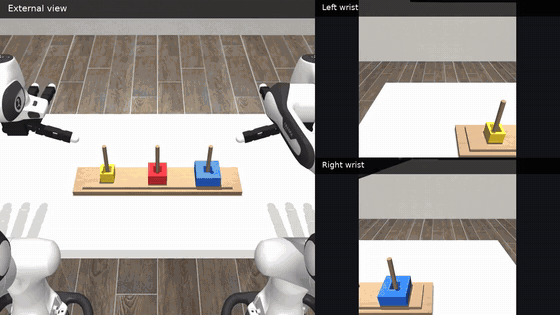
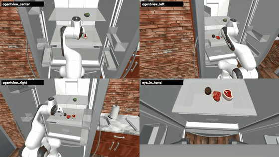

# AMD Physical AI 仿真基准与长程视频复现

本章把 AMD AI DevMaster Physical AI 项目中的仿真、策略评估和多视角视频整理成一条可复用的学习路径。内容覆盖 Every Embodied、RoboCasa365、DexJoCo、DISCOVERSE、RoboWits 和 Unitree G1 安全控制，并统一说明任务协议、AMD ROCm［AMD 开放计算平台］运行路径、结果口径和视频导出方法。

本页负责总览与路线选择。每套 benchmark［评测基准］的下载、环境、迁移、训练、评估和视频命令已经拆成独立教程：

| 阶段 | 详细教程 |
| --- | --- |
| 共用准备 | [仿真基准下载、鉴权、断点续传与统一目录](./README_10_仿真基准下载与统一目录.md) |
| 家庭操作 | [RoboCasa365：资产、GR00T/Pi0.5 训练与 16 任务评估](./README_11_RoboCasa365_ROCm下载训练评估.md) |
| 灵巧操作 | [DexJoCo：Pi0.5、原生 ROCm JAX［AMD 平台 JAX 运行栈］与 11 任务评估](./README_12_DexJoCo_Pi05_ROCm_JAX迁移训练评估.md) |
| 合成数据 | [DISCOVERSE：专家数据、ACT/Diffusion Policy［扩散策略］与多视角视频](./README_13_DISCOVERSE_ROCm数据生成训练与多视角视频.md) |
| 创意解题 | [RoboWits：受限数据、ACT/Pi0/Pi0.5 与 mutation［突变条件］评估](./README_14_RoboWits_ROCm下载训练与创意任务评估.md) |
| 安全控制 | [Unitree G1：预测 CBF［控制障碍函数］与全身体态回放](./README_15_Unitree_G1预测CBF_ROCm复现.md) |
| 结果发布 | [统一评估、视频编码与结果归档](./README_16_统一评估视频与结果归档.md) |

## 1. 从两个长程成功案例开始

下面两段视频都在 AMD Ryzen AI MAX+ 395 上完成闭环推理和仿真录制。动态预览压缩了时间轴；点击预览可观看保持原始动作节奏的完整 MP4［视频文件］。

| DexJoCo 双臂河内塔 | RoboCasa365 长程装餐任务 |
| --- | --- |
| [](./assets/competition_showcase/dexjoco_bimanual_hanoi_amd.mp4) | [](./assets/competition_showcase/robocasa_pack_identical_lunches_gr00t_amd.mp4) |
| Pi0.5 多任务 checkpoint［检查点］，双臂协同完成搬运与堆叠；外部视角和左右腕部视角同步录制，47.6 秒。 | GR00T N1.5 多任务 checkpoint［检查点］，PandaOmron 在厨房内连续操作；四视角同步录制，195 秒。 |

这两个案例分别展示了两类互补能力：DexJoCo 关注双臂与灵巧操作，RoboCasa365 关注家庭场景中的长时序任务。它们共用同一套工程判断：策略输出必须真正推进模拟器、任务成功条件必须由环境判定、视频必须和该回合的结果记录一一对应。

## 2. 仿真与策略矩阵

| 系统 | 机器人与任务 | 策略或控制器 | AMD 运行内容 | 已归档结果 |
| --- | --- | --- | --- | --- |
| Every Embodied | MuJoCo 抓杯与稳定放置 | SmolVLA、Pi0、ACT | 数据采集、训练、闭环评估、四视角视频 | SmolVLA 严格物理成功 `57/60`，红杯 `27/30`、蓝杯 `30/30` |
| RoboCasa365 | PandaOmron 厨房操作，16 个固定任务 | GR00T N1.5、Pi0.5 | PyTorch［张量计算框架］推理、16×50 同协议评估、四视角视频 | GR00T `230/800`；Pi0.5 `142/800` |
| DexJoCo | 11 个双臂与灵巧任务 | Pi0.5 多任务模型 | JAX［高性能数组计算框架］原生 ROCm［AMD 开放计算平台］推理、闭环评估、三视角视频 | 官方固定 seed［随机种子］为 `5/11`；固定 seed［随机种子］档案中 10/11 个任务有可复现成功案例 |
| DISCOVERSE | AIRBOT、MMK2、专家轨迹与合成数据 | 专家状态机、ACT 等 | 运行门禁、任务执行、数据生成、三路 1080p 视频、3DGS［三维高斯泼溅］渲染 | 运行门禁 `18/18`；AIRBOT `12/12`；MMK2 `8/8`；高清任务 `4/4` |
| RoboWits | 意外条件下的操作任务 | ACT | W7900 训练、checkpoint［检查点］保存、推理与视频评估 | 完整训练和评估工具链，可用于异常条件分析 |
| Unitree G1 | 抛球威胁下的全身避障 | Predictive CBF［预测控制障碍函数］ | PyTorch［张量计算框架］预测器、固定回合回放与安全指标 | 固定 seed［随机种子］ `8/8`，最小间距 `0.422 m` |

这张矩阵可以按三条路线学习：

1. **策略训练路线**：从 Every Embodied 的可控抓杯任务理解数据、训练和严格成功评估。
2. **多任务评估路线**：用 RoboCasa365 和 DexJoCo 学习多任务 checkpoint［检查点］加载、动作接口、批量闭环和视频索引。
3. **仿真工程路线**：用 DISCOVERSE、3DGS［三维高斯泼溅］和 Unitree G1 理解多机器人运行门禁、合成数据、渲染与安全控制。

## 3. 统一复现流程

不同仿真器的命令不同，但可复现流程可以统一成六个阶段：

```text
固定上游版本与任务配置
        ↓
确认 AMD GPU［图形处理器］、ROCm［AMD 开放计算平台］和框架后端
        ↓
加载资产、机器人、相机与任务成功条件
        ↓
加载 checkpoint［检查点］、归一化统计和动作接口
        ↓
运行固定 seed［随机种子］闭环评估并保存逐回合结果
        ↓
导出多视角视频、汇总成功率和阶段指标
```

推荐为每个实验保存以下最小结构：

```text
runs/{system}/{model}/{task}/
├── run_config.json
├── episodes/
│   ├── seed_000.json
│   └── seed_000.mp4
├── stats.json
└── videos/
```

`run_config.json` 记录任务、模型、相机、控制频率和 seed［随机种子］；逐回合 JSON［结构化数据文件］记录成功条件和阶段状态；`stats.json` 从逐回合文件聚合，避免手工填写成功率。

## 4. RoboCasa365：同协议家庭任务评估

RoboCasa365 的正式对比使用 16 个任务，每个任务 50 个回合。GR00T N1.5 和 Pi0.5 使用相同任务目录、回合数和成功条件，因此可以直接比较：

| 模型 | 任务数 | 回合数 | 成功数 | 成功率 |
| --- | ---: | ---: | ---: | ---: |
| GR00T N1.5 | 16 | 800 | 230 | 28.75% |
| Pi0.5 | 16 | 800 | 142 | 17.75% |

RoboCasa365 的视频使用四路相机：中央第三人称、左侧第三人称、右侧第三人称和手眼相机。四路画面在同一模拟时刻拼接，可以同时观察全局路径、手臂姿态、遮挡和末端接触。

本章首页的 `PackIdenticalLunches` 使用 GR00T N1.5 成功回合。它连续展示目标识别、接近、抓取、运输和放置，比单步开关门更适合作为长时序复现案例。

## 5. DexJoCo：原生 ROCm JAX 多任务推理

DexJoCo 的 11 个任务共用官方 Pi0.5 多任务 checkpoint［检查点］。AMD 运行环境采用 Python 3.12、ROCm 7.14.0 和 JAX/JAXlib 0.10.0，并完成 GPU［图形处理器］矩阵预检、模型加载、动作生成和模拟器闭环。

官方评估固定 seed［随机种子］ 0，每个任务 1 个回合，结果为 `5/11`。随后仅对未成功任务依次检查 seed［随机种子］ 1–10，并在首个成功回合停止；该固定档案为 10/11 个任务提供了可复现成功视频。两组数据承担不同用途：前者用于模型对比，后者用于观察任务完成过程和调试动作接口。

双臂河内塔视频使用三个同步视角：

- 外部视角：观察双臂协同、积木位置和最终堆叠；
- 左腕视角：观察左手接近和抓取；
- 右腕视角：观察右手搬运与放置。

## 6. DISCOVERSE：运行、专家数据与高清渲染

DISCOVERSE 迁移把运行门禁、机器人任务、专家数据和视频导出连成完整链路：

- 18 个运行门禁全部通过；
- AIRBOT 12 个任务与 MMK2 8 个任务完成执行验证；
- 专家轨迹可转换为训练数据；
- 高清任务同时导出三路 1920×1080 相机；
- 3DGS［三维高斯泼溅］用于场景渲染与动态回放。

这里的关键接口不是单一推理函数，而是仿真状态、相机、动作、成功条件和数据写入之间的契约。推荐先用专家状态机生成一条完整轨迹，再把观测和动作转换到 LeRobot 数据格式，最后接入 ACT、SmolVLA 或 Pi0 系列策略。

## 7. Every Embodied：从训练到严格物理成功

Every Embodied 抓杯任务适合作为学习入口，因为任务短、成功条件清楚、训练成本可控。SmolVLA 的正式结果使用红杯和蓝杯各 30 个固定 seed［随机种子］，严格物理成功要求完成抬升、运输、放置并稳定保持，最终为 `57/60`。

对应的完整训练与评估入口已经拆分在本专题：

- [端到端采集、训练与部署](./README_07_ROCm端到端采集训练部署.md)
- [预训练权重与零训练体验](./README_08_预训练权重与零训练体验.md)
- [物理成功评估与视频复核](./README_02_物理成功评估与视频复核.md)

## 8. 多视角视频导出

多视角视频应在同一个仿真循环中采集，所有相机共享同一帧索引。下面是通用结构：

```python
frames = {name: [] for name in camera_names}

for step in range(max_steps):
    action = policy.select_action(observation)
    observation, reward, terminated, truncated, info = env.step(action)

    for camera_name in camera_names:
        frames[camera_name].append(env.render(camera_name=camera_name))

    if terminated or truncated:
        break
```

导出时建议同时保留：

- 单相机原始视频，便于逐视角诊断；
- 多视角合成视频，便于快速复核；
- 成功回合海报帧，便于 README［项目说明］和课程首页展示；
- 逐回合 JSON［结构化数据文件］，把视频和任务结果绑定。

## 9. 学习产出

完成本章后，建议整理一份自己的 AMD 仿真复现包：

| 产出 | 内容 |
| --- | --- |
| 环境记录 | AMD 设备、ROCm［AMD 开放计算平台］、PyTorch［张量计算框架］或 JAX［高性能数组计算框架］版本 |
| 任务配置 | 机器人、任务、相机、控制频率、回合数和 seed［随机种子］ |
| 模型记录 | checkpoint［检查点］来源、归一化统计和动作接口 |
| 结果 | 每任务成功数、总分母和阶段指标 |
| 视频 | 至少一段完整成功回合和对应逐回合 JSON［结构化数据文件］ |
| 复盘 | 环境接口、模型接口和物理成功条件中最关键的适配点 |

## 10. 延伸资料

- [AMD ROCm 策略复刻专题首页](./README.md)
- [AMD Physical AI 公开成果站](https://ethan-chen-plus.github.io/amd-physical-ai-showcase/)
- [RoboCasa](https://github.com/robocasa/robocasa)
- [DexJoCo](https://github.com/brave-eai/dexjoco)
- [DISCOVERSE](https://github.com/discoverse-dev/DISCOVERSE)
- [RoboWits](https://umass-embodied-agi.github.io/RoboWits/)
- [PAC-MAN Unitree G1 安全控制](https://github.com/lzyang2000/perceptive_cbf_rl)

比赛项目的完整材料保存在以下公开入口：

- [Radeon Physical AI Evidence Suite 源码与复现文档](https://github.com/Ethan-Chen-plus/radeon-physical-ai-evidence-suite)
- [4 分 59 秒英文演示视频](https://ethan-chen-plus.github.io/amd-physical-ai-showcase/assets/videos/amd-physical-ai-demo-en.mp4)
- [英文技术报告](https://github.com/Ethan-Chen-plus/radeon-physical-ai-evidence-suite/blob/main/output/pdf/datawhale-eai-radeon-physical-ai-technical-report.pdf)
- [SmolVLA 模型](https://huggingface.co/Datawhale/every-embodied-smolvla-mujoco-pnp)
- [Pi0 模型](https://huggingface.co/Datawhale/every-embodied-pi0-mujoco-pnp)
- [ACT 模型](https://huggingface.co/Datawhale/every-embodied-act-mujoco-pnp)
- [RoboWits ACT 模型](https://huggingface.co/Datawhale/robowits-act-amd-rocm)
