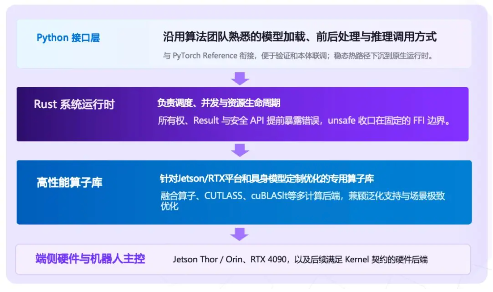
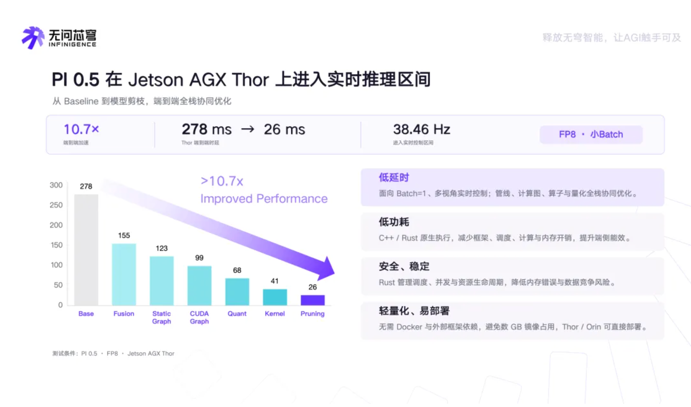

<!-- Generated by the offline translation workflow.
Source: 06-策略抓取或抓取VLA/大模型控制、VLA、VLM/09APXInf具身端侧推理引擎/README.md
Source SHA-256: a51ec6bfcfafad3524d9b58eb541733cb5799070ff172fa193487abdf4ba1fe5
Model: tencent/Hy-MT2-1.8B-GGUF:Q4_K_M
Review machine-translated technical claims before relying on them.
-->
# APXInf: Embodied Model Edge Inference Engine

## What has been accomplished in this chapter

This chapter explores APXInf from a system perspective: why it has a separate Runtime for embodied models, its boundaries with RLinf, OpenPI, EVA-Client, Jetson-PI, and TensorRT, and how to perform a minimalized π0.5 inference verification according to the official process.

The focus here is on "how the model generates actions stably on the robot body," not on training a new VLA model. The official open-source implementation of APXInf is [RLinf/APXinf-robo](https://github.com/RLinf/APXinf-robo), where the ApxInf engine is introduced via Git submodule.

## 1. Why VLA requires a dedicated on-premise Runtime

The training load and robot deployment load for VLA vary significantly. During the training phase, large memory GPUs and large batches are commonly used; during deployment, Jetson Orin, Jetson Thor, or a single RTX 4090 is typical, with a batch size of 1. The following closed loop must be repeatedly executed:

```text
相机图像 + 语言指令 + 机器人状态
                ↓
          VLA / WAM 推理
                ↓
          action chunk
                ↓
          控制器与机器人
```

For policies such as π0.5 that use flow matching, generating an action chunk also involves multiple sampling steps. The model forward pass, image preprocessing, sampling, memory transfer, Python scheduling, and action post-processing all enter a closed loop. The goal of on-device deployment is not the peak FLOPS of a single operator, but end-to-end latency and stability under fixed input shape, small batch size, and continuous operation conditions.

## 2. System location of APXInf

APXInf should be understood as “embodied model inference runtime”, rather than a complete robot operating system:

```text
OpenPI / 自定义策略
        ↓  checkpoint 与观测
APXInf Runtime
  Rust 调度 + CUDA Kernel + CUDA Graph + 量化
        ↓  normalized actions
APXinf-robo policy / OpenPI-compatible server
        ↓
机器人客户端或评测环境
```



Figure 1: Official layered diagram of APXInf. The upper layer retains the Python model loading, preprocessing, and inference invocation methods. The middle layer is managed by Rust Runtime for scheduling and resource lifecycle management. The underlying layer connects high-performance operator libraries tailored for Jetson/RTX and embodied models.

Source: [. Official introduction of Wenxinqiong APXInf ](https://www.infinigence-ai.com/news-updates/233.html).

The launch focus of the official repository is π0.5, with options for BF16, FP8, and INT8 paths. Currently supported hardware includes Jetson AGX Thor, Jetson AGX Orin, and RTX 4090; FP8 requires calibration data, while INT8 is primarily for Orin and Ada architectures. The specific support scope should be based on the target version's README.

### Table 1: Boundaries of Related Projects

| Item | Primary Location | Equals APXInf? |
| --- | --- | --- |
| RLinf | Embodied RL training, rollout, simulation, and evaluation infrastructure | No, belongs to the training/evaluation layer |
| OpenPI | Reference implementations for π0/π0.5 models, preprocessing, and policy services | No, belongs to the model and policy stack |
| APXInf | Real robot-side inference Runtime for small batches and low latency embodied models | Main body of this chapter |
| EVA-Client | Deployment, collection, and evaluation client for connecting policy services and real robots | No, belongs to the real robot execution layer |
| Jetson-PI | Research approach for hiding VLA latency through asynchronous inference and predictive correction | No, belongs to control/scheduling methods |
| TensorRT / TensorRT-LLM | General NVIDIA inference backend | Can serve as the underlying route, but not a dedicated closed loop for embodied systems |

The papers and code of EVA-Client can be found in the [ project repository ](https://github.com/Noietch/EVA-CLIENT) and the [ papers ](https://arxiv.org/abs/2607.02646); the papers and Edge Runtime of Jetson-PI can be found in the [ paper ](https://arxiv.org/abs/2607.12659); Embodied.cpp can be found in the [ project repository ](https://github.com/SEU-PAISys/Embodied.cpp) and the [ papers ](https://arxiv.org/abs/2607.02501). These projects have different roles, and they cannot be considered as the same framework just because they both mention "inference".

## 3. Things Worth Seeing about APXInf

### 3.1 Focus on closed loop at the edge, rather than optimizing the bare model only

The public benchmark for APXInf divides the measurements into L1, L2, and L3: L1 covers the transformation from resized RGB to model output, L2 includes the preprocessing and post-processing of the policy, and L3 also encompasses server-side round trips. This division helps identify whether the bottleneck lies in CUDA computation, Python/Rust calls, policy encapsulation, or communication links.

The example data provided in the official README for π0.5, batch=1, two-view perspective, 10 flow steps, and an action horizon of 10 are as follows. These are official measurement results, and they do not indicate that any model or input shape can achieve the same latency:

| Hardware | Precision | Base Latency | After onestep Pruning |
| --- | --- | ---: | ---: |
| Jetson AGX Thor | BF16 | 72.45 ms | 44.05 ms |
| Jetson AGX Thor | FP8 | 41.16 ms | 26.32 ms |
| Jetson AGX Orin | BF16 | 165.67 ms | 119.05 ms |
| RTX 4090 | BF16 | 31.38 ms | 20.36 ms |



Figure 2: The optimized path provided by the official source. The gradual reduction in latency comes from the combination of fusion operators, static graphs, CUDA Graph, quantization, Kernel optimization, and action generation pruning. The final 26 ms cannot be simply attributed to Rust or a specific CUDA Kernel.

Source: [ No Question Core Dome APXInf Official Introduction ](https://www.infinigence-ai.com/news-updates/233.html).

The 26.32 ms for Thor FP8 corresponds to approximately 38 Hz, indicating that its optimization goal is indeed real-time robot control, rather than just focusing on offline throughput. [ Official performance table ](https://github.com/RLinf/APXinf-robo#performance)

### 3.2 Clear Division of Labor between Rust Runtime and CUDA Kernel

The Python API is responsible for model invocation and upper-level integration, Rust handles the runtime organization closer to the system, and CUDA Kernel handles GPU computing. Rust is not the embodied AI algorithm itself; its value lies in reducing runtime resource management risks, converging interfaces, and minimizing scheduling overhead. The real performance benefits still come from graph capture, fusion operators, precision paths, memory reuse, and model structure specialization.

### 3.3 OpenPI compatibility reduces replacement costs

APXinf-robo provides an OpenPI-compatible WebSocket server. Clients that already use `openpi-client` can switch the service address to APXInf without having to rewrite the entire observation and action interface. This represents an important engineering design move from a "benchmark optimization implementation" to a deployed component.

## 4. Minimum Verification Process

### 4.1 Environmental Requirements

The official build process requires Linux, NVIDIA drivers, CUDA Toolkit, Rust, and CMake. The compilation process reads the compute capability of the currently visible GPU and builds the CUDA kernel for the target architecture; therefore, it is best to build directly on the deployment machine. When building across machines, `APXINF_CUDA_ARCH` must be explicitly set, for example, Orin uses `sm_87`.

The following commands are executed in the root directory of the APXinf-robo repository. They are a streamlined version of the official build process and do not include model weights:

```bash
git clone --recursive https://github.com/RLinf/APXinf-robo.git
cd APXinf-robo

python3 -m venv .venv
source .venv/bin/activate
pip install maturin

CARGO_TARGET_DIR=target/wheel maturin build --release --features cuda \
  --auditwheel skip -m apxinf/crates/apxinf-py/Cargo.toml
pip install --force-reinstall target/wheel/wheels/apxinf_py-*.whl
pip install -e "./apxinf/python/apxinf[serving]" --config-settings editable_mode=strict
pip install -e ".[serve]"
```

### Checkpoint 1: Bindings and packages can be imported

```bash
python -c 'import apxinf_py; print(apxinf_py.__version__)'
python -c 'import apxinf_robo; print(apxinf_robo.__version__)'
```

This step only proves that the Python extension and upper-level package installation were successful, but it does not prove that the model output is correct, nor does it prove that the end-to-end latency meets the official results. If the import fails, prioritize checking whether the Rust, CUDA, and CMake versions, as well as the current GPU architecture, are consistent with the build target.

### Checkpoint 2: Verify the runtime link with random weights

```bash
python scripts/bench_pi05.py \
  --random-weights \
  --precision bf16 \
  --layer l1 \
  --views 2 \
  --token-count 10 \
  --action-horizon 10 \
  --num-flow-steps 10 \
  --warmup 10 \
  --samples 30 \
  --autotune
```

Random weight benchmark is suitable for checking CUDA Kernel, input shape, image capture, and timing links. It does not verify model performance, and cannot replace LIBERO or real robot evaluations with real robot checkpoints.

### Checkpoint 3: Use a real checkpoint

The real evaluation requires a compatible π0.5 checkpoint, as well as the corresponding tokenizer, normalization statistics, and model configuration. The LIBERO process described in the official README requires the preparation of `norm_stats.json` and running 10 tasks with `apxinf-robo eval-libero` for evaluation. It is recommended to run a single-task single-round smoke test first, and then conduct the full evaluation:

```bash
apxinf-robo eval-libero \
  --backend in-process \
  --model-dir /path/to/pi05_libero_base \
  --norm-stats /path/to/pi05_libero_base/norm_stats.json \
  --precision bf16 \
  --action-horizon 10 \
  --suite libero_10 \
  --tasks 0 \
  --trials-per-task 1 \
  --results-jsonl /path/to/results/smoke.jsonl \
  --summary-json /path/to/results/smoke.json
```

If the smoke test passes, replace `--tasks 0 --trials-per-task 1` with the full task and number of rounds. The overall success rate should be compared with the reference results using the same checkpoint, normalization method, and seed, rather than just comparing a single demo video.

## 5. Precautions during quantification and deployment

- BF16 is the easiest to reproduce, and no calibration files are required.
- FP8 requires representative observation data to generate the activation scale; calibration data should cover the actual camera, state, and command distributions as much as possible.
- INT8 does not mean “turning on the switch and it will be faster immediately”. It is necessary to consider model accuracy, input shape, GPU architecture, and real-time control success rate simultaneously.
- CUDA Graph typically requires stable input shapes and execution paths. Dynamic number of viewpoints, dynamic action horizon, or temporary changes to flow steps may lead to re-capture or loss of optimization benefits.
- End-to-end latency should be broken down into model computation, preprocessing, post-processing, transmission, and robot execution. Reporting only L1 latency easily overestimates the actual closed loop frequency.

## 6. How to Understand Its Innovation

The main contribution of APXInf is in system engineering, not a new VLA training algorithm. It does not alter the task definition of π0.5, nor introduces a new visual encoder or action learning objective; instead, it applies the already trained policy to the robot and makes the entire execution path more compact under fixed shapes, small batches, and real-time closed loop conditions.

Therefore, it can be evaluated as follows:

- Algorithmic innovation: limited;
- Runtime and Kernel engineering value: high;
- Practical value for NVIDIA on-device deployment: high;
- Generality: still limited by the range of model and hardware support;
- Current maturity: early version, requiring self-verification of version locking, long-term operation, and real robot safety.

## 7. Combination methods with related work

The actual system does not necessarily have to choose one or the other among these options:

```text
RLinf：训练 / rollout / 评测
        ↓
APXInf：模型端侧推理
        ↓
EVA-Client 或自研控制客户端：异步动作执行、IK、记录和真机评测
        ↓
机器人控制器
```

If a single inference is already fast but the robot still has pauses, prioritize checking asynchronous scheduling, action chunks, control cycles, and communication delays. In such cases, the policy for Jetson-PI or EVA-Client may be more effective than continuing to modify the Kernel. If the goal is a unified Runtime across models and hardware, you can continue to track [Embodied.cpp](https://github.com/SEU-PAISys/Embodied.cpp), but compare it separately from the public benchmark of APXInf.

## References

1. [APXinf-robo Official Repository](https://github.com/RLinf/APXinf-robo)
2. [RLinf Official Repository](https://github.com/RLinf/RLinf)
3. [RLinf ApxInf Rollout Backend Documentation](https://rlinf.readthedocs.io/en/latest/rst_source/guides/apxinf.html)
4. [Wenwenqiong APXInf Project Introduction](https://www.infinigence-ai.com/news-updates/233.html)
5. [EVA-Client Official Repository](https://github.com/Noietch/EVA-CLIENT)
6. [Jetson-PI Paper](https://arxiv.org/abs/2607.12659)
7. [Embodied.cpp Project and Paper](https://arxiv.org/abs/2607.02501)
