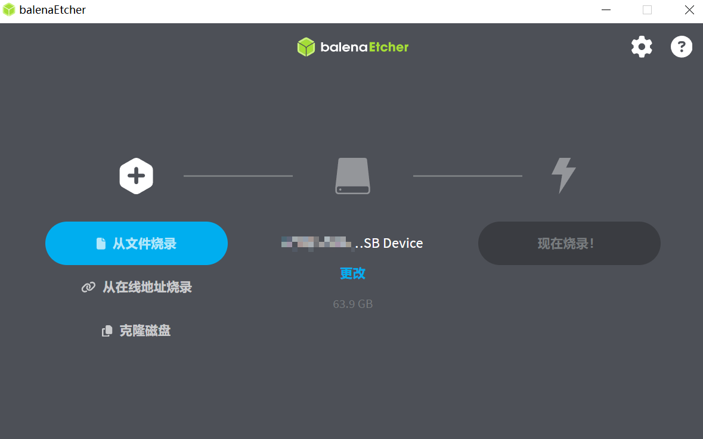
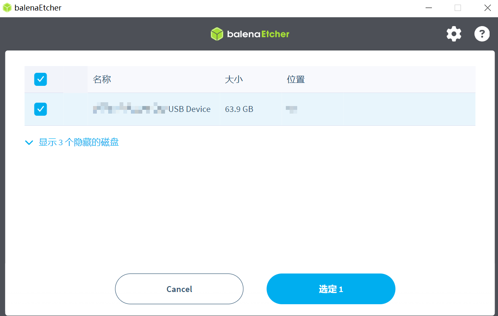
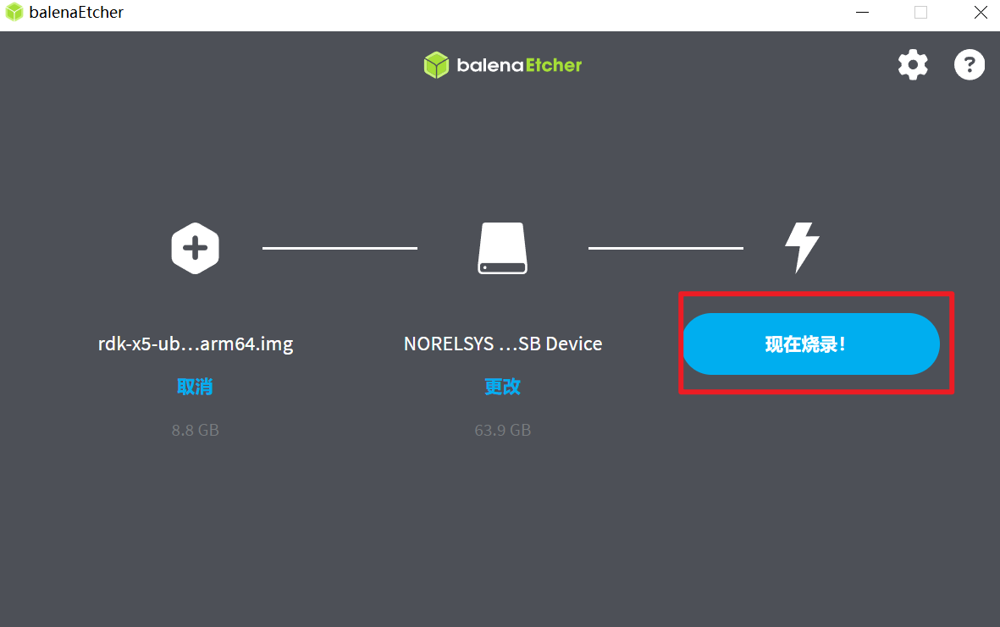
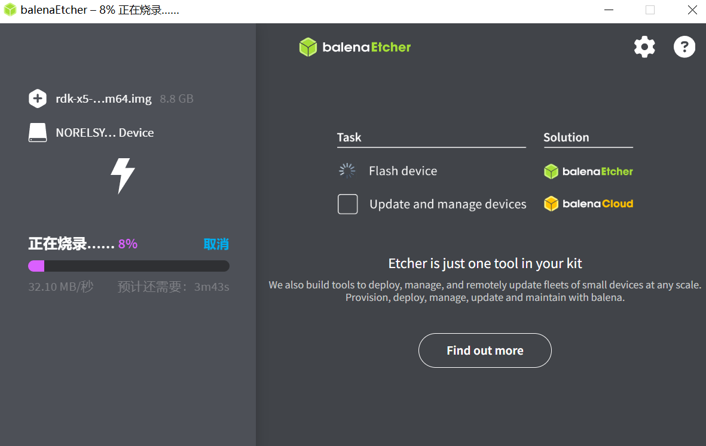
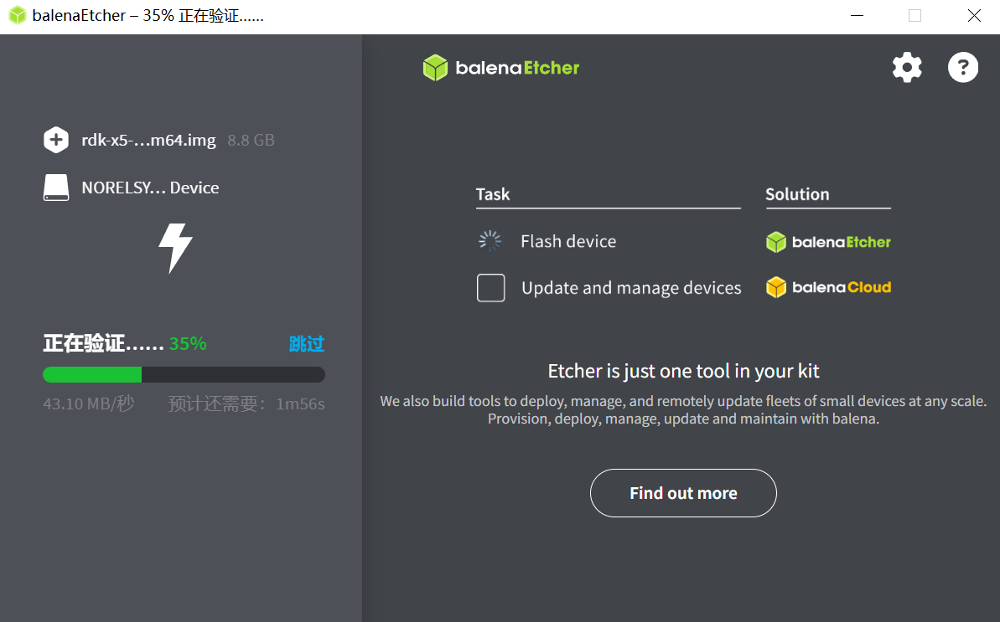
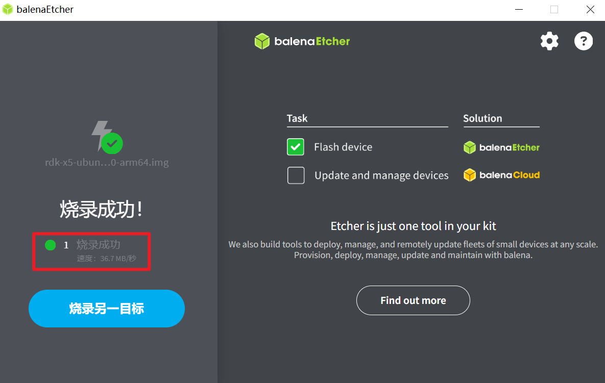

# RDK X5 Ultra Beginner's Guide : From System Flashing to YOLO Object Recognition

## Table of Contents

- [RDK X5 Ultra Beginner's Tutorial: From System Flashing to YOLO Object Recognition](#rdk-x5-ultra-beginner-s-tutorial-from-system-flashing-to-yolo-object-recognition)
  - [Table of Contents](#table-of-contents)
  - [How to Purchase](#how-to-purchase)
  - [RDK X5 Specifications](#rdk-x5-specifications)
  - [System Flashing](#system-flashing)
    - [Flashing Preparation](#flashing-preparation)
      - [Power Supply](#power-supply)
      - [Storage](#storage)
      - [Display](#display)
      - [Network Connection](#network-connection)
      - [System Flashing](#system-flashing-1)
    - [Image Download](#image-download)
    - [System Flashing](#system-flashing-2)
    - [Start the System](#start-the-system)
    - [Frequently Asked Questions](#frequently-asked-questions)
  - [YOLO Algorithm Test](#yolo-algorithm-test)
    - [Running Method](#running-method)
  - [Camera Application](#camera-application)
    - [Local Saving of Camera Images](#local-saving-of-camera-images)
      - [Environment Preparation](#environment-preparation)
      - [Running Method](#running-method-1)
      - [Expected Effect](#expected-effect)
  - [ROS Application](#ros-application)
    - [Function Introduction](#function-introduction)
    - [Implementation Steps](#implementation-steps)
  - [Conclusion](#conclusion)

## How to Purchase

The first step is to buy a board —— which you can get from the [RDK official website](https://developer.d-robotics.cc/).

The board will come in a well-packaged box as follows:

<p align="center">
  
</p>

## RDK X5 Specifications

| Component | Parameters                                                                                                                                                                                                 |
| --------- | -------------------------------------------------------------------------------------------------------------------------------------------------------------------------------------------------------------------------------------------------------------------------- |
| CPU       | 8x A55 @ 1.5GHz                                                                                                                                                                                            |
| RAM       | 4GB / 8GB LPDDR4                                                                                                                                                                                           |
| BPU       | 10 TOPS                                                                                                                                                                                                   |
| GPU       | 32 GFlops                                                                                                                                                                                                  |
| Storage   | An external Micro SD card used as storage (purchased separately)                                                                                                                                           |
| Multimedia| H.265 (HEVC) Main Profile @ L5.1, H.264 (AVC) Baseline/Constrained Baseline/Main/High Profiles @ L5.2 with SVC-T encoding, H.265/H.264 encoding and decoding up to 3840x2160@60fps |

The RDK X5 provides functional interfaces such as Ethernet, USB, camera, LCD, HDMI, CANFD, and 40PIN, making it easier for users to develop and test applications image multimedia,deep learning algorithms and other applications. The layout of the development board interfaces is as follows:

<p align="center">
  
</p>

| No.  | Function                     | No.  | Function                     | No.  | Function                    |
|------|------------------------------|------|------------------------------|------|-----------------------------|
| 1    | Power interface (USB Type-C)  | 2    | RTC battery interface        | 3    | Easy-connect interface (USB Type-C) |
| 4    | Debug serial port (Micro USB)| 5    | 2-channel MIPI Camera interface | 6    | Gigabit Ethernet port, POE supported |
| 7    | 4 USB 3.0 Type A interfaces  | 8    | CAN FD high-speed interface  | 9    | 40PIN interface             |
| 10   | HDMI display interface       | 11   | Multi-standard compatible headphone interface | 12   | Onboard Wi-Fi antenna       |
| 13   | TF card interface (bottom)   | 14   | LCD display interface (MIPI DSI) |      |                             |

Mechanical dimensions:

<p align="center">
  
</p>

## System Flashing

### Flashing Preparation

#### Power Supply

The RDK X5 development board,powered via a USB Type-C interface, requires a power adapter that supports **5V/3A**.

> [!NOTE]
> 
> Do not use a computer USB port to power the development board, otherwise, **unexpected shutdowns or repeated restarts** may occur due to insufficient power supply.
>

#### Storage

The RDK X5 development board uses a Micro SD memory card as the system boot medium. It is recommended to use a memory card with a capacity of at least `8GB` to meet the storage requirements of the Ubuntu system and softwares.

> [!IMPORTANT]
> 
>SD cards with a price of about 1 yuan per GB are recommonded. I once tried cheap ones and failed to start the system！

#### Display

The RDK X5 development board supports the HDMI interface. You can connect the development board and the display via an HDMI cable. Graphical desktops are supported.

#### Network Connection

The RDK X5 development board supports two network interfaces: Ethernet and Wi-Fi. Users can connect the network through any interface.

#### System Flashing

The RDK kit currently provides an image of Ubuntu 22.04.  Graphical desktops are also supported.


> [!NOTE]
> 
>A test - version system image is pre-installed on the RDK X5 development board at the factory. To ensure the system to be the latest version, it is recommended to read this document to flash the latest version of the system image.</font>.
> 

### Image Download

Click [**Download Image**](https://archive.d-robotics.cc/downloads/os_images/rdk_x5/), enter the version selection page and select the corresponding version directory to enter the 3.1.0 version system download page.

When the download is complete, unzip the Ubuntu system image file. For example:
`rdk-x5-ubuntu22-preinstalled-desktop-3.1.0-arm64.img`

> [!TIP]
> 
> - `desktop`: Ubuntu system with a desktop can connect external screens and mouses
> - `server`: Ubuntu system without a desktop, can be operated through serial port or network remote connection
> 

### System Flashing

Before flashing the Ubuntu system image, the following preparations are required:

- Prepare a Micro SD card with a capacity of at least `8GB`
- Micro SD card reader
- Download the image flashing tool [balenaEtcher](https://etcher.balena.io/), which is a PC-side boot disk creation tool that supports multiple platforms such as Windows/Mac/Linux.

The process of making an SD boot card is as follows:

1. Open the [balenaEtcher](https://etcher.balena.io/) tool, click the `从文件烧录（Flash from File)` , and select the unzipped `rdk-x5-ubuntu22-preinstalled-desktop-3.1.0-arm64.img` file as the flashing image

<p align="center">
  
</p>

2. Click the `Select target` button to select the corresponding Micro SD memory card as the target storage device

<p align="center">
  
</p>

3. Click the `现在烧录（Flash Now)` to start flashing

<p align="center">
  
</p>

4. Wait for the flashing & verification to finish
<p align="center">
  
  
</p>

5. When a prompt pops up with `烧录成功（Flash Success`, it means the image flashing is finished. You can close `balenaEtcher` and take out the memory card
<p align="center">
  
</p>

### Start the System

First, keep the development board **powered off**, then insert the prepared memory card into the Micro SD card slot of the board, connect it to the display via an HDMI cable, and finally power on the board.

When the system starts for the first time, it is default to  configure the environment, a process that costs 45 seconds. After the configuration, the Ubuntu desktop will be displayed as shown:


> [!TIP]
> If the**<font color='Green'>Green</font>** indicator lights up, it means the hardware is powered on properly.
> 
> If there is no output on the monitor for more than 2 minutes after the board is powered on, it means that there is a startup exception. It requires a debugging through the serial cable to check whether the development board works properly.
> 
> If you don't have a display, you can check whether the orange light near the green one is on. If so, it means the system is up and ready!

### Frequently Asked Questions

There are some FAQ questions people using the development board for the first time may get:

- **<font color='Blue'>No power on</font>**: Please use adapters recommended in [Power Supply](#power-supply) to supply power and ensure that the Micro SD card of the board has been flashed with the Ubuntu system image
- **<font color='Blue'> Hot-swap of memory card during use</font>**: The development board does not support hot swapping of Micro SD cards. If a misoperation occurs, please restart the board

> [!WARNING] 
> Notes
> 
> - **Do not** plug or unplug any devices except USB, HDMI, and network cables when the board is powered on
> - The Type-C USB port of RDK X5 is only used for power supply
> - Use a qualified USB Type-C power cable, otherwise exceptions may occur, leading to  a system power failure.


## YOLO Algorithm Test

This example mainly realizes the following functions:

1. Load the `yolov5s_672x672_nv12` target detection model
2. Read the static `kite.jpg` image as the input of the model
3. Analyze the algorithm results and render the detection results

### Running Method

The complete code and test data of this example are installed in the `/app/pydev_demo/07_yolov5_sample/` directory. Run the following command to execute:

```shell
cd /app/pydev_demo/07_yolov5_sample/
sudo python3 ./test_yolov5.py
```

Then the detection results of the target will be output:

```bash
bbox: [593.949768, 80.819038, 672.215027, 147.131607], score: 0.856997, id: 33, name: kite
bbox: [215.716019, 696.537476, 273.653442, 855.298706], score: 0.852251, id: 0, name: person
bbox: [278.934448, 236.631256, 305.838867, 281.294922], score: 0.834647, id: 33, name: kite
bbox: [115.184196, 615.987, 167.202667, 761.042542], score: 0.781627, id: 0, name: person
bbox: [577.261719, 346.008453, 601.795349, 370.308624], score: 0.705358, id: 33, name: kite
bbox: [1083.22998, 394.714569, 1102.146729, 422.34787], score: 0.673642, id: 33, name: kite
bbox: [80.515938, 511.157104, 107.181572, 564.28363], score: 0.662, id: 0, name: person
bbox: [175.470078, 541.949219, 194.192871, 572.981812], score: 0.623189, id: 0, name: person
bbox: [518.504333, 508.224396, 533.452759, 531.92926], score: 0.597822, id: 0, name: person
bbox: [469.970398, 340.634796, 486.181305, 358.508972], score: 0.5593, id: 33, name: kite
bbox: [32.987705, 512.65033, 57.665741, 554.898804], score: 0.508812, id: 0, name: person
bbox: [345.142609, 486.988464, 358.24762, 504.551331], score: 0.50672, id: 0, name: person
bbox: [530.825439, 513.695679, 555.200256, 536.498352], score: 0.459818, id: 0, name: person
```

The result will be rendered to the `output_image.jpg`, as shown in the following figure:


## Camera Application

### Local Storage of Camera Images

This example `vio_capture` realizes image collection with a `MIPI` camera and local storage of images in `RAW` and `YUV` format. The flow chart of the process is as follows:


#### Environment Preparation

- Connect the `MIPI` camera to the development board when the it is **powered off**
- Connect the development board to the display via an HDMI cable
- Power on the development board and log in through the command line.

#### Running Method

The source code of the example is provided and the `make` command is needed to run it. The steps are as follows:

```bash
sunrise@ubuntu:~$ cd /app/cdev_demo/vio_capture/
sunrise@ubuntu:/app/cdev_demo/vio_capture$ sudo make
sunrise@ubuntu:/app/cdev_demo/vio_capture$ sudo ./capture -b 16 -c 10 -h 1080 -w 1920
```

Parameter description:

- `-b`: The number of `bit`s for the RAW image. `IMX219` / `IMX477` / `OV5647` are all set to `16`, with only a few Camera Sensors set to `8`
- `-c`: The number of images to save
- `-w`: The width of t images to save
- `-h`: The height of the images to save


#### Expected Effect

When the program runs properly, the specified number of image files will be saved in the current directory. The `RAW` imges will be named as `raw_*.raw`, and the `YUV` imaged with be named as `yuv_*.yuv`. The running log is as follows:

```bash
sunrise@ubuntu:/app/cdev_demo/vio_capture$ sudo ./capture -b 16 -c 10 -h 1080 -w 1920
Camera 0:
        i2c_bus: 6
        mipi_host: 0
Camera 1:
        i2c_bus: 4
        mipi_host: 2
Camera 2:
        i2c_bus: 0
        mipi_host: 0
Camera 3:
        i2c_bus: 0
        mipi_host: 0
mipi mclk is not configured.
Searching camera sensor on device: /proc/device-tree/soc/cam/vcon@0 i2c bus: 6 mipi rx phy: 0
INFO: Found sensor name:imx219-30fps on mipi rx csi 0, i2c addr 0x10, config_file:linear_1920x1080_raw10_30fps_2lane.c
2024/12/14 12:38:17.478 !INFO [CamInitParam][0279]Setting VSE channel-0: input_width:1920, input_height:1080, dst_w:1920, dst_h:1080
2024/12/14 12:38:17.479 !INFO [CamInitParam][0279]Setting VSE channel-1: input_width:1920, input_height:1080, dst_w:1920, dst_h:1080
2024/12/14 12:38:17.479 !INFO [vp_vin_init][0041]csi0 ignore mclk ex attr, because mclk is not configed at device tree.
... omitted ...
capture time :0
temp_ptr.data_size[0]:4147200
capture time :1
temp_ptr.data_size[0]:4147200
capture time :2
temp_ptr.data_size[0]:4147200
capture time :3
temp_ptr.data_size[0]:4147200
capture time :4
temp_ptr.data_size[0]:4147200
... omitted ...
```

The saved files are as follows:

```bash
-rw-r--r-- 1 root video 4147200 Dec 14 12:38 raw_0.raw
-rw-r--r-- 1 root video 4147200 Dec 14 12:38 raw_1.raw
-rw-r--r-- 1 root video 4147200 Dec 14 12:38 raw_2.raw
-rw-r--r-- 1 root video 4147200 Dec 14 12:38 raw_3.raw
-rw-r--r-- 1 root video 4147200 Dec 14 12:38 raw_4.raw
-rw-r--r-- 1 root video 4147200 Dec 14 12:38 raw_5.raw
-rw-r--r-- 1 root video 4147200 Dec 14 12:38 raw_6.raw
-rw-r--r-- 1 root video 4147200 Dec 14 12:38 raw_7.raw
-rw-r--r-- 1 root video 4147200 Dec 14 12:38 raw_8.raw
-rw-r--r-- 1 root video 4147200 Dec 14 12:38 raw_9.raw
-rw-r--r-- 1 root video 3110400 Dec 14 12:38 yuv_0.yuv
-rw-r--r-- 1 root video 3110400 Dec 14 12:38 yuv_1.yuv
-rw-r--r-- 1 root video 3110400 Dec 14 12:38 yuv_2.yuv
-rw-r--r-- 1 root video 3110400 Dec 14 12:38 yuv_3.yuv
-rw-r--r-- 1 root video 3110400 Dec 14 12:38 yuv_4.yuv
-rw-r--r-- 1 root video 3110400 Dec 14 12:38 yuv_5.yuv
-rw-r--r-- 1 root video 3110400 Dec 14 12:38 yuv_6.yuv
-rw-r--r-- 1 root video 3110400 Dec 14 12:38 yuv_7.yuv
-rw-r--r-- 1 root video 3110400 Dec 14 12:38 yuv_8.yuv
-rw-r--r-- 1 root video 3110400 Dec 14 12:38 yuv_9.yuv
```

## ROS Application

### Function Introduction

This example uses the YOLOv8 target detection algorithm to subscribe to the images published by the MIPI camera, publish inference results as algorithm messages, and realize rendering and display of the published images and corresponding algorithm results on the PC browser through the websocket package.

The model is trained with the [COCO dataset](http://cocodataset.org/). It supports 80 types of target detection including people, animals, fruits, vehicles, etc.

Code repository: https://github.com/D-Robotics/hobot_dnn

### Implementation Steps

```bash
# Configure tros environment
source /opt/tros/humble/setup.bash

# Configure MIPI camera
export CAM_TYPE=mipi

# Start the launch file
ros2 launch dnn_node_example dnn_node_example.launch.py dnn_example_config_file:=config/yolov8workconfig.json dnn_example_image_width:=640 dnn_example_image_height:=640
```

The terminal will output as follows:

```bash
[example-3]  model_name: 
[example-3] [WARN] [1734150496.829080954] [dnn_example_node]: model_file_name_: /opt/hobot/model/x5/basic/yolov8_640x640_nv12.bin, task_num: 4
[example-3] [BPU_PLAT]BPU Platform Version(1.3.6)!
[example-3] [HBRT] set log level as 0. version = 3.15.54.0
[example-3] [DNN] Runtime version = 1.23.10_(3.15.54 HBRT)
[example-3] [A][DNN][packed_model.cpp:247][Model](2024-12-14,12:28:16.917.894) [HorizonRT] The model builder version = 1.23.6
[example-3] [WARN] [1734150497.032746099] [dnn_example_node]: Get model name: yolov8n_640x640_nv12 from load model.
[example-3] [WARN] [1734150497.032959099] [dnn_example_node]: Create ai msg publisher with topic_name: hobot_dnn_detection
[example-3] [WARN] [1734150497.046993438] [dnn_example_node]: Create img hbmem_subscription with topic_name: /hbmem_img
[mipi_cam-1] [WARN] [1734150499.038839668] [mipi_cam]: [init]->cap F37 init success.
[mipi_cam-1] 
[mipi_cam-1] [WARN] [1734150499.039121668] [mipi_cam]: Enabling zero-copy
[example-3] [WARN] [1734150499.136643335] [dnn_example_node]: Loaned messages are only safe with const ref subscription callbacks. If you are using any other kind of subscriptions, set the ROS_DISABLE_LOANED_MESSAGES environment variable to 1 (the default).
[hobot_codec_republish-2] [WARN] [1734150499.136643251] [hobot_codec]: Loaned messages are only safe with const ref subscription callbacks. If you are using any other kind of subscriptions, set the ROS_DISABLE_LOANED_MESSAGES environment variable to 1 (the default).
[hobot_codec_republish-2] [WARN] [1734150499.136958250] [HobotVenc]: init_pic_w_: 640, init_pic_h_: 640, alined_pic_w_: 640, alined_pic_h_: 640, aline_w_: 16, aline_h_: 16
[example-3] [WARN] [1734150499.136956459] [dnn_example_node]: Recved img encoding: nv12, h: 640, w: 640, step: 640, index: 0, stamp: 1734150499_136107128, data size: 614400, comm delay [0.8273]ms
[example-3] [WARN] [1734150500.175391091] [dnn_example_node]: Sub img fps: 31.25, Smart fps: 31.25, pre process time ms: 3, infer time ms: 8, post process time ms: 4
[hobot_codec_republish-2] [WARN] [1734150500.259715501] [hobot_codec]: sub nv12 640x640, fps: 34.0136, pub jpeg, fps: 34.0136, comm delay [2.5714]ms, codec delay [4.4857]ms
[example-3] [WARN] [1734150501.195177356] [dnn_example_node]: Sub img fps: 30.36, Smart fps: 30.42, pre process time ms: 1, infer time ms: 7, post process time ms: 4
[hobot_codec_republish-2] [WARN] [1734150501.285234834] [hobot_codec]: sub nv12 640x640, fps: 30.2439, pub jpeg, fps: 30.2439, comm delay [0.0000]ms, codec delay [1.5806]ms
[example-3] [WARN] [1734150502.140048396] [dnn_example_node]: Recved img encoding: nv12, h: 640, w: 640, step: 640, index: 91, stamp: 1734150502_139378439, data size: 614400, comm delay [0.6543]ms
```

The output log shows that the `topic` for publishing algorithm inference results is `hobot_dnn_detection`, and the `topic` for subscribing to images is `/hbmem_img`.

Enter `http://IP:8000/TogetheROS/` in the browser on the PC to view the image and algorithm rendering effect (IP is the IP address of the RDK).

## Conclusion

The above is all the content of this tutorial. Feel free to explore more 😁
